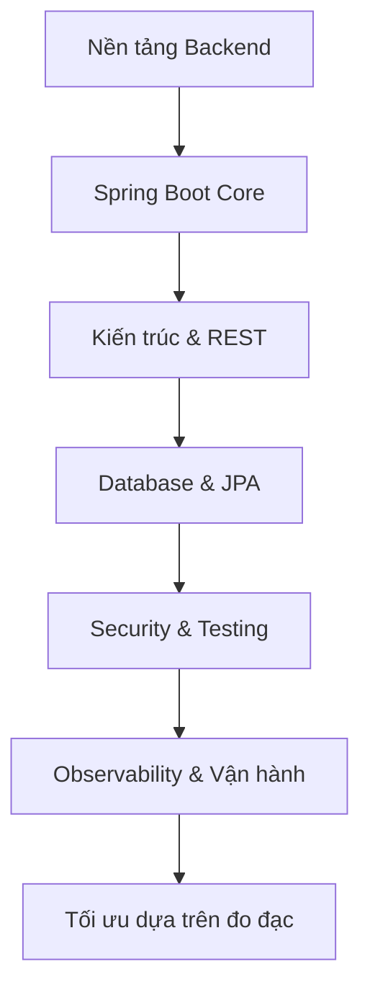
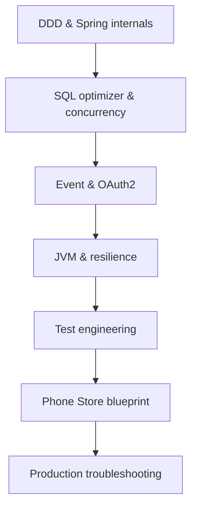

# Backend & Spring Boot Engineering Knowledge Base

> [!important] Mục tiêu
> Đây là kho tri thức dùng đồng thời cho ba việc: học Backend có hệ thống, ra quyết định kỹ thuật trong dự án và làm nguồn quy tắc cho AI Agent. Tài liệu ưu tiên tính đúng, khả năng truy vết và khả năng kiểm chứng; không xem một blog cá nhân là “chân lý”.

## Hồ sơ kỹ thuật mặc định

| Thành phần | Chuẩn mặc định | Ghi chú |
|---|---|---|
| Ngôn ngữ | Java 21 LTS | Không dùng tính năng preview trong production nếu chưa có quyết định kiến trúc |
| Dự án mới | Spring Boot 4.1.x | Tại ngày kiểm chứng, tài liệu Spring công bố 4.1.0 là stable mới nhất |
| Dự án hiện hữu | Spring Boot 3.5.x | Giữ đúng BOM/API của nhánh 3.5; không sao chép mù quáng ví dụ 4.x |
| Build | Gradle Wrapper | Khóa phiên bản; dependency qua Spring Boot BOM |
| Database chính | MySQL 8.4 LTS / InnoDB | PostgreSQL phải có ghi chú riêng khi cú pháp hoặc optimizer khác |
| Kiến trúc khởi đầu | Modular monolith, package-by-feature | Chỉ tách microservice khi có lý do đo được |
| API | HTTP semantics + RFC 9457 | OpenAPI là hợp đồng máy đọc được |
| Migration DB | Flyway hoặc Liquibase | Production không dùng `ddl-auto=update` |
| Test tích hợp | JUnit + Testcontainers | Chạy đúng loại database production |
| Quan sát hệ thống | Actuator + Micrometer/OpenTelemetry | Log, metric và trace phải liên kết được |

Nguồn xác minh phiên bản: [Spring Boot System Requirements](https://docs.spring.io/spring-boot/system-requirements.html), [JDK 21 Documentation](https://docs.oracle.com/en/java/javase/21/), [MySQL 8.4 Reference Manual](https://dev.mysql.com/doc/refman/8.4/en/).

## Bản đồ vault

1. [[01-Chinh-sach-kiem-chung-nguon]] — cách xác định kiến thức đáng tin.
2. [[02-Nen-tang-Backend]] — request lifecycle, state, concurrency, consistency, reliability.
3. [[03-Java-21-va-Spring-Boot-Core]] — Java, IoC/DI, auto-configuration, configuration.
4. [[04-Kien-truc-va-cau-truc-code]] — modular monolith, package-by-feature, boundaries.
5. [[05-Chuan-REST-API]] — HTTP, status code, error, pagination, idempotency.
6. [[06-Database-va-toi-uu-SQL-MySQL]] — schema, index, EXPLAIN, query tuning.
7. [[07-JPA-Hibernate-va-Transaction]] — persistence context, fetch, lock, transaction.
8. [[08-Spring-Security-va-API-Security]] — authentication, authorization, JWT, OWASP.
9. [[09-Chien-luoc-Testing]] — unit, integration, mutation, property, fuzz.
10. [[10-Observability-Performance-Reliability]] — log, metric, trace, cache, resilience.
11. [[11-Docker-CICD-va-Van-hanh]] — container, pipeline, migration, release.
12. [[12-Bo-quy-tac-cho-AI-Agent]] — nguồn luật để Agent làm việc an toàn.
13. [[13-Checklist-Definition-of-Done]] — checklist review và bàn giao.
14. [[90-Template-Ghi-chu-Ky-thuat]] — mẫu thêm kiến thức mới.
15. [[99-Danh-muc-nguon-chuan]] — danh mục nguồn chính thức.

### Chuyên đề nâng cao

16. [[14-DDD-va-Modular-Monolith-Nang-cao]] — bounded context, aggregate, module contract và Spring Modulith.
17. [[15-Spring-Internals-AOP-va-Request-Lifecycle]] — bean lifecycle, proxy, AOP, MVC và thread context.
18. [[16-MySQL-Optimizer-va-Index-Nang-cao]] — cấu trúc InnoDB, statistics, composite/covering index và plan.
19. [[17-Concurrency-Isolation-va-Idempotency-Nang-cao]] — anomaly, atomic update, lock, deadlock và exactly-once business effect.
20. [[18-Event-Driven-Outbox-va-Kafka]] — message semantics, transactional outbox, CDC, consumer inbox và schema evolution.
21. [[19-OAuth2-OIDC-va-Token-Security-Nang-cao]] — OAuth2/OIDC, PKCE, rotation, token validation và browser security.
22. [[20-JVM-Memory-GC-va-Profiling]] — heap/native memory, GC, JFR, JMH và OOM runbook.
23. [[21-Distributed-Reliability-va-Resilience4j]] — timeout budget, retry, circuit breaker, bulkhead và overload.
24. [[22-Test-Engineering-Nang-cao]] — risk-based tests, migration, contract, concurrency, mutation, fuzz và performance.
25. [[23-Blueprint-Phone-Store-Backend]] — bản áp dụng cụ thể cho dự án Phone Store.
26. [[24-Production-Troubleshooting-Playbook]] — playbook xử lý lỗi production và data incident.

## Cách dùng trong Obsidian

- Đặt `00-README.md` làm Home.
- Mỗi quyết định dự án tạo một ADR và liên kết đến ghi chú nền tảng tương ứng.
- Mọi ghi chú có kiến thức dễ thay đổi phải có `verified_on`, `applies_to` và nguồn.
- Dùng liên kết nội bộ Obsidian để nối các khái niệm; không nhân bản cùng một quy tắc ở nhiều nơi.
- Nội dung chưa xác minh đưa vào `Inbox`, gắn `status: unverified`; không cho AI Agent xem đó là quy tắc bắt buộc.
- Khi Agent tạo code, đưa `12-Bo-quy-tac-cho-AI-Agent.md`, tài liệu nghiệp vụ và ADR liên quan vào context; không cần nạp toàn bộ vault.

## Thứ tự học khuyến nghị

Sau khi hoàn thành nền tảng, đi theo tuyến nâng cao:

> [!warning] Ranh giới của tài liệu
> Không có cấu trúc code, index hay mẫu transaction nào đúng cho mọi hệ thống. Quy tắc trong vault là mặc định có căn cứ; được phép thay đổi khi ADR nêu rõ bối cảnh, phương án, đánh đổi và bằng chứng đo đạc.
