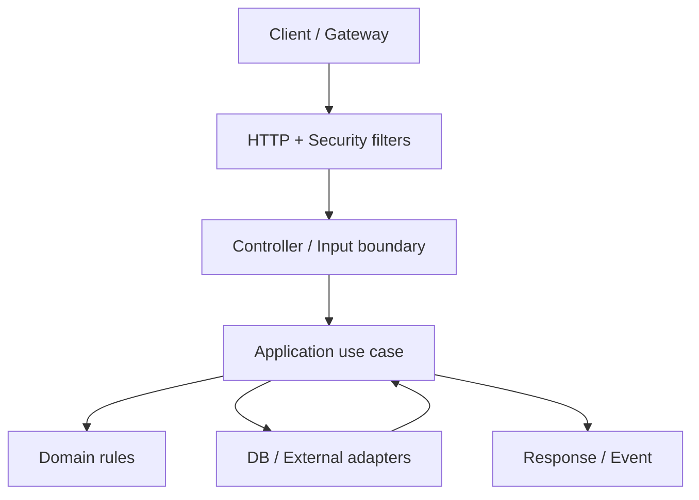

# Nền tảng Backend

## 1. Backend thực sự chịu trách nhiệm gì?

Backend không chỉ là CRUD. Nó bảo vệ invariants nghiệp vụ, xác thực và phân quyền, quản lý state, điều phối transaction, giao tiếp với hệ thống khác, cung cấp khả năng quan sát và tiếp tục vận hành khi một phần hạ tầng lỗi.

Một request điển hình:



Mỗi boundary phải trả lời: dữ liệu nào được tin cậy, timeout bao nhiêu, lỗi được chuyển đổi ra sao, thao tác có thể retry không và log/metric nào cho biết nó đang hỏng.

## 2. Invariant và use case

Invariant là điều phải luôn đúng, ví dụ:

- số lượng tồn kho không âm;
- một đơn chỉ được thanh toán tổng số tiền đã chốt;
- người duyệt KYC không được duyệt hồ sơ ngoài phạm vi quyền;
- một idempotency key chỉ tạo tối đa một payment intent.

Validation hình thức (`@NotBlank`, độ dài, format) nằm ở input boundary. Validation nghiệp vụ cần dữ liệu hoặc trạng thái hiện tại nằm trong application/domain service và cùng transaction với thay đổi state. Database constraint là lớp bảo vệ cuối, không thay thế thông báo lỗi nghiệp vụ.

## 3. State và consistency

Phân biệt:

- **Strong consistency trong một database transaction:** phù hợp khi invariant nằm trong cùng DB.
- **Eventual consistency:** state ở nhiều hệ thống hội tụ sau; cần event, idempotency, retry và reconciliation.
- **Atomicity không tự vượt qua network boundary:** transaction DB không làm cho gửi email, gọi payment và publish Kafka cùng atomic.

Mẫu an toàn thường dùng:

- Transactional outbox để commit state + event record trong cùng transaction.
- Idempotent consumer để xử lý event giao lại nhiều lần.
- Saga/process manager cho quy trình nhiều bước và hành động bù.
- Reconciliation job để phát hiện state lệch lâu dài.

## 4. Concurrency

Lỗi phổ biến là “check rồi update”:

```text
T1 đọc stock=1   T2 đọc stock=1
T1 bán 1         T2 bán 1
=> overselling nếu không có atomic update/lock/version
```

Các công cụ:

- unique/check/foreign-key constraint;
- atomic SQL như `UPDATE ... SET stock = stock - ? WHERE stock >= ?` rồi kiểm tra affected rows;
- optimistic locking bằng cột version khi xung đột hiếm;
- pessimistic locking khi phải serialize truy cập, với transaction ngắn;
- queue/partition theo key khi workflow cần thứ tự;
- idempotency key cho command từ client/network.

Không dùng `synchronized` để bảo vệ state dùng chung giữa nhiều instance ứng dụng.

## 5. Timeout, retry và backpressure

- Mọi network call phải có connect timeout và response/read timeout.
- Retry chỉ cho lỗi tạm thời và thao tác an toàn/idempotent; dùng exponential backoff + jitter.
- Không retry vô hạn; không retry `4xx` nghiệp vụ.
- Ngân sách thời gian của downstream phải nhỏ hơn deadline toàn request.
- Bulkhead giới hạn tài nguyên theo dependency; circuit breaker giảm tải khi dependency hỏng.
- Queue phải có giới hạn hoặc cơ chế backpressure; queue vô hạn chỉ dời lỗi sang OOM/latency.

## 6. Monolith hay microservice?

Mặc định tốt cho đội nhỏ/junior là **modular monolith**: một deployable, module boundary rõ, transaction đơn giản, quan sát và test dễ hơn. Microservice hợp lý khi có ít nhất một lực kéo thực:

- team ownership và release cadence độc lập;
- scaling profile khác biệt đáng kể;
- isolation failure/security/compliance;
- bounded context đã ổn định;
- tổ chức có năng lực CI/CD, observability, incident response và platform.

Tách service làm phát sinh network failure, distributed tracing, version contract, eventual consistency, deployment và chi phí vận hành. Không tách chỉ vì “chuẩn doanh nghiệp”.

## 7. SLI, SLO và capacity

- **SLI:** phép đo, ví dụ tỷ lệ request thành công dưới 300 ms.
- **SLO:** mục tiêu, ví dụ 99.9% request checkout thành công trong tháng.
- **SLA:** cam kết với khách hàng, thường kèm hậu quả thương mại.
- **Error budget:** phần không đạt cho phép; dùng để cân bằng feature và reliability.

Luôn đo latency theo percentile. Average có thể che p99 rất xấu. Capacity plan dựa trên traffic thực, peak, growth, headroom và dependency limit.

## 8. Nguyên tắc quyết định

1. Correctness trước micro-optimization.
2. Đo trước khi tối ưu.
3. Làm rõ failure mode trước khi thêm retry/cache/async.
4. Database constraint bảo vệ invariant quan trọng.
5. API và event là contract, phải version/test.
6. Đơn giản là tính năng vận hành: giải pháp ít moving parts thường dễ tin cậy hơn.

