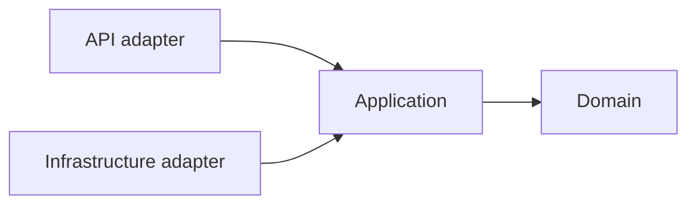

# Kiến trúc và cấu trúc code Spring Boot

## 1. Chọn kiến trúc theo lực thay đổi

Kiến trúc tốt làm cho thay đổi nghiệp vụ có phạm vi rõ, dependency đi đúng hướng và test được mà không khởi động toàn hệ thống. Nó không được đánh giá bằng số lượng pattern hoặc folder.

Mặc định cho dự án vừa và nhỏ:

- modular monolith;
- package-by-feature/bounded context;
- application service điều phối use case;
- domain giữ business rule quan trọng;
- infrastructure triển khai DB, HTTP client, message broker;
- REST controller là adapter mỏng.

## 2. Cấu trúc đề xuất

```text
com.example.phonestore
├── common
│   ├── error
│   ├── security
│   ├── web
│   └── observability
├── catalog
│   ├── api
│   │   ├── ProductController.java
│   │   ├── ProductRequest.java
│   │   └── ProductResponse.java
│   ├── application
│   │   ├── CreateProductUseCase.java
│   │   └── ProductQueryService.java
│   ├── domain
│   │   ├── Product.java
│   │   └── ProductPolicy.java
│   └── infrastructure
│       ├── JpaProductRepository.java
│       └── ProductJpaEntity.java
├── ordering
│   ├── api
│   ├── application
│   ├── domain
│   └── infrastructure
└── PhoneStoreApplication.java
```

Với CRUD đơn giản, có thể dùng entity JPA trong module domain để giảm ceremony, nhưng phải tránh để annotation/framework kéo business rule ra khỏi model. Với domain phức tạp hoặc cần thay persistence, tách domain model và persistence model rõ ràng.

## 3. Dependency rule



- Domain không import Spring MVC, JPA repository hoặc HTTP client.
- Application phụ thuộc interface/port, không phụ thuộc SDK vendor cụ thể.
- API không gọi repository trực tiếp.
- Module không đọc bảng/entity nội bộ của module khác tùy tiện; giao tiếp qua public API/application port/event đã định nghĩa.
- `common` chỉ chứa cross-cutting thật sự; không biến thành “sọt rác”.

## 4. Trách nhiệm từng lớp

| Thành phần | Nên làm | Không nên làm |
|---|---|---|
| Controller | Parse/validate input, auth context, gọi use case, map HTTP | Business rule, transaction dài, query JPA |
| Application service | Điều phối use case, transaction boundary, authorization theo resource | Chứa chi tiết HTTP/JSON |
| Domain | Invariant, state transition, policy | Gọi controller hoặc SDK hạ tầng trực tiếp |
| Repository port | Ngôn ngữ truy cập aggregate/use-case | Phơi `EntityManager` ra ngoài |
| Adapter | JPA, REST client, broker, storage | Quyết định nghiệp vụ |

“Controller mỏng” không có nghĩa dồn mọi thứ vào một `ServiceImpl` 2.000 dòng. Tách use case theo hành vi và cohesive responsibility.

## 5. DTO, entity và mapping

- Request/response DTO là contract bên ngoài; không trả JPA entity trực tiếp.
- Request create/update tách nhau khi validation/field khác nhau.
- Response không lộ password hash, internal status, audit secret hoặc quan hệ không cần thiết.
- Mapping đặt gần boundary; MapStruct hay manual mapping đều được, nhưng mapping không che giấu query N+1.
- Entity không dùng Lombok `@Data` một cách mù quáng; `toString`, `equals`, `hashCode` trên lazy collection có thể gây query/recursion.

## 6. Command và query

Không bắt buộc CQRS đầy đủ. Tuy nhiên nên tách tư duy:

- command thay state, bảo vệ invariant, thường cần transaction;
- query đọc projection phù hợp, không cần load aggregate nặng;
- DTO query có thể tối ưu riêng mà không phá domain write model.

## 7. Cross-cutting concerns

Dùng framework/interceptor/aspect có mục đích cho logging correlation, metrics, transaction, security. Không dùng AOP để giấu business flow quan trọng; người đọc phải thấy được trạng thái được thay đổi ở đâu.

## 8. Architecture Decision Record

Mỗi quyết định lớn tạo ADR:

```markdown
# ADR-0001: Chọn modular monolith
Status: Accepted
Date: 2026-07-21

## Context
Đội 4 người, một database, release cùng lịch...

## Decision
Package-by-feature, module boundary được kiểm tra bằng ArchUnit.

## Consequences
+ Transaction đơn giản, deploy dễ.
- Chưa scale/deploy module độc lập.

## Alternatives
Layered monolith; microservices.
```

## 9. Kiểm tra kiến trúc tự động

- ArchUnit kiểm tra dependency/package rule.
- Build fail nếu module vi phạm dependency.
- Contract test cho public port/API.
- Không chỉ dựa vào code review để giữ boundary lâu dài.

## 10. Dấu hiệu cần refactor

- một thay đổi nhỏ chạm nhiều module không liên quan;
- service constructor có quá nhiều dependency;
- controller hoặc service chứa nhiều nhánh theo type/status;
- module chia sẻ entity và update chéo;
- transaction bao gồm network call dài;
- test unit cần khởi động Spring context cho mọi logic;
- tên package theo layer làm developer không biết feature nằm ở đâu.

