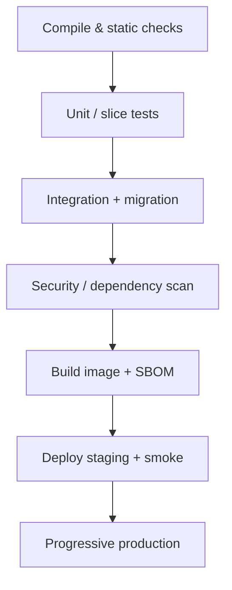

# Docker, CI/CD và Vận hành Spring Boot

## 1. Reproducible build

- Dùng Gradle Wrapper và toolchain Java.
- Build từ clean checkout; không phụ thuộc file local chưa commit.
- Dependency version khóa qua BOM/lock.
- Artifact có version/commit SHA/build metadata.
- Cùng artifact đi qua môi trường; configuration inject bên ngoài.

## 2. Dockerfile nguyên tắc

- Multi-stage build hoặc build artifact trong CI rồi copy vào runtime image.
- Runtime image tối thiểu nhưng vẫn có patch/support phù hợp.
- Pin version/digest theo chính sách; rebuild định kỳ để lấy security fixes.
- Chạy non-root, filesystem read-only khi có thể.
- Không copy source, `.git`, `.env`, test report, credential vào image.
- `.dockerignore` rõ.
- `ENTRYPOINT` exec form để nhận signal.
- Container không lưu state bền vững trong writable layer.

Ví dụ khung, phải thay image/digest theo registry đã duyệt:

```dockerfile
FROM eclipse-temurin:21-jre AS runtime
WORKDIR /app
RUN useradd --system --uid 10001 appuser
COPY --chown=appuser:appuser build/libs/app.jar app.jar
USER 10001
EXPOSE 8080
ENTRYPOINT ["java", "-jar", "/app/app.jar"]
```

Không đưa secret bằng `ARG`/`ENV` trong Dockerfile vì có thể lưu trong history/metadata.

## 3. Layering và JVM

Tách dependency/application layers có thể tăng cache và giảm push. Cấu hình heap dựa trên container memory limit và quan sát thực; giữ headroom cho metaspace, direct buffer, thread stack và native memory. OOM phải có diagnostic/runbook, không chỉ tăng memory vô hạn.

## 4. Configuration theo môi trường

- Non-secret default trong repo.
- Secret từ secret manager/runtime mount/injection.
- Validate startup; fail fast nếu thiếu.
- Profile không chứa nhánh business khác nhau quá lớn giữa dev/prod.
- Test production-like config path trước release.

## 5. Database migration khi deploy

Chọn owner migration rõ: pipeline job/init job hoặc một cơ chế leader, không để nhiều replica đua migration nguy hiểm. Migration phải backward-compatible trong rolling deploy:

1. expand schema;
2. deploy code đọc/ghi tương thích;
3. backfill;
4. chuyển traffic/behavior;
5. contract ở release sau.

Có backup/restore verification và rollback application. Rollback schema không phải lúc nào an toàn, nên ưu tiên forward fix.

## 6. CI pipeline tối thiểu



Mỗi gate fail thì dừng. Không cho phép “temporary skip test” không expiry/owner.

## 7. Artifact và supply chain

- Generate SBOM.
- Scan dependency và image; triage theo exploitability/impact.
- Artifact immutable, registry access least privilege.
- Ký/provenance theo năng lực tổ chức.
- Không build lại source khác cho production sau khi staging đã test.

## 8. Deployment strategy

- Rolling: đơn giản, cần backward compatibility.
- Blue/green: rollback traffic nhanh, tốn tài nguyên và cần xử lý DB.
- Canary: giảm blast radius, cần metrics/automated analysis.

Release phải có health/readiness, smoke test, telemetry, rollback condition và owner. Feature flag tách deploy khỏi release nhưng cần lifecycle; cờ chết phải xóa.

## 9. Runtime security

- non-root, least Linux capabilities;
- read-only filesystem/tmp volume nếu phù hợp;
- network policy/egress control;
- resource requests/limits;
- secret rotation;
- protect Actuator/admin endpoint;
- base image và JDK được patch;
- audit deploy/config changes.

## 10. Runbook bắt buộc

Mỗi service có:

- owner/on-call/escalation;
- dashboard, log và trace link;
- dependency và SLO;
- startup/shutdown/rollback;
- database migration/recovery;
- common alerts và diagnostic commands;
- secret/certificate rotation;
- backup restore test;
- data reconciliation.

## 11. Production readiness review

- Capacity/load test đã đạt SLO với headroom?
- Timeout/retry/pool/rate limit có số liệu?
- Liveness/readiness/graceful shutdown đúng?
- Secret/PII/logging được kiểm tra?
- Migration backward-compatible và đã test?
- Alert actionable và runbook có owner?
- Backup restore đã diễn tập?
- Có rollback và tiêu chí kích hoạt?

