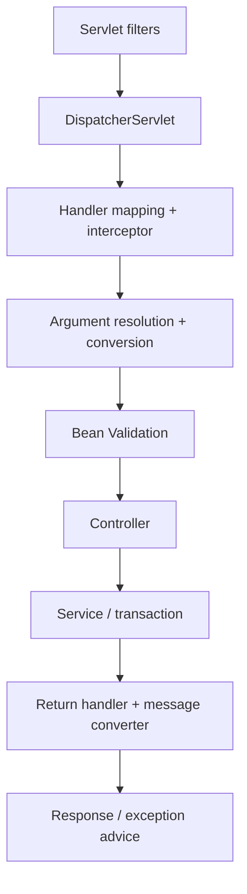

# Spring Internals, AOP và Request Lifecycle

## 1. Vì sao cần hiểu internals?

Phần lớn lỗi “annotation không chạy” đến từ việc không hiểu container, proxy, lifecycle hoặc thread boundary. Mental model đúng giúp debug có phương pháp thay vì thêm annotation ngẫu nhiên.

## 2. Bean creation mental model

Trình tự khái quát, chi tiết có thể thay đổi theo post-processor:

1. Đọc configuration/component scan và tạo bean definitions.
2. `BeanFactoryPostProcessor` có thể sửa definitions trước khi instantiate bean thường.
3. Chọn constructor/factory method và tạo instance.
4. Inject dependency/property.
5. Aware callbacks và `BeanPostProcessor` trước initialization.
6. `@PostConstruct`/initialization callbacks.
7. `BeanPostProcessor` sau initialization; AOP infrastructure thường có thể trả proxy.
8. Bean sẵn sàng được lấy từ container.
9. Khi context đóng, destroy callbacks chạy cho bean được quản lý phù hợp.

Không dựa vào initialization callback để gọi transactional method của chính bean: target có thể chưa đi qua proxy theo cách mong đợi. Spring docs nêu target bean được tạo trước rồi AOP proxy mới áp dụng; interceptor không nên được giả định chạy trên init method. Nguồn: [Customizing Bean Nature](https://docs.spring.io/spring-framework/reference/core/beans/factory-nature.html).

## 3. Bean scope và thread safety

| Scope | Lifecycle | Lưu ý |
|---|---|---|
| singleton | Một instance/container | Không chứa mutable request state |
| prototype | Mỗi lần container tạo/lấy | Container không quản lý đầy đủ destruction |
| request | Một instance/request web | Inject vào singleton cần scoped proxy/provider |
| session | Một instance/session | Memory và serialization/concurrency cần xem xét |

Singleton không tự thread-safe. Service stateless với local variables thường an toàn; mutable collection/counter field cần concurrency strategy hoặc external store.

Nguồn: [Spring Bean Scopes](https://docs.spring.io/spring-framework/reference/core/beans/factory-scopes.html).

## 4. JDK proxy và class-based proxy

- JDK dynamic proxy dựa trên interface.
- Class-based proxy tạo subclass và không thể advice `final` class/method; private method cũng không được override/intercept.
- Caller phải đi qua proxy. `this.someTransactionalMethod()` là self-invocation và thường bỏ qua advice ở proxy mode.
- Runtime type có thể là proxy, nên assumptions bằng `getClass()`/reflection/cast có thể sai.

Các tính năng thường dựa vào proxy/interceptor: `@Transactional`, `@Async`, `@Cacheable`, method security, custom AOP.

## 5. Self-invocation và cách sửa

Không tốt:

```java
public void importAll(List<Row> rows) {
    rows.forEach(this::importOne); // không đi qua transactional proxy
}

@Transactional(propagation = REQUIRES_NEW)
public void importOne(Row row) { ... }
```

Hướng xử lý:

1. Tách `importOne` sang bean/use case khác và gọi qua dependency.
2. Đổi transaction boundary thành batch phù hợp.
3. Dùng `TransactionTemplate` khi programmatic boundary rõ hơn.
4. AspectJ weaving chỉ khi thật sự cần và đội hiểu complexity.

Spring ghi rõ proxy mode chỉ intercept call đi vào qua proxy. Nguồn: [Using `@Transactional`](https://docs.spring.io/spring-framework/reference/data-access/transaction/declarative/annotations.html).

## 6. AOP dùng đúng chỗ

Phù hợp:

- transaction;
- method authorization;
- metric/timing;
- tracing/correlation;
- cache kỹ thuật;
- audit kỹ thuật có contract rõ.

Không phù hợp:

- ẩn state transition nghiệp vụ;
- tự động retry mọi exception;
- sửa input/output business âm thầm;
- pointcut quá rộng theo tên package không kiểm soát;
- aspect có side effect khó test/order-dependent.

## 7. Auto-configuration

Auto-configuration là tập configuration có điều kiện theo classpath, bean, property và environment. Debug:

- kiểm tra starter và dependency graph;
- xem condition evaluation report;
- tìm bean user-defined khiến auto-config “back off”;
- kiểm tra property prefix/type/profile;
- kiểm tra multiple candidates và `@Primary`/`@Qualifier`;
- không copy bean từ internet khi Boot đã tự cấu hình.

Tạo custom starter chỉ khi nhiều service thật sự chia sẻ integration/configuration; starter là public API nội bộ và cần compatibility tests.

## 8. `@Configuration` và `@Bean`

Full `@Configuration` có cơ chế đảm bảo inter-bean references qua container; `@Bean` trong plain component có Java semantics khác khi gọi trực tiếp method. Tốt nhất dùng method parameter injection:

```java
@Bean
PaymentClient paymentClient(HttpClient httpClient, PaymentProperties props) {
    return new PaymentClient(httpClient, props.baseUrl(), props.timeout());
}
```

Nó làm dependency rõ và giảm phụ thuộc vào gọi method configuration. Nguồn: [Classpath Scanning and Managed Components](https://docs.spring.io/spring-framework/reference/core/beans/classpath-scanning.html).

## 9. Externalized configuration

- `@ConfigurationProperties` cho nhóm property có type.
- Validation tại startup.
- Không dùng `@Value` rải rác cho configuration domain lớn.
- Property precedence phải kiểm tra theo Spring Boot reference đúng version.
- Không dùng profile làm feature flag runtime.
- Không để secret trong default property, image hoặc error log.
- Config ảnh hưởng bean graph có khác biệt khi AOT/native; xác minh build-time behavior.

Nguồn: [Spring Boot Externalized Configuration](https://docs.spring.io/spring-boot/reference/features/external-config.html), [Spring AOT](https://docs.spring.io/spring-framework/reference/core/aot.html).

## 10. Spring MVC request lifecycle



- Filter phù hợp security, CORS, correlation ở servlet boundary.
- Interceptor phù hợp pre/post handler metadata, không thay Spring Security.
- Argument resolver cho principal/domain-specific parameter có kiểm soát.
- Converter parse type; validator kiểm constraint.
- `@RestControllerAdvice` map exception sang error contract.
- Jackson/message converter quyết định JSON contract; entity lazy graph không được đi tới đây.

## 11. Filter ordering

Order sai có thể làm:

- correlation ID chưa tồn tại khi security log;
- custom JWT chạy sau authorization;
- CORS preflight bị authentication chặn;
- request body bị đọc mất trước controller;
- exception ngoài MVC không được controller advice bắt.

Ưu tiên Spring Security built-in filter chain. Nếu custom filter, dùng `OncePerRequestFilter` khi semantics phù hợp, xác định dispatch types, order, failure response và test cả preflight/error/async.

## 12. Thread boundary và context

Transaction, `SecurityContext`, MDC và request attributes thường gắn với thread/context. Khi dùng `@Async`, executor, `CompletableFuture` hoặc virtual threads:

- không giả định context tự truyền;
- capture/propagate bằng cơ chế chính thức;
- không truyền JPA managed entity sang thread khác;
- exception async cần observation/handler;
- executor/queue/concurrency phải bounded;
- cancellation/deadline cần truyền nếu workflow hỗ trợ.

## 13. Circular dependency

Circular dependency thường báo module/responsibility sai. Cách sửa:

- tách orchestration/use case;
- đảo dependency qua port;
- publish event nếu thực sự là reaction độc lập;
- gom behavior vào đúng aggregate/domain service;
- không dùng lazy injection chỉ để che cycle nếu thiết kế chưa rõ.

## 14. Startup failure checklist

- Java/Boot/Gradle compatibility.
- Dependency/BOM và duplicate version.
- Component scan root.
- Missing/ambiguous bean.
- Conditional property/profile.
- Configuration binding/validation.
- Migration/datasource connectivity.
- Port collision.
- Circular dependency.
- Secret/certificate/path permission.
- AOT/native runtime hints nếu dùng.

