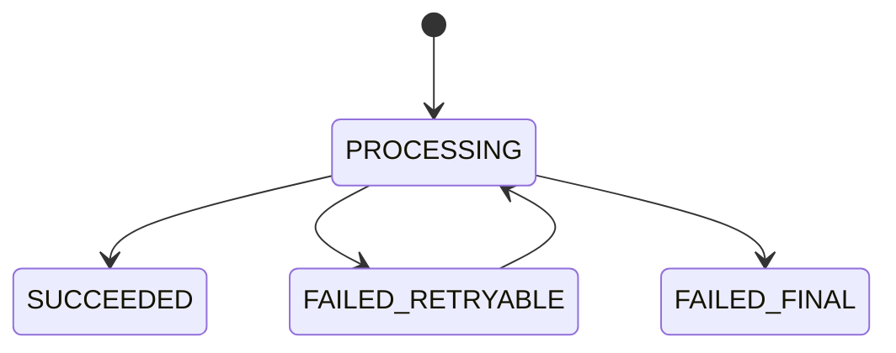

# Concurrency, Isolation và Idempotency nâng cao

## 1. Correct khi chạy tuần tự chưa đủ

Concurrency bug xuất hiện khi nhiều request hợp lệ xen kẽ. Cần viết invariant và interleaving trước khi chọn lock.

Ví dụ invariant tồn kho:

```text
available_stock >= 0
reserved + sold + available = physical_stock ± adjustments
```

Hai request cùng đọc `available=1`, cùng kiểm tra và cùng ghi `0` có thể bán hai đơn nhưng state nhìn vẫn không âm: chỉ kiểm tra cột stock chưa chứng minh invariant toàn workflow.

## 2. Các anomaly quan trọng

| Anomaly | Hiện tượng |
|---|---|
| Dirty read | Đọc dữ liệu chưa commit |
| Non-repeatable read | Cùng row đọc hai lần ra giá trị khác |
| Phantom | Query theo predicate thấy tập row thay đổi |
| Lost update | Hai writer ghi đè thay đổi |
| Write skew | Hai transaction đọc cùng điều kiện rồi sửa row khác, làm invariant tổng thể sai |

Tên isolation level không đủ để kết luận; behavior phụ thuộc DB, loại statement và locking/nonlocking read.

## 3. MySQL InnoDB mental model

InnoDB kết hợp MVCC với row/index-range locking. Nonlocking consistent read có snapshot semantics; `UPDATE`, `DELETE`, `SELECT ... FOR UPDATE/SHARE` là locking operations. Ở `REPEATABLE READ`, range scan locking có thể dùng gap/next-key locks.

Nguồn: [InnoDB Transaction Model](https://dev.mysql.com/doc/refman/8.4/en/innodb-transaction-model.html), [Transaction Isolation Levels](https://dev.mysql.com/doc/refman/8.4/en/innodb-transaction-isolation-levels.html).

## 4. Unique constraint như concurrency primitive

Case check-then-insert:

```java
if (!repository.existsByEmail(email)) {
    repository.save(new User(email));
}
```

Hai transaction vẫn có thể cùng thấy false. `UNIQUE(email)` quyết định winner. App có thể pre-check để UX tốt, nhưng phải catch/map constraint violation thành conflict.

Tương tự cho:

- idempotency key + caller;
- one active cart/customer;
- one review/product/customer;
- transaction reference/provider;
- one reservation/business slot.

## 5. Atomic conditional update

Tốt cho counter/resource đơn giản:

```sql
UPDATE products
SET stock = stock - :qty,
    version = version + 1
WHERE id = :id
  AND stock >= :qty;
```

Ưu điểm: một round-trip/statement và atomic tại DB. Cần kiểm affected rows và test concurrent. Nếu cần audit/reservation entity, atomic update phải nằm cùng transaction tạo record.

## 6. Optimistic locking

Flow:

1. Read entity version 7.
2. Update `... WHERE id=? AND version=7` và set version 8.
3. Affected rows 0 → conflict.

Phù hợp khi xung đột hiếm và work trước commit không quá đắt. Không auto-retry mù quáng user edit vì retry có thể ghi đè intent mới. Map version sang ETag/If-Match cho HTTP nếu contract phù hợp.

## 7. Pessimistic lock

`SELECT ... FOR UPDATE` phù hợp khi cần đọc state rồi quyết định phức tạp và phải serialize. Điều kiện:

- query có index đúng để lock ít record/range;
- transaction ngắn;
- không gọi network;
- timeout và deadlock handling;
- lock order nhất quán.

Lock “row” thực tế gắn với index records/ranges; query thiếu index có thể lock phạm vi lớn ngoài dự tính.

## 8. Write skew và invariant nhiều row

Ví dụ phải luôn có ít nhất một admin active. Hai transaction cùng thấy hai admin, mỗi transaction disable một người khác; từng row update không xung đột nhưng kết quả không còn admin.

Giải pháp tùy mô hình:

- lock một aggregate/control row chung;
- serialize command theo key;
- materialize counter và atomic constraint/update;
- isolation mạnh hơn với retry;
- redesign aggregate để invariant cùng row/transaction boundary.

## 9. Deadlock là điều phải xử lý

T1 lock order A rồi B; T2 lock B rồi A → cycle. MySQL chọn victim rollback một transaction. Giảm deadlock:

- truy cập row/table cùng thứ tự;
- index chính xác;
- transaction ngắn/nhỏ;
- tránh user/network wait;
- batch theo deterministic order;
- capture deadlock graph và query.

Retry toàn transaction từ đầu với backoff/jitter, chỉ khi operation idempotent và exception đúng là transient. Nguồn: [Deadlocks in InnoDB](https://dev.mysql.com/doc/refman/8.4/en/innodb-deadlocks.html).

## 10. Idempotency không phải dedup đơn giản

Idempotency record tối thiểu:

```text
scope/caller_id
idempotency_key
request_hash
status: PROCESSING | SUCCEEDED | FAILED_RETRYABLE | FAILED_FINAL
response/status/resource_id
lease/locked_at
expires_at
created_at/updated_at
UNIQUE(scope, caller_id, idempotency_key)
```

State machine:



Cùng key nhưng request hash khác phải conflict. `PROCESSING` bị crash cần lease/recovery rule. Không cache lỗi transient như final outcome nếu client được retry.

## 11. Exactly-once business effect

Network/broker thường có duplicate hoặc uncertain outcome. “Exactly once” end-to-end đạt bằng phối hợp:

- stable operation/event ID;
- idempotency/dedup constraint;
- atomic state + inbox/outbox record;
- retry safe;
- consumer offset/ack đúng thứ tự;
- reconciliation cho case hiếm.

Không tin chỉ vào producer setting để bảo đảm payment/order effect đúng một lần qua mọi hệ thống.

## 12. External call và uncertain outcome

Payment request timeout không có nghĩa payment thất bại; provider có thể đã xử lý nhưng response mất. Thiết kế:

1. tạo payment attempt ID/idempotency key;
2. gửi cùng key khi retry;
3. lưu trạng thái `UNKNOWN/PENDING`;
4. query provider/webhook reconcile;
5. state transition conditional/idempotent;
6. không tạo attempt mới chỉ vì timeout.

## 13. Transaction retry template

Retry phải ở ngoài transaction attempt:

```text
for attempt 1..max:
  begin new transaction
  re-read current state
  validate command/invariant
  apply change
  commit
  on recognized transient conflict/deadlock:
      rollback; backoff+jitter; retry
```

Không reuse entity/state đọc từ attempt cũ. Side effect bên ngoài phải sau commit hoặc qua outbox.

## 14. Concurrency test

Test race cần barrier/latch để tăng khả năng interleaving, chạy trên MySQL Testcontainers:

- N callers reserve stock 1 từ stock M → success đúng M;
- duplicate idempotency key → một resource/outcome;
- optimistic conflict → một update bị từ chối;
- deadlock retry → eventual success hoặc error có contract;
- unique constraint race → một winner, loser 409;
- crash giữa state/outbox → không mất integration event.

Không chứng minh concurrency bằng một test tuần tự hoặc mock repository.

## 15. Decision table

| Tình huống | Mặc định |
|---|---|
| Uniqueness | DB unique constraint + error mapping |
| Counter/stock condition đơn giản | Atomic conditional SQL |
| User edit, conflict hiếm | Optimistic locking + ETag/version |
| Decision phức tạp, contention vừa | Pessimistic lock, transaction ngắn |
| Hot key contention cao | Serialize/partition/queue hoặc redesign |
| Client retry command tạo side effect | Persistent idempotency record |
| DB state + event | Transactional outbox |
| Multi-system uncertain outcome | State machine + idempotency + reconciliation |

