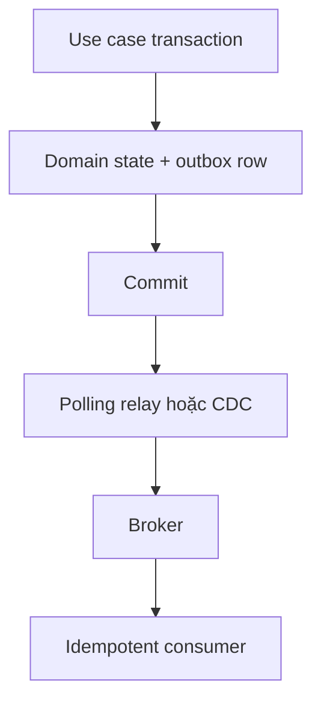
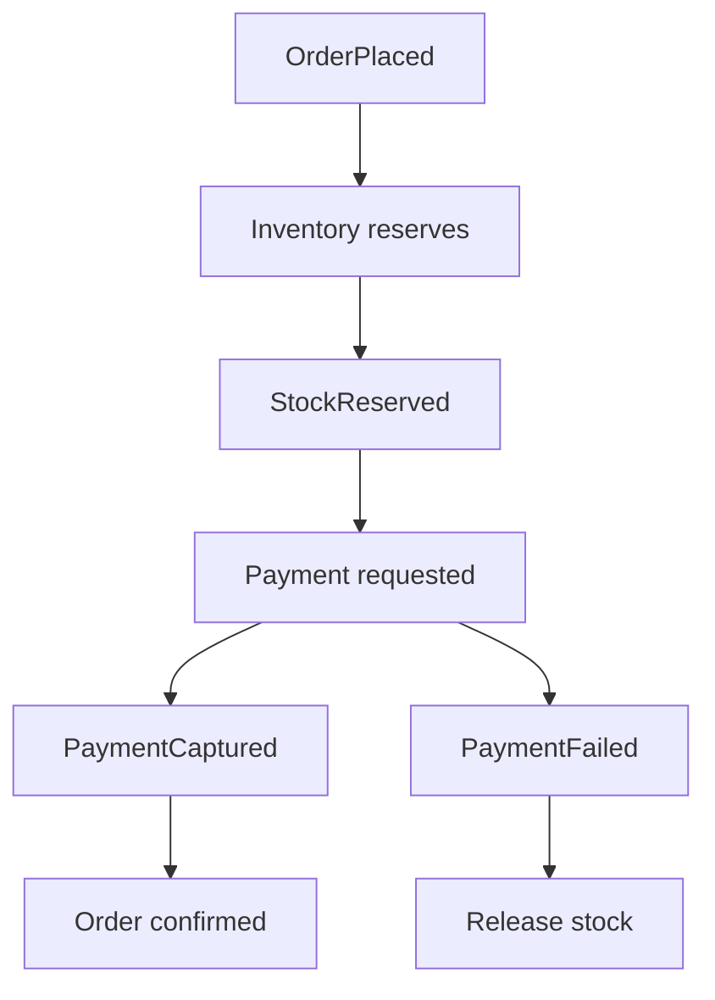

# Event-Driven, Transactional Outbox và Kafka

## 1. Chọn synchronous hay asynchronous

| Câu hỏi | Synchronous call | Event/message |
|---|---|---|
| Caller cần kết quả ngay? | Phù hợp | Cần workflow/status async |
| Consistency tức thời trong một process/DB? | Dễ hơn | Eventual consistency |
| Producer cần biết consumer? | Có contract trực tiếp | Có thể decouple theo event |
| Failure hiển thị cho caller? | Trực tiếp | Cần retry/DLQ/reconcile |
| Debug flow | Dễ theo stack/trace | Cần correlation/tracing |

Không dùng message broker chỉ để “trông như microservice”. Async làm failure và ordering phức tạp hơn; dùng khi latency decoupling, burst absorption, independent consumers hoặc integration boundary mang lại giá trị thật.

## 2. Command, Event và Message

- **Command:** yêu cầu một owner thực hiện hành động, có thể bị từ chối; `CapturePayment`.
- **Event:** sự kiện đã xảy ra; `PaymentCaptured`.
- **Message:** envelope vận chuyển command/event qua channel.

Tên event ở quá khứ và không chứa imperative ambiguity.

## 3. Event envelope

```json
{
  "eventId": "01K...",
  "eventType": "order.placed",
  "eventVersion": 1,
  "aggregateType": "Order",
  "aggregateId": "01J...",
  "aggregateVersion": 5,
  "occurredAt": "2026-07-21T07:30:00Z",
  "producer": "ordering",
  "correlationId": "...",
  "causationId": "...",
  "payload": {
    "customerId": "...",
    "total": {"amount": "24990000.00", "currency": "VND"}
  }
}
```

Không đưa toàn bộ entity, credential hoặc PII không cần. Schema phải có owner, version, compatibility policy và examples.

## 4. Dual-write problem

Không an toàn:

```text
1. COMMIT order vào MySQL
2. Publish OrderPlaced lên broker
```

Crash giữa 1 và 2 làm DB có order nhưng không có event. Đảo thứ tự lại tạo event cho transaction DB bị rollback. Hai hệ thống không cùng local transaction.

## 5. Transactional Outbox

Trong cùng transaction DB:

```sql
INSERT INTO orders (...);
INSERT INTO outbox_events
    (id, aggregate_type, aggregate_id, event_type,
     event_version, payload, occurred_at, status)
VALUES (...);
COMMIT;
```

Sau commit, relay đọc outbox và publish. Nếu publish rồi crash trước đánh dấu sent, event có thể được publish lại → consumer phải idempotent.



Debezium mô tả outbox như cách tránh inconsistency giữa state nội bộ và event cho service khác; Outbox Event Router capture thay đổi ở bảng outbox. Nguồn: [Debezium Outbox Event Router](https://debezium.io/documentation/reference/stable/transformations/outbox-event-router.html).

## 6. Outbox schema gợi ý

```sql
CREATE TABLE outbox_events (
    id              BINARY(16) PRIMARY KEY,
    aggregate_type  VARCHAR(100) NOT NULL,
    aggregate_id    VARCHAR(100) NOT NULL,
    aggregate_version BIGINT NULL,
    event_type      VARCHAR(150) NOT NULL,
    event_version   INT NOT NULL,
    payload         JSON NOT NULL,
    headers         JSON NULL,
    occurred_at     DATETIME(6) NOT NULL,
    published_at    DATETIME(6) NULL,
    attempts        INT NOT NULL DEFAULT 0,
    status          VARCHAR(30) NOT NULL,
    next_attempt_at DATETIME(6) NULL,
    INDEX idx_outbox_relay (status, next_attempt_at, occurred_at, id),
    INDEX idx_outbox_aggregate (aggregate_type, aggregate_id, aggregate_version)
);
```

Schema phụ thuộc relay:

- polling cần status/lease/retry index;
- CDC có thể chỉ cần immutable event row và retention cleanup;
- không update outbox payload sau commit;
- retention phải đảm bảo connector/relay không bị tụt quá xa.

## 7. Polling relay và CDC

### Polling publisher

Ưu: ít hạ tầng, dễ dùng cho modular monolith. Cần claim batch an toàn, tránh nhiều worker publish cùng row, retry/backoff và cleanup.

### CDC/Debezium

Đọc database log/binlog nên giảm polling query và capture commit order tốt hơn. Đổi lại cần connector, Kafka Connect, schema/offset/lag monitoring và runbook. Debezium MySQL đọc binlog và phát change event cho INSERT/UPDATE/DELETE. Nguồn: [Debezium MySQL Connector](https://debezium.io/documentation/reference/stable/connectors/mysql.html).

## 8. Consumer Inbox / dedup

Trong consumer transaction:

```sql
INSERT INTO consumed_messages(consumer, event_id, consumed_at)
VALUES (?, ?, NOW()); -- UNIQUE(consumer, event_id)

-- apply business change
COMMIT;
```

Nếu unique violation → message đã xử lý, acknowledge an toàn. Inbox record và business state phải cùng transaction nếu dùng local DB. TTL chỉ xóa dedup record khi chắc broker không redeliver event cũ hơn window.

## 9. Ordering

Kafka chỉ đảm bảo thứ tự trong một partition, không toàn topic. Chọn partition key theo ordering boundary, thường aggregate/customer/order ID. Một hot key giới hạn parallelism.

Consumer vẫn phải xử lý:

- duplicate;
- out-of-order do retry/multiple source/topic;
- event version gap;
- late event;
- replay.

Aggregate version cho phép bỏ duplicate cũ, phát hiện gap hoặc yêu cầu reload/reconcile theo policy.

## 10. Delivery semantics

- At-most-once: có thể mất, không duplicate.
- At-least-once: không dễ mất nhưng có duplicate; phổ biến.
- Exactly-once trong Kafka có phạm vi/điều kiện cụ thể; không tự bảo đảm side effect ở DB/payment/email bên ngoài.

Thiết kế business effect bằng idempotency và transaction ở boundary. Apache Kafka nêu các guarantee và exactly-once processing của nền tảng; phải đọc đúng configuration/processing model. Nguồn: [Apache Kafka Documentation](https://kafka.apache.org/documentation/).

## 11. Retry và Dead Letter Queue

Phân loại:

- transient infrastructure → backoff + jitter;
- rate limit → tôn trọng retry-after/deadline;
- poison message/schema invalid → DLQ/quarantine;
- business rejection → event/outcome nghiệp vụ, không retry vô hạn;
- bug → dừng/alert, tránh đốt tài nguyên.

DLQ không phải nghĩa địa. Cần reason, original metadata, attempt count, trace, owner, dashboard, redrive tool và idempotent reprocessing.

## 12. Schema evolution

- ưu tiên additive optional field;
- không đổi meaning/type trong cùng version;
- consumer không phụ thuộc field không cần;
- producer và consumer có compatibility tests;
- deploy consumer hiểu cả cũ+mới trước producer phát mới;
- giữ event lịch sử đủ cho replay hoặc có upcaster/migration strategy.

Không version bằng cách tạo topic mới cho mọi thay đổi nhỏ nếu compatibility vẫn giữ được.

## 13. Event-driven Phone Store flow



Mỗi bước cần:

- state machine và allowed transition;
- idempotency key/event ID;
- timeout/deadline;
- compensating action;
- human/reconciliation path nếu compensation fail;
- correlation ID cho toàn saga.

## 14. Observability

Metrics:

- outbox unpublished oldest age/count;
- publish latency/error/attempt;
- broker consumer lag;
- processing success/failure/duration;
- duplicate rate;
- DLQ depth/oldest age;
- event gap/out-of-order;
- reconciliation mismatch.

Log event ID/type/version/key/correlation nhưng không full sensitive payload.

## 15. Checklist trước khi dùng event

- Event là fact có owner và business meaning?
- Caller có thật sự không cần kết quả đồng bộ?
- Delivery có thể duplicate/mất/order thế nào?
- State + event atomic bằng outbox chưa?
- Consumer idempotent bằng durable key chưa?
- Schema evolution/replay/retention policy?
- Retry/DLQ/redrive/reconciliation?
- PII/retention/right-to-delete?
- Trace/metrics/alert/runbook?
- Complexity có đáng hơn synchronous call không?

## 16. Kết nối mở rộng

- Kafka partition/offset/rebalance/EOS chi tiết: [[39-Kafka-Deep-Dive-Partition-Rebalance-EOS]].
- CAP, timeout ambiguity, clock/version: [[35-Nen-tang-He-phan-tan-CAP-Clock-Consensus]].
- AsyncAPI/webhook/protocol comparison: [[36-So-sanh-REST-gRPC-GraphQL-Webhooks-va-AsyncAPI]].
- Search projection/rebuild: [[38-Search-Architecture-Elasticsearch-va-Projection]].
- Case checkout/payment/search end-to-end: [[45-Case-Study-Phone-Store-at-Scale]].
