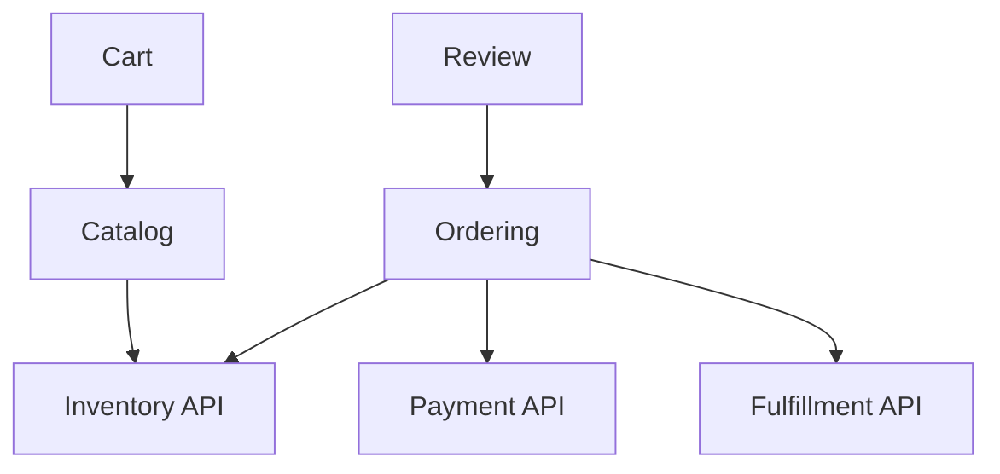
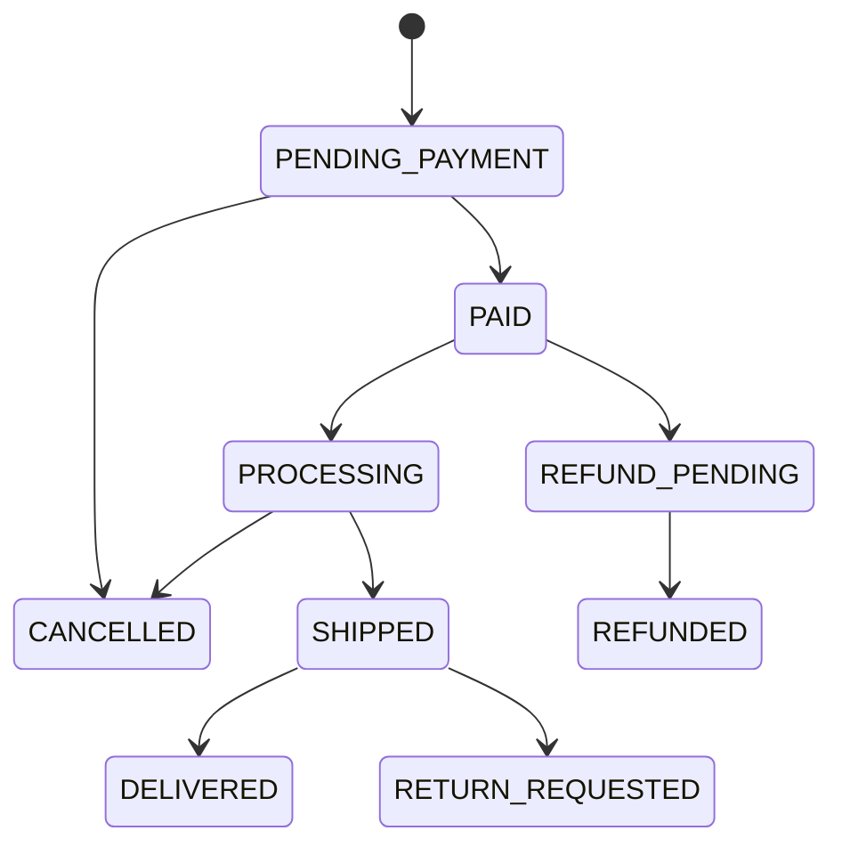

# Blueprint áp dụng cho Phone Store Backend

> [!warning]
> Đây là blueprint kỹ thuật, không tự động là yêu cầu nghiệp vụ cuối cùng. Field, endpoint và state phải đối chiếu SRS/SQL/ADR của dự án trước khi Agent code.

## 1. Module map

| Module | Ownership | Public capability |
|---|---|---|
| identity | User, credential, role/session | authenticate, authorize, account lifecycle |
| catalog | Product, category, brand, specs, images | browse/search/manage catalog |
| inventory | SKU stock, reservation, adjustment | availability, reserve/release/commit |
| cart | Cart, cart item | add/update/remove/merge |
| ordering | Order, order line, status history | place/cancel/query order |
| payment | Payment attempt, provider ref, refund | initiate/capture/reconcile/refund |
| fulfillment | Shipment, tracking, delivery | create shipment/update tracking |
| review | Review, moderation | create/update/moderate review |
| promotion | Coupon/rule/campaign nếu có | price/discount decision |
| audit | Security/business audit | append/query authorized audit |

Admin là actor/capability, không nhất thiết một module sở hữu mọi bảng.

## 2. Dependency direction gợi ý



Đây không phải compile dependency bắt buộc cho mọi arrow; một số reaction nên là event. Tránh `catalog` phụ thuộc `ordering` chỉ để tính số đã bán; dùng query projection/event-derived read model nếu phù hợp.

## 3. Package structure

```text
com.example.phonestore
├── common
│   ├── error
│   ├── web
│   ├── security
│   └── observability
├── catalog
│   ├── api
│   ├── application
│   ├── domain
│   └── infrastructure
├── inventory
├── cart
├── ordering
├── payment
├── fulfillment
├── review
└── PhoneStoreApplication.java
```

`common` không chứa business entity/service. Module internal package không được truy cập trực tiếp.

## 4. Data ownership

- `catalog`: categories, brands, products, product_images, product_specs.
- `inventory`: inventory_items, stock_reservations, inventory_movements.
- `cart`: carts, cart_items.
- `ordering`: orders, order_items, order_status_history.
- `payment`: payments, payment_attempts, refunds, webhook_receipts.
- `fulfillment`: shipments, tracking_events.
- `review`: reviews, review_moderation.
- `identity`: users, roles/permissions, refresh sessions.
- shared technical: outbox_events, consumed_messages, idempotency_records, audit_logs—vẫn phải có owner.

Module khác không update trực tiếp bảng không sở hữu. Reporting read model có thể join/replicate theo ADR nhưng không biến thành write coupling.

## 5. Product và SKU

Điện thoại thường có variant như RAM/storage/color. Nếu mỗi product chỉ có một `sku`, `price`, `stock`, model sẽ khó mở rộng.

Gợi ý:

```text
Product: tên/model/brand/category/description/status
ProductVariant: sku, color, storage, ram, price, status
InventoryItem: variant_id, available, reserved, version
ProductImage: product/variant scope, url, sort_order, primary
Specification: product-level technical spec
```

Chọn mức này chỉ khi requirement có variant. Nếu bài tập đơn giản không có, giữ model nhỏ nhưng ghi migration path.

## 6. Order snapshot

`order_items` phải lưu snapshot:

- product/variant ID để trace;
- SKU;
- display name;
- selected attributes;
- unit price;
- discount/tax nếu có;
- quantity;
- line total.

Không tính lịch sử đơn bằng product price hiện tại.

## 7. Order state machine



State thực tế tùy COD/banking/provider. Mỗi transition cần actor, precondition, side effect, audit và idempotency. Không cho PATCH status tùy ý.

## 8. Place order transaction

Trong một modular monolith/same DB, use case khái quát:

1. Validate cart ownership và selected variant active.
2. Load authoritative current price/promotion policy.
3. Reserve inventory bằng atomic update/lock.
4. Tạo order + snapshot items.
5. Ghi idempotency outcome/outbox event.
6. Commit.
7. Sau commit initiate payment/notification theo workflow.

Không tin price/total từ client. Nếu payment network nằm trong transaction, lock stock/order bị giữ lâu và outcome có thể bất định.

## 9. Inventory reservation

```sql
UPDATE inventory_items
SET available = available - :qty,
    reserved = reserved + :qty,
    version = version + 1
WHERE variant_id = :variantId
  AND available >= :qty;
```

Tạo reservation có expiry/order ID cùng transaction. Worker release reservation hết hạn phải idempotent và không release reservation đã committed/cancelled.

## 10. Payment model

- `Payment` là business lifecycle cho order.
- `PaymentAttempt` là từng lần gọi provider/idempotency key.
- Provider webhook có receipt/event ID unique.
- State như `PENDING`, `SUCCEEDED`, `FAILED`, `UNKNOWN`, `REFUND_PENDING`, `REFUNDED` tùy contract.
- Timeout → `UNKNOWN/PENDING` + reconcile, không auto tạo charge mới.
- Amount/currency/reference/outcome immutable audit fields.

## 11. API surface P0

```text
POST   /api/v1/auth/register
POST   /api/v1/auth/login
POST   /api/v1/auth/refresh
POST   /api/v1/auth/logout

GET    /api/v1/products
GET    /api/v1/products/{productId}
GET    /api/v1/products/{productId}/variants

GET    /api/v1/cart
POST   /api/v1/cart/items
PATCH  /api/v1/cart/items/{itemId}
DELETE /api/v1/cart/items/{itemId}

POST   /api/v1/orders
GET    /api/v1/orders/{orderId}
GET    /api/v1/orders
POST   /api/v1/orders/{orderId}/cancel

POST   /api/v1/payments/{paymentId}/confirm  # chỉ nếu flow yêu cầu
POST   /api/v1/payment-webhooks/{provider}
GET    /api/v1/shipments/{shipmentId}/tracking
```

Create order/payment command dùng `Idempotency-Key`. Webhook xác minh signature, timestamp/replay và provider event ID.

## 12. Admin API boundary

```text
POST/PATCH /api/v1/admin/products...
POST/PATCH /api/v1/admin/variants...
POST        /api/v1/admin/inventory/adjustments
GET/PATCH   /api/v1/admin/orders...
POST        /api/v1/admin/orders/{id}/ship
POST        /api/v1/admin/reviews/{id}/moderate
```

Inventory adjustment là command có reason/reference/audit, không PATCH trực tiếp `stock=...`. Role route check + permission/resource policy.

## 13. Index candidates phải kiểm chứng

```sql
-- Product browse
(category_id, status, created_at, id)
(brand_id, status, created_at, id)

-- Customer order history
(customer_id, created_at DESC, id DESC)

-- Order operations queue
(status, updated_at, id)

-- Cart uniqueness
UNIQUE(cart_id, variant_id)

-- Review uniqueness
UNIQUE(customer_id, product_id)

-- Provider webhook/idempotency
UNIQUE(provider, provider_event_id)
UNIQUE(caller_scope, idempotency_key)

-- Reservation expiry worker
(status, expires_at, id)
```

Đây chỉ là candidates. Phải đối chiếu query, selectivity, order, dataset và `EXPLAIN ANALYZE`.

## 14. Security matrix rút gọn

| Capability | Guest | Customer | Staff | Admin |
|---|---:|---:|---:|---:|
| Browse product | ✓ | ✓ | ✓ | ✓ |
| Own cart/order/review | — | own | Theo nhiệm vụ | Theo policy |
| Adjust inventory | — | — | permission | permission |
| Manage catalog | — | — | permission | permission |
| Manage roles/users | — | — | — | permission đặc biệt |
| View audit/PII | — | own-limited | need-to-know | need-to-know |

Không hiểu bảng này là mọi Admin mặc định xem toàn bộ secret/PII.

## 15. Test portfolio P0

- auth token/refresh/logout/reuse/ban;
- product filter/sort/pagination/query plan;
- cart ownership/merge/duplicate variant;
- concurrent stock reservation;
- create-order idempotency;
- price tampering;
- payment timeout/webhook duplicate/out-of-order;
- order transition authorization;
- transaction rollback;
- MySQL constraints/migration;
- N+1/query count;
- cross-user/cross-role object access;
- structured audit/trace without secret.

## 16. Agent input bundle cho mỗi feature

```text
12-Bo-quy-tac-cho-AI-Agent.md
23-Blueprint-Phone-Store-Backend.md
SRS/acceptance criteria của feature
SQL migrations/schema owner liên quan
OpenAPI/error convention
Existing code + tests trong module
ADR/concurrency/security decision liên quan
```

Không đưa riêng blueprint rồi cho Agent tự bịa business requirement.

## 17. Cache và search/read scaling tùy chọn

- Product detail/list có thể cache nếu freshness cho price/availability được định nghĩa; stock authoritative không lấy từ cache khi đặt hàng.
- Key phải chứa catalog version/filter/sort/page hoặc cursor và tenant/locale nếu response phụ thuộc chúng.
- Invalidate catalog sau commit; TTL jitter và cold-cache protection.
- Search engine/read replica chỉ thêm khi MySQL access plan/SLO chứng minh cần; product update → projection có lag và reconciliation.
- Customer vừa cập nhật/đặt hàng cần read-your-writes từ primary hoặc consistency token phù hợp.

## 18. File/image workflow

- Product image upload dùng session + object key opaque + presigned URL thời hạn ngắn.
- Metadata ở `catalog`, bytes ở object storage; state `INITIATED/SCANNING/AVAILABLE/REJECTED`.
- Chỉ admin/staff có permission được tạo upload session; object không public trước validation/scan/transform.
- Variant thumbnail là derived object versioned; delete product không xóa bytes tức thì nếu retention/audit còn cần.
- Reconciliation xử lý orphan object và upload stuck.

## 19. Deployment profile

- API và consumer có thể là Deployment riêng nếu scale/lifecycle khác, nhưng vẫn cùng modular monolith codebase ở giai đoạn đầu.
- Reservation expiry/reconciliation dùng durable job có operation ID và lease/idempotency, không dựa duy nhất vào một `@Scheduled` in-memory.
- Liveness chỉ phản ánh process unrecoverable; readiness/drain bảo vệ rolling deploy.
- DB migration chạy một controlled job/stage và theo expand-contract.
- Dashboard P0: checkout success/latency, stock conflict, payment unknown, outbox lag, DB pool, Redis hit/eviction, pod restart và version.

## 20. Case study và knowledge graph

- Bản thực hành đầy đủ có SQL, code, event, failure và release: [[45-Case-Study-Phone-Store-at-Scale]].
- Router chọn context cho từng task: [[44-MOC-Mang-luoi-Tu-duy-Backend-Spring-Boot]].
- Các giả định trong case study không thay SRS/ADR/schema thật của dự án.
