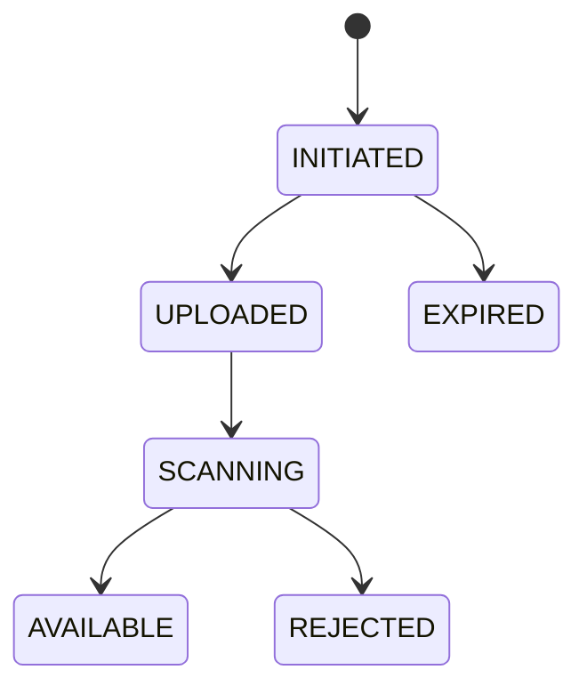

# Object Storage và File Processing an toàn

## 1. Tách metadata và bytes

- Database giữ ownership, state, media type đã xác minh, size, checksum, object key, version và audit.
- Object storage giữ bytes.
- API không lưu binary lớn trong JPA entity mặc định.

Object key là internal identifier ngẫu nhiên/opaque, không dùng nguyên filename của user làm path authority.

## 2. Upload state machine

Chỉ object `AVAILABLE` được phục vụ. Quét/transform thất bại không được tự coi là an toàn.

## 3. Direct upload bằng presigned URL

Flow:

1. client xin upload session với filename/type/size business;
2. backend authorize, tạo object key và record `INITIATED`;
3. backend cấp presigned URL thời hạn ngắn, quyền tối thiểu;
4. client upload trực tiếp;
5. client callback hoặc storage event;
6. backend HEAD/metadata/checksum, scan/transform;
7. chuyển `AVAILABLE`.

Presigned URL là bearer capability; ai có URL có thể dùng trong phạm vi quyền/thời hạn. Không log URL đầy đủ.

## 4. Không tin metadata từ client

Kiểm tra nhiều lớp:

- extension allowlist;
- declared content type;
- magic bytes/file signature;
- parser/decoder an toàn;
- size thật;
- dimensions/page count/uncompressed size;
- malware scan;
- filename normalization chỉ để hiển thị;
- archive recursion/path traversal/zip bomb.

Không có một check đơn lẻ chứng minh file an toàn.

## 5. Authorization

Upload session gắn subject/tenant/resource/purpose. Download phải kiểm tra quyền tại thời điểm cấp URL, không chỉ lúc upload. Public asset cần quyết định publish rõ; private bucket là mặc định.

Object key không phải secret và không thay authorization.

## 6. Presigned URL policy

- TTL ngắn theo operation;
- method/key/content constraints nếu provider hỗ trợ;
- credential ký có quyền tối thiểu;
- không cho overwrite key hiện hữu trừ workflow có version/condition;
- giới hạn size/content checksum;
- HTTPS;
- revoke gián tiếp bằng policy/credential/object state khi cần;
- URL download chỉ cấp cho object `AVAILABLE`.

AWS ghi rõ upload cùng key có thể thay object hiện hữu; vì vậy key unique và immutable là default an toàn.

## 7. Multipart upload

Phù hợp file lớn: parts upload độc lập, retry part thất bại, rồi complete. Cần lưu:

- upload ID;
- part number/ETag/checksum;
- expected size;
- owner/expiry;
- complete/abort state.

Lifecycle cleanup multipart chưa complete để tránh chi phí rác. Complete phải idempotent và verify object cuối.

## 8. Checksum và integrity

Checksum dùng để phát hiện corruption/nhầm object, không phải malware detection. Ghi thuật toán, giá trị expected/actual và scope (part/toàn object). Không mặc định coi ETag là MD5 vì multipart/encryption/provider semantics có thể khác.

## 9. Image/document processing

Worker xử lý trong sandbox/resource limit:

- timeout, CPU/memory/temp disk bounded;
- thư viện parser được vá;
- strip metadata nhạy cảm nếu requirement;
- re-encode image thay vì tin input;
- output key immutable/versioned;
- không shell interpolate filename;
- quarantine input;
- idempotent transformation theo source checksum + profile version.

## 10. Consistency DB–object storage

Không có transaction ACID chung. Dùng state machine và reconciliation:

- DB record có nhưng object thiếu;
- object có nhưng DB record thiếu;
- callback/event duplicate/out-of-order;
- delete DB thành công, delete object thất bại;
- object upload hoàn tất nhưng client không callback.

Periodic reconciler xử lý orphan/stuck record theo retention, không xóa ngay thiếu bằng chứng.

## 11. Delete và retention

Soft delete metadata trước, revoke serving, rồi async delete bytes sau retention. Cân nhắc:

- legal hold;
- object versioning;
- backup;
- derived variants/thumbnails;
- CDN cache purge;
- audit;
- right-to-erasure và dữ liệu dẫn xuất.

Delete phải idempotent và có reconciliation.

## 12. Serving và CDN

- immutable versioned URL cho public asset;
- `Content-Disposition` phù hợp;
- `X-Content-Type-Options: nosniff` khi phục vụ web;
- CSP/sandbox domain riêng cho untrusted content;
- cache-control theo privacy/version;
- Range request/large download policy;
- CDN signed URL/cookie nếu private;
- không phục vụ HTML/SVG upload không tin cậy cùng origin ứng dụng nếu chưa sanitize đúng.

## 13. Encryption và key management

TLS in transit, encryption at rest và key ownership/rotation theo data class. Không lưu access key trong repo. Bucket policy chặn public access ngoài trường hợp đã duyệt; audit access và lifecycle changes.

## 14. Cost/capacity

Theo dõi:

- stored bytes/object count/version count;
- request/egress/CDN cost;
- incomplete multipart;
- temp/quarantine/derived retention;
- upload/download latency/error;
- scan queue age;
- orphan ratio.

Client retry phải có idempotency để không tạo nhiều object rác.

## 15. Tests

- cross-user/tenant download;
- expired/reused presigned URL theo policy;
- filename traversal/double extension;
- MIME mismatch/polyglot;
- huge dimensions/archive bomb;
- malware scanner unavailable;
- multipart duplicate/missing part/abort;
- checksum mismatch;
- object event duplicate/out-of-order;
- orphan reconciliation/delete retry;
- CDN/private cache behavior.

## 16. Checklist production

- Bytes không public trước scan/validation.
- Metadata/source-of-truth/state machine rõ.
- Key opaque/immutable và authorization đầy đủ.
- Presigned URL TTL/quyền/size/checksum bounded.
- Multipart/orphan/derived object có lifecycle.
- Parser worker sandboxed và patched.
- Delete/retention/legal/CDN policy test được.
- Metrics, audit, alert và reconciliation job.

