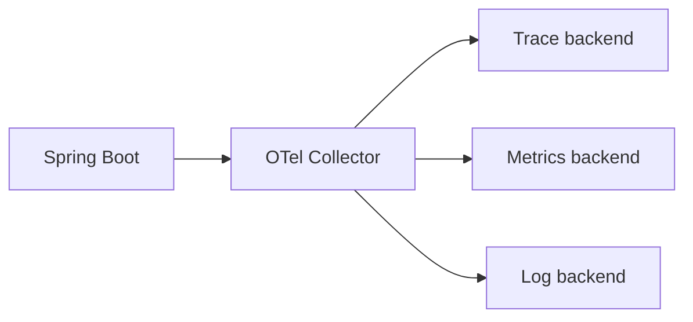

# OpenTelemetry, Micrometer và triển khai Observability

## 1. Observability phục vụ câu hỏi vận hành

Telemetry phải giúp trả lời:

- người dùng đang lỗi gì và ở version nào;
- latency nằm ở app, DB hay downstream;
- impact bao nhiêu tenant/request;
- có mất/duplicate business effect không;
- thay đổi nào gây regression;
- mitigation/rollback có hiệu quả không.

Thu thập nhiều dữ liệu nhưng không điều tra được không phải observability tốt.

## 2. Vai trò công nghệ

- Micrometer Metrics: instrumentation abstraction cho metrics.
- Micrometer Observation: một observation có thể tạo metric/tracing signal qua handlers.
- Micrometer Tracing: facade tích hợp tracing implementation.
- OpenTelemetry: APIs, SDKs, semantic conventions, auto-instrumentation và Collector cho traces/metrics/logs.
- Backend như Prometheus/Tempo/Jaeger/vendor: lưu, query, visualize/alert.

OpenTelemetry không phải observability backend.

## 3. Hai chiến lược instrumentation Java

### Java agent

- triển khai nhanh, auto-instrument thư viện phổ biến;
- phù hợp baseline/fleet consistency;
- phải khóa/test agent version;
- kiểm tra startup/memory/performance;
- custom business spans/attributes vẫn cần code khi cần.

### Application-native

- dùng Spring Boot/Micrometer/OpenTelemetry dependencies;
- kiểm soát code/config/version sâu hơn;
- cần governance để mọi service nhất quán.

Không vô tình bật hai pipeline instrument cùng request tạo duplicate spans/metrics.

## 4. Telemetry architecture



Collector giúp batch, retry, enrich, filter và route. Collector cũng có queue/memory/failure modes, cần HA/capacity/monitoring.

## 5. Resource identity

Mọi signal tối thiểu có:

- service name;
- service version/build commit;
- deployment environment;
- instance/workload identity;
- region/zone/cluster khi có;
- team/domain owner nếu governance cho phép.

Tên service ổn định; không nhét pod ID vào `service.name`.

## 6. Trace design

Tạo span cho boundary có giá trị:

- inbound HTTP/message;
- outbound HTTP/DB/broker;
- business operation dài/quan trọng;
- queue wait/processing;
- external provider call.

Không tạo span cho mọi private method. Span name low-cardinality theo operation/route, không dùng raw URL/order ID.

## 7. Trace context propagation

Propagate format chuẩn qua HTTP và message. Boundary public phải không tin tùy ý baggage từ client:

- giới hạn header size;
- allowlist baggage;
- không truyền secret/PII;
- regenerate/validate correlation metadata;
- preserve context qua async executor/reactive pipeline bằng framework integration.

## 8. Sampling

- Head sampling quyết định sớm, rẻ nhưng có thể bỏ trace hiếm.
- Tail sampling quyết định sau khi thấy trace, cần collector state/resource.
- Error/high-latency sampling phải tránh bias làm metric sai; metrics không lấy từ sampled traces như nguồn duy nhất.

Ghi sampling rate/policy theo service/route; không đặt 100% production mà không tính volume/cost/privacy.

## 9. Metrics design

RED cho request/service:

- Rate;
- Errors;
- Duration.

USE cho resource:

- Utilization;
- Saturation;
- Errors.

Thêm business metrics như orders placed/payment outcomes nhưng phải có định nghĩa source, dedupe và reconciliation; telemetry không thay ledger.

## 10. Cardinality budget

Không dùng các giá trị unbounded làm label/tag:

- user/order/request ID;
- raw URL;
- exception message;
- SQL string có literal;
- filename;
- tenant nếu hàng triệu tenant.

Dùng route template, error class allowlist, operation type và bounded outcome. ID để trong trace/log có retention/access phù hợp.

## 11. Histogram và percentile

Percentile client-side không luôn aggregate được. Histogram buckets cần phù hợp SLO và backend. Chọn boundary quanh latency mục tiêu, theo dõi p50/p95/p99 nhưng alert ưu tiên SLO/error-budget hoặc symptom có action.

Average latency có thể che tail.

## 12. Structured logging

Log fields:

- timestamp/level/service/version/environment;
- traceId/spanId/correlation/operation ID;
- event name;
- safe subject/resource references;
- outcome/error class;
- duration khi hữu ích.

Không log token, password, cookie, presigned URL, full payment/PII. Stack trace một lần ở owner boundary; tránh cùng lỗi bị log ở mọi layer.

## 13. Error taxonomy

Phân loại ổn định:

- validation/business conflict;
- authn/authz;
- dependency timeout/unavailable/rate-limit;
- DB constraint/deadlock/timeout;
- overload/rejection;
- bug/unexpected;
- uncertain external outcome.

Metric tag dùng class bounded; chi tiết exception ở trace/log.

## 14. Manual observation

Instrument custom business operation ở application boundary, không rải timer thủ công. Observation cần:

- stable name;
- low-cardinality key-values cho metrics;
- high-cardinality chỉ cho trace nếu privacy cho phép;
- error recording;
- scope/context đóng đúng;
- test handler/export.

API cụ thể phải kiểm tra đúng Micrometer/Spring Boot BOM.

## 15. Database telemetry

Theo dõi connection acquire, active/idle/pending, query duration/error và slow query ở DB. Không export raw SQL với literal/PII. Trace không thay `EXPLAIN ANALYZE`, performance schema hay lock diagnostics.

## 16. Messaging telemetry

Phân biệt producer send, broker wait và consumer process. Propagate context trong message headers có schema/size policy. Metric:

- publish error/latency;
- consumer lag/queue age;
- processing outcome/duration;
- retry/DLQ/redrive;
- duplicate/reconciliation.

Một message retry có thể có nhiều processing spans cùng operation/message ID.

## 17. SLO và alert

SLO dựa trên user-visible SLI:

- availability đúng semantics;
- latency threshold;
- correctness/freshness khi đo được.

Alert phải có owner, severity, dashboard, runbook và action. Alert symptom trước nguyên nhân; CPU cao không tự là incident nếu user SLO vẫn ổn, nhưng có thể là capacity warning.

## 18. Collector/export failure

Telemetry không được làm request business treo vô hạn. Exporter:

- async/batched;
- queue/memory bounded;
- timeout/retry/backoff;
- drop policy/metric rõ;
- TLS/auth;
- local buffering chỉ khi operationally justified.

Theo dõi dropped spans/metrics/logs, queue saturation và exporter failures.

## 19. Verification

- một request qua gateway–service–DB có trace liên tục;
- async/message context đúng;
- error status/class đúng;
- sampling hoạt động;
- metric labels bounded;
- không có PII/secret;
- dashboard link từ alert;
- rollout version distinguishable;
- collector down không làm app fail;
- load test đo overhead.

## 20. Incident workflow

```text
Alert/SLO -> xác định scope/version -> trace exemplar -> log chi tiết
          -> dependency/resource evidence -> mitigation -> verify SLO
          -> timeline/root cause/follow-up
```

Không bắt đầu bằng tìm chuỗi text ngẫu nhiên trong log khi đã có trace/operation ID.

## 21. Checklist production

- Resource identity/version thống nhất.
- RED/USE/business metrics có định nghĩa.
- Span/label cardinality và privacy được kiểm soát.
- Context qua HTTP/async/message đúng.
- Sampling/retention/cost có policy.
- Collector/export bounded, secure và monitored.
- Alert gắn SLO, owner, dashboard, runbook.
- Telemetry được failure-test và benchmark overhead.

## 22. Kết nối mở rộng

- Capacity/SLO/load evidence: [[40-Performance-Capacity-va-Load-Testing]].
- DNS/TLS/HTTP2/pool signals: [[41-Networking-DNS-TLS-HTTP2-va-Load-Balancing]].
- Kafka/search projection telemetry: [[39-Kafka-Deep-Dive-Partition-Rebalance-EOS]], [[38-Search-Architecture-Elasticsearch-va-Projection]].
- Canary/release verification: [[43-Release-Engineering-GitOps-Feature-Flags-va-Canary]].
- Symptom router: [[44-MOC-Mang-luoi-Tu-duy-Backend-Spring-Boot]].
