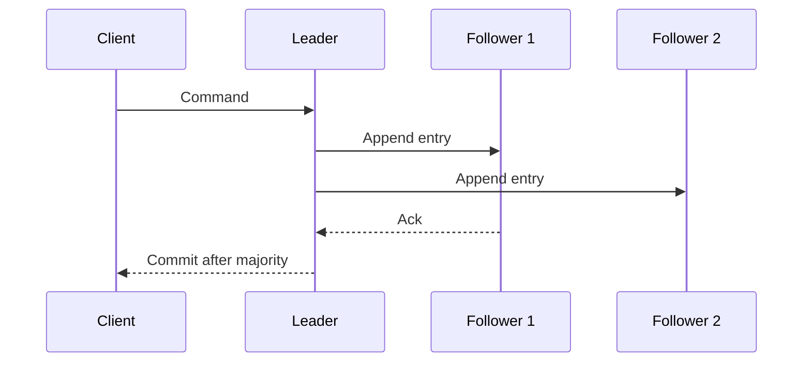

# Nền tảng hệ phân tán — CAP, Consistency, Clock và Consensus

## 1. Mental model đầu tiên: mạng không phải lời gọi hàm

Một lời gọi local thường trả về hoặc ném exception. Một lời gọi qua mạng có thêm trạng thái **không biết**:

```text
Client gửi command
  ├─ server chưa nhận
  ├─ server nhận nhưng chưa xử lý
  ├─ server đã xử lý, response bị mất
  └─ server đang xử lý khi client timeout
```

Vì vậy `timeout` không đồng nghĩa `failed`. Đây là nguồn gốc của:

- duplicate payment/order;
- retry storm;
- trạng thái `UNKNOWN/PENDING`;
- idempotency key;
- reconciliation job;
- outbox/inbox.

Liên quan: [[17-Concurrency-Isolation-va-Idempotency-Nang-cao]], [[21-Distributed-Reliability-va-Resilience4j]], [[31-Background-Jobs-Scheduling-va-Spring-Batch]].

## 2. Failure taxonomy

| Failure | Quan sát từ caller | Điều chưa biết | Thiết kế cần có |
|---|---|---|---|
| Process crash trước xử lý | connection reset/timeout | request đã tới chưa | retry + idempotency |
| Crash sau commit | timeout | effect đã commit chưa | query/reconcile |
| Packet delay | timeout | server chậm hay mạng chậm | deadline, no blind retry |
| Network partition | một vùng không liên lạc | phía kia sống hay chết | consistency/availability policy |
| Clock skew | timestamp “ngược” | thứ tự thật | logical/version ordering |
| Partial dependency failure | một bước lỗi | workflow còn bước nào | saga/state machine |

Không dùng heartbeat để “chứng minh chắc chắn node đã chết”; trong mạng bất đồng bộ, delay và failure có thể không phân biệt được.

## 3. CAP đúng nghĩa

Định lý Gilbert–Lynch mô hình hóa:

- **Consistency:** linearizable/atomic register; read sau write đã hoàn tất phải thấy write đó hoặc mới hơn.
- **Availability:** mọi request đến node không hỏng cuối cùng nhận response.
- **Partition tolerance:** hệ thống phải hoạt động dù message giữa các phần mạng bị mất.

Khi partition xảy ra, hệ thống không thể đồng thời duy trì cả linearizability và availability theo định nghĩa trên.

> [!warning] Hiểu sai phổ biến
> CAP không nói “mỗi database chọn hai chữ trong ba chữ ở mọi thời điểm”. Khi mạng bình thường, latency/consistency vẫn có nhiều đánh đổi; khi partition, từng operation/data class có thể chọn fail/đợi hoặc trả dữ liệu có thể stale.

## 4. CAP áp dụng theo nghiệp vụ

| Dữ liệu/operation | Khi partition | Lý do |
|---|---|---|
| Trừ tồn kho cuối cùng | từ chối/đợi authority | oversell là correctness error |
| Xác nhận thanh toán | `PENDING/UNKNOWN` + reconcile | không được báo thất bại giả rồi charge lại |
| Product description | có thể trả cache stale có TTL | availability quan trọng hơn freshness tức thời |
| Feature recommendation | có thể bỏ/degrade | không phải critical path |
| Revoked credential | ưu tiên consistency | stale authorization là security risk |

Quyết định phải đặt tại **business operation**, không gắn nhãn chung “hệ thống CP/AP”.

## 5. Consistency models

| Model | Guarantee trực giác | Chi phí/giới hạn |
|---|---|---|
| Linearizability | operation như xảy ra tại một thời điểm giữa invoke/response | coordination/latency/availability khi partition |
| Sequential consistency | mọi process thấy cùng một order, không bắt buộc real-time | vẫn cần order toàn cục |
| Causal consistency | nguyên nhân được thấy trước kết quả | concurrent writes có thể khác order |
| Read-your-writes | client thấy write của chính mình | cần session/token/routing |
| Monotonic reads | client không “quay lại quá khứ” | pin/session/version tracking |
| Eventual consistency | nếu ngừng update, replicas cuối cùng hội tụ | không nêu bao lâu hoặc đọc gì trong lúc chưa hội tụ |

`Eventual consistency` không phải thiết kế hoàn chỉnh. Phải bổ sung:

- freshness bound/SLO;
- conflict resolution;
- duplicate/out-of-order;
- read-your-writes;
- repair/reconciliation;
- behavior khi không hội tụ.

## 6. ACID isolation khác distributed consistency

- Serializable: nhiều transaction tạo kết quả như chạy tuần tự.
- Linearizable: từng operation tôn trọng thứ tự real-time.

Một database có thể serializable nhưng client đọc replica stale nên không linearizable trên toàn topology. Không dùng hai thuật ngữ thay nhau.

Liên quan: [[07-JPA-Hibernate-va-Transaction]], [[17-Concurrency-Isolation-va-Idempotency-Nang-cao]], [[28-MySQL-Replication-Backup-va-Scaling]].

## 7. Physical clock không phải thứ tự tuyệt đối

Clock có:

- offset/skew giữa node;
- drift theo thời gian;
- NTP adjustment;
- leap/timezone/DST ở presentation layer;
- VM pause;
- timestamp cùng độ phân giải.

Không dùng `created_at` đơn độc để:

- quyết định event nào “mới hơn” cho correctness;
- tạo distributed lock fencing;
- sinh global order;
- loại duplicate;
- xác minh JWT nếu clock skew policy chưa rõ.

## 8. Lamport clock

Quy tắc khái quát:

1. local event: tăng counter;
2. gửi message: gửi counter;
3. nhận: `clock = max(local, received) + 1`.

Nếu A happens-before B thì `L(A) < L(B)`. Chiều ngược không đúng: số nhỏ hơn không chứng minh quan hệ nhân quả.

Ví dụ:

```text
OrderPlaced L=41
  -> StockReserved L=57
  -> PaymentRequested L=63
```

Lamport clock tạo order phù hợp causality nhưng không phát hiện hai event thật sự concurrent.

## 9. Vector clock và version

Vector clock có thể phân biệt:

- A trước B;
- B trước A;
- A và B concurrent.

Đổi lại metadata tăng theo số participant và conflict resolution phức tạp. Trong backend business thông thường, aggregate version/sequence từ một authority thường đơn giản hơn.

```json
{
  "aggregateId": "order-42",
  "aggregateVersion": 7,
  "eventType": "OrderPaid"
}
```

Consumer:

- version = expected → apply;
- version < expected → duplicate/old;
- version > expected → gap, pause/reload/reconcile.

## 10. Quorum trực giác

Với `N` replicas, write quorum `W`, read quorum `R`, điều kiện `R + W > N` tạo giao nhau giữa read và write quorum trong mô hình nhất định.

Ví dụ `N=3, W=2, R=2`.

> [!warning]
> Công thức giao nhau không tự bảo đảm linearizability. Còn phụ thuộc leader/versioning, concurrent writes, sloppy quorum, clock, failure recovery, read repair và implementation thật.

Không tự xây distributed database chỉ từ công thức quorum.

## 11. Consensus giải quyết gì

Consensus giúp nhiều node thống nhất một sequence/value dù có một số failure. Raft chia:

- leader election;
- log replication;
- safety;
- membership change.

Consensus phù hợp cho:

- cluster metadata;
- leader/lease authority;
- replicated state machine;
- configuration/control plane.

Không chạy consensus cho mọi product view nếu cache/eventual projection đủ tốt.

## 12. Raft mental model



Leader response semantics phải xem đúng implementation: khi nào entry được commit, applied và durable. Client vẫn cần request ID vì response có thể mất sau commit.

## 13. Leader, lease và fencing

Lease dựa trên thời gian có thể hết hạn khi holder bị pause nhưng vẫn tiếp tục chạy. Fencing token tăng đơn điệu làm downstream từ chối stale holder:

```sql
UPDATE inventory
SET reserved = reserved + :qty,
    last_fence = :token
WHERE sku = :sku
  AND :token > last_fence;
```

Lock/leader election không thay idempotency; fencing không thay transaction invariant.

Liên quan: [[27-Redis-Cache-Data-Structures-va-Distributed-Lock]].

## 14. Split brain

Hai node cùng tin mình là leader có thể tạo divergent writes. Phòng vệ:

- majority quorum;
- epoch/term;
- fencing;
- single write authority;
- reject stale term;
- operator/runbook không “force promote” hai phía;
- test network partition, không chỉ node kill.

## 15. Conflict resolution

| Strategy | Dùng khi | Rủi ro |
|---|---|---|
| Last-write-wins | data không critical, clock/version authority đáng tin | mất update âm thầm |
| Merge set/CRDT | operation merge được về toán học | domain phức tạp, metadata |
| Single owner | invariant quan trọng | availability/latency |
| Manual resolution | conflict hiếm nhưng giá trị cao | operational cost |
| Reject concurrent write | user có thể retry/rebase | UX/conflict handling |

Không dùng timestamp LWW cho money/stock.

## 16. Ví dụ: đặt hàng trong partition

Yêu cầu: không bán âm stock.

Phương án A — mỗi region tự trừ:

```text
VN sees 1 item -> sell 1
SG sees 1 item -> sell 1
partition heals -> total sold 2, stock was 1
```

Phương án B — home region authority:

- non-home region forward;
- partition → command chờ/fail explicit;
- catalog vẫn đọc local cache;
- checkout degraded, correctness giữ.

Phương án C — escrow/pre-allocated quota:

- chia 100 stock: VN 60, SG 40;
- mỗi region bán trong quota local;
- chuyển quota cần coordination;
- tăng availability nhưng thêm planning/rebalancing.

## 17. Decision record cho distributed state

```markdown
Data/operation:
Authority:
Consistency model:
Partition behavior:
Read-your-writes:
Conflict rule:
Idempotency key/scope:
Clock/version source:
Recovery/reconciliation:
SLO/freshness:
Evidence/test:
```

## 18. Failure tests

- drop traffic một chiều/hai chiều;
- delay/reorder/duplicate packet/message;
- leader pause dài hơn lease;
- response loss sau commit;
- replica lag;
- clock skew;
- concurrent write từ hai region;
- restart trong replay/reconciliation;
- stale DNS/connection;
- retry từ nhiều layers.

Assert business invariant, không chỉ HTTP status.

## 19. Liên kết tư duy

| Quan hệ | Ghi chú |
|---|---|
| Học trước | [[02-Nen-tang-Backend]], [[17-Concurrency-Isolation-va-Idempotency-Nang-cao]] |
| Áp dụng cùng | [[18-Event-Driven-Outbox-va-Kafka]], [[28-MySQL-Replication-Backup-va-Scaling]], [[29-Microservices-API-Gateway-va-Service-Communication]] |
| Cơ chế bảo vệ | [[21-Distributed-Reliability-va-Resilience4j]], [[27-Redis-Cache-Data-Structures-va-Distributed-Lock]] |
| Kiểm chứng bằng | [[22-Test-Engineering-Nang-cao]], [[24-Production-Troubleshooting-Playbook]], [[34-OpenTelemetry-Micrometer-va-Observability-Implementation]] |
| Ví dụ xuyên suốt | [[45-Case-Study-Phone-Store-at-Scale]] |

