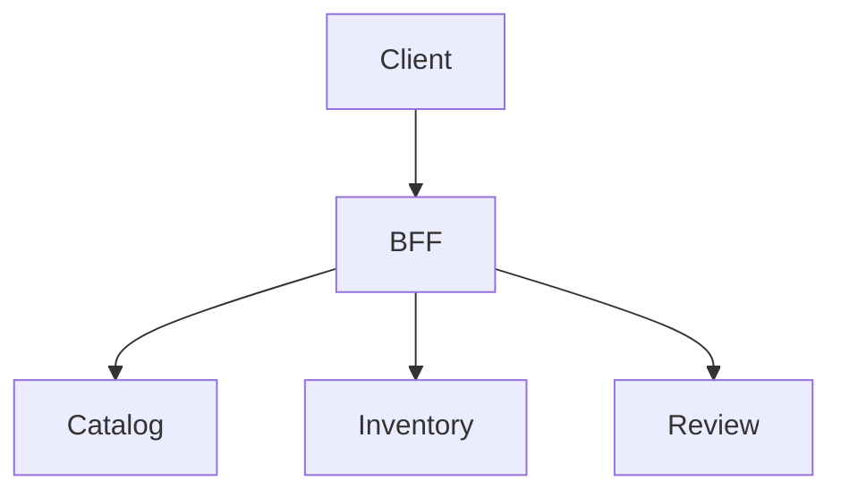

# So sánh REST, gRPC, GraphQL, Webhooks và AsyncAPI

## 1. Chọn protocol từ interaction, không từ sở thích

| Kiểu | Mạnh nhất khi | Điểm yếu chính |
|---|---|---|
| REST/HTTP JSON | public CRUD/resource API, cache/tooling rộng | over/under-fetch ở composite UI; schema discipline tùy OpenAPI |
| gRPC | internal typed RPC, low-latency, streaming | browser/public interoperability và debugging thủ công |
| GraphQL | client cần chọn graph dữ liệu linh hoạt | query cost, authorization, N+1, caching/observability |
| Webhook | provider chủ động thông báo consumer | delivery/retry/signature/replay/endpoint lifecycle |
| Broker + AsyncAPI | durable async event/command | eventual consistency, broker operations, replay/schema |

Một hệ thống có thể dùng nhiều kiểu ở các boundary khác nhau. Không tạo một “protocol chuẩn duy nhất” cho mọi use case.

## 2. REST là semantic HTTP, không chỉ JSON

Thiết kế dựa trên:

- resource identity;
- method semantics;
- status code;
- representation;
- conditional request/cache;
- idempotency;
- link/pagination;
- Problem Details.

```http
PATCH /api/v1/orders/42
If-Match: "version-7"
Content-Type: application/merge-patch+json

{"shippingAddressId": "addr-9"}
```

Server trả `412 Precondition Failed` nếu version đổi. Đây là optimistic concurrency qua HTTP, liên quan [[17-Concurrency-Isolation-va-Idempotency-Nang-cao]].

## 3. REST command không cần giả CRUD

Business action có thể là sub-resource/command rõ:

```http
POST /api/v1/orders/42/cancellations
Idempotency-Key: 01K...
```

Tốt hơn:

```http
PATCH /api/v1/orders/42
{"status":"CANCELLED"}
```

vì endpoint đầu biểu diễn actor, validation, transition, idempotency và audit.

## 4. gRPC core model

gRPC định nghĩa service/method bằng Protocol Buffers và hỗ trợ:

- unary;
- server streaming;
- client streaming;
- bidirectional streaming;
- deadlines/cancellation;
- metadata/status.

```proto
syntax = "proto3";
package inventory.v1;

service InventoryService {
  rpc Reserve(ReserveRequest) returns (ReserveResponse);
}

message ReserveRequest {
  string operation_id = 1;
  string sku = 2;
  int32 quantity = 3;
}

message ReserveResponse {
  string reservation_id = 1;
  int64 inventory_version = 2;
}
```

Không tái sử dụng field number đã xóa; reserve chúng. Compatibility phải test producer/consumer qua version.

## 5. gRPC deadline và retry

Deadline phải truyền theo call chain. Server nên dừng work không còn giá trị khi cancellation đến, nhưng cancellation không rollback external side effect đã commit.

Retry:

- chỉ với status/transient allowlist;
- operation idempotent;
- retry policy đúng client/runtime version;
- overall deadline;
- retry budget;
- không retry ở mọi hop.

Liên quan [[21-Distributed-Reliability-va-Resilience4j]], [[35-Nen-tang-He-phan-tan-CAP-Clock-Consensus]].

## 6. gRPC load balancing và streaming

HTTP/2 connection dài có thể pin traffic vào ít backend nếu load balancer chỉ cân bằng connection. Cần hiểu:

- client-side vs proxy load balancing;
- DNS/service discovery;
- connection age/drain;
- stream concurrency;
- backpressure/buffer;
- health/readiness;
- observability theo method/status.

Streaming không phù hợp nếu consumer chậm mà không có bounded buffer/cancellation.

## 7. GraphQL mental model

Client gửi document chọn field:

```graphql
query ProductPage($id: ID!) {
  product(id: $id) {
    id
    name
    variants {
      sku
      price { amount currency }
      availability
    }
  }
}
```

Server có typed schema/resolvers. GraphQL giải quyết shape/fetch flexibility, không tự giải quyết data ownership, transaction hoặc N+1.

## 8. GraphQL N+1 và batching

Sai:

```text
1 query products
N query variants
N query inventory
```

Biện pháp:

- DataLoader/batch by keys;
- query projection;
- resolver boundary;
- cache per request;
- query-count integration test;
- field-level latency trace.

Không mở persistence session/lazy load tùy ý qua toàn resolver graph.

## 9. GraphQL security và cost

Authentication ở request; authorization phải ở field/resource/domain boundary.

Guardrail:

- depth/complexity/cost limit;
- max aliases/list/page size;
- persisted/allowlisted operations nếu phù hợp;
- timeout;
- introspection policy;
- rate limit theo cost, không chỉ request count;
- redact query variables;
- prevent batching abuse;
- schema deprecation governance.

Một request GraphQL có thể tốn gấp hàng nghìn lần request khác; QPS đơn thuần không đo capacity tốt.

## 10. GraphQL error semantics

GraphQL có thể trả data một phần kèm errors. Client/server phải quyết định:

- field nào nullable;
- partial data có dùng được không;
- business error biểu diễn bằng union/result hay error;
- HTTP transport status;
- retry có lặp mutation không;
- correlation/trace.

Không biến mọi lỗi thành HTTP 200 rồi mất observability/SLO semantics.

## 11. Webhook delivery model

Provider gửi HTTP request đến consumer khi event xảy ra:

```json
{
  "id": "evt_01K...",
  "type": "payment.succeeded",
  "createdAt": "2026-07-23T09:15:00Z",
  "data": {"paymentId": "pay_42", "orderId": "ord_9"}
}
```

Consumer:

1. đọc raw body có size limit;
2. xác minh signature + timestamp;
3. check replay window/event ID;
4. persist receipt/inbox;
5. trả nhanh;
6. xử lý async idempotent;
7. reconcile với provider.

## 12. Webhook signature

Mẫu canonical thường ký timestamp + delimiter + raw payload:

```text
signed = timestamp + "." + rawBody
expected = HMAC-SHA256(secret, signed)
```

Yêu cầu:

- constant-time compare;
- raw bytes, không serialize lại JSON;
- multiple active secrets trong rotation;
- timestamp tolerance;
- HTTPS;
- secret per endpoint/tenant nếu phù hợp;
- không log signature/secret/full payload nhạy cảm.

Định dạng chính xác phải theo provider/spec, không tự suy diễn.

## 13. Webhook retry và ordering

Provider có thể:

- gửi duplicate;
- gửi trễ;
- gửi out-of-order;
- retry nhiều ngày;
- ngừng endpoint sau nhiều lỗi;
- nhận 2xx nhưng consumer crash sau đó.

Do đó event ID unique + state machine/version + reconciliation quan trọng hơn “webhook chỉ gửi một lần”.

## 14. Broker event và AsyncAPI

AsyncAPI mô tả channel, operation, message, payload, security và binding cho event-driven API.

```yaml
channels:
  orderPlaced:
    address: commerce.orders.v1
    messages:
      OrderPlaced:
        payload:
          type: object
          required: [eventId, orderId, occurredAt]
```

Contract cần:

- event owner và meaning;
- partition/ordering key;
- delivery/replay;
- schema compatibility;
- PII/retention;
- retry/DLQ;
- consumer expectations.

Xem [[18-Event-Driven-Outbox-va-Kafka]], [[39-Kafka-Deep-Dive-Partition-Rebalance-EOS]].

## 15. Webhook so với broker

| Câu hỏi | Webhook | Broker |
|---|---|---|
| Consumer ngoài tổ chức | phù hợp | khó cấp broker access |
| Durable replay | provider-specific | thường mạnh hơn |
| Consumer tự điều tiết | endpoint + retry | offsets/pull/group |
| Fan-out | provider quản lý endpoints | topic/subscriptions |
| Network | public/private HTTP | broker connectivity |
| Schema/binding | HTTP payload | broker + AsyncAPI/schema |

## 16. REST vs GraphQL cho Phone Store

REST phù hợp:

- checkout/order/payment command;
- stable mobile/public endpoints;
- HTTP cache product asset;
- error/idempotency rõ.

GraphQL có thể phù hợp:

- product detail UI cần nhiều shape;
- admin dashboard composite read;
- BFF layer.

Không dùng GraphQL mutation để che một business command không có idempotency/concurrency.

## 17. API composition

Gateway/BFF gọi nhiều service:



Phải định nghĩa:

- deadline từng nhánh;
- concurrency/fan-out cap;
- mandatory vs optional;
- partial result;
- stale cache;
- cancellation;
- trace;
- fallback semantics.

Liên quan [[29-Microservices-API-Gateway-va-Service-Communication]], [[40-Performance-Capacity-va-Load-Testing]].

## 18. Contract evolution comparison

| Style | Safe change thường gặp | Breaking change thường gặp |
|---|---|---|
| REST/OpenAPI | thêm optional response field | đổi meaning/type, xóa field |
| Protobuf | thêm field number mới | reuse field number, đổi incompatible type |
| GraphQL | thêm field/type | xóa/đổi field đang dùng |
| Event/AsyncAPI | additive optional field | đổi semantic trong cùng event version |
| Webhook | additive payload | signature/canonicalization thay không overlap |

Deploy consumer hiểu mới trước producer phát mới.

## 19. Testing matrix

- schema lint/compatibility;
- provider/consumer contract;
- authn/authz/ownership;
- pagination/depth/cost;
- deadline/cancellation;
- duplicate/idempotency;
- mixed-version deployment;
- malformed/unknown field;
- streaming slow consumer;
- webhook signature/replay/rotation;
- trace propagation;
- load theo operation cost.

## 20. Decision record

```markdown
Boundary/consumers:
Interaction: query/command/event/stream
Latency/throughput:
Schema evolution:
Browser/external constraints:
Delivery/ordering:
Security:
Failure/partial result:
Observability:
Chosen style and rejected alternatives:
```

## 21. Liên kết tư duy

| Quan hệ | Ghi chú |
|---|---|
| Nền tảng | [[05-Chuan-REST-API]], [[35-Nen-tang-He-phan-tan-CAP-Clock-Consensus]] |
| Security | [[08-Spring-Security-va-API-Security]], [[19-OAuth2-OIDC-va-Token-Security-Nang-cao]] |
| Gateway | [[29-Microservices-API-Gateway-va-Service-Communication]] |
| Async | [[18-Event-Driven-Outbox-va-Kafka]], [[39-Kafka-Deep-Dive-Partition-Rebalance-EOS]] |
| Performance | [[21-Distributed-Reliability-va-Resilience4j]], [[40-Performance-Capacity-va-Load-Testing]] |
| Case study | [[45-Case-Study-Phone-Store-at-Scale]] |

