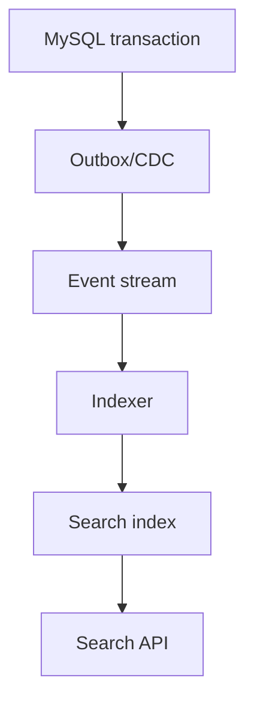

# Search Architecture, Elasticsearch và Projection

## 1. Không thêm search engine trước khi định nghĩa search

Phải biết:

- fields searchable/filterable/sortable;
- language/tokenization;
- exact vs full-text;
- typo/synonym/stemming;
- ranking goals;
- facets/aggregation;
- result freshness;
- max latency/QPS;
- tenant/security filtering;
- index size/growth;
- rebuild/recovery.

`GET /products?q=phone` chưa phải search specification.

## 2. So sánh lựa chọn

| Lựa chọn | Dùng khi | Giới hạn |
|---|---|---|
| MySQL indexed exact/range | filter/sort có cấu trúc | full-text/ranking hạn chế |
| MySQL `LIKE 'prefix%'` | prefix đơn giản có index phù hợp | leading wildcard thường khó dùng index |
| MySQL FULLTEXT | full-text vừa phải, hạ tầng nhỏ | analyzer/ranking/facet/tooling ít linh hoạt hơn |
| Elasticsearch/OpenSearch | relevance, analyzer, facet, scale search | projection lag, cluster/ops/reindex |
| External managed search | giảm vận hành | cost/vendor/contract/data governance |

Đo query/SLO trước. Search engine là một distributed stateful system, không chỉ dependency Java.

## 3. Source of truth và projection

MySQL giữ product/price/status authoritative; search index là read projection có thể rebuild.



Phải định nghĩa:

- event → document transform;
- version/order;
- delete/tombstone;
- replay/rebuild;
- lag SLO;
- mismatch reconciliation;
- cutover alias.

Liên quan [[18-Event-Driven-Outbox-va-Kafka]], [[39-Kafka-Deep-Dive-Partition-Rebalance-EOS]].

## 4. Document design

Search document được denormalize theo query:

```json
{
  "productId": "p_42",
  "version": 19,
  "tenantId": "t_1",
  "name": "Điện thoại Nova X",
  "brand": {"id":"b_9","name":"Nova"},
  "categoryIds": ["c_phone"],
  "variants": [
    {"sku":"NX-BLK-256","color":"black","storageGb":256,"price":24990000}
  ],
  "minPrice": 24990000,
  "inStock": true,
  "status": "ACTIVE",
  "updatedAt": "2026-07-23T08:00:00Z"
}
```

Không copy toàn entity graph. Chỉ index field phục vụ search/result/security và có owner.

## 5. Mapping explicit

```json
{
  "mappings": {
    "dynamic": "strict",
    "properties": {
      "productId": {"type": "keyword"},
      "tenantId": {"type": "keyword"},
      "name": {
        "type": "text",
        "fields": {"raw": {"type": "keyword", "ignore_above": 256}}
      },
      "minPrice": {"type": "long"},
      "inStock": {"type": "boolean"},
      "updatedAt": {"type": "date"}
    }
  }
}
```

- `text` cho analyzed full-text.
- `keyword` cho exact/filter/sort/aggregation.
- numeric/date đúng type.
- `nested` khi cần giữ quan hệ giữa phần tử object array; nested có cost.
- dynamic field không bounded có thể gây mapping explosion.

Field type khó đổi tại chỗ; thường phải index mới + reindex/cutover.

## 6. Analyzer

Analyzer gồm character filters, tokenizer, token filters. Index analyzer và search analyzer phải tương thích với query semantics.

Ví dụ cần quyết định:

- lowercase/diacritic folding;
- Vietnamese tokenization;
- product model `S24+`;
- SKU exact;
- synonym một/hai chiều;
- stop words;
- edge n-gram cho autocomplete.

Không áp synonym/stemming chung cho SKU, tên model và prose description.

## 7. Test analyzer trước dữ liệu thật

Tập golden:

```text
"điện thoại" -> điện, thoại?
"iPhone 15 Pro Max" -> iphone, 15, pro, max
"NX-BLK-256" -> giữ exact SKU
"ốp lưng" / "case" -> synonym theo product language
```

Kiểm tra token output và relevance regression khi thay analyzer.

## 8. Query context và filter context

Elasticsearch:

- query context tính `_score`;
- filter context yes/no, không tính score và có thể cache.

```json
{
  "query": {
    "bool": {
      "must": [
        {"multi_match": {
          "query": "điện thoại nova",
          "fields": ["name^3", "brand.name^2", "description"]
        }}
      ],
      "filter": [
        {"term": {"tenantId": "t_1"}},
        {"term": {"status": "ACTIVE"}},
        {"range": {"minPrice": {"lte": 30000000}}}
      ]
    }
  }
}
```

Tenant/status/price không nên ảnh hưởng relevance score.

## 9. Ranking

Relevance có thể kết hợp:

- lexical score;
- field boost;
- popularity;
- freshness;
- inventory/business rule;
- personalization.

Guardrail:

- không đẩy sponsored item mà không label;
- popularity không khóa sản phẩm mới mãi;
- stock/permission là filter, không chỉ boost;
- ranking feature có normalization/bound;
- explain/debug chỉ bật có kiểm soát.

## 10. Relevance evaluation

Golden judgments:

```text
Query: "điện thoại chụp đêm"
Relevant:
  p_7: 3 (highly relevant)
  p_2: 2
  p_9: 0
```

Đo:

- precision@k;
- recall@k;
- MRR/NDCG khi phù hợp;
- zero-result rate;
- reformulation/click/conversion có bias;
- latency/cost.

Online click không tự là ground truth; position bias và promotion ảnh hưởng.

## 11. Pagination

Deep `from/size` tốn tài nguyên và kết quả có thể đổi khi index refresh. Với pagination sâu:

- deterministic sort;
- `search_after`;
- point-in-time nếu cần snapshot tương đối ổn định;
- opaque cursor chứa sort values/PIT info;
- TTL/max pages;
- không cho client sửa cursor.

```json
{
  "size": 20,
  "sort": [
    {"_score": "desc"},
    {"productId": "asc"}
  ],
  "search_after": [12.781, "p_42"]
}
```

Tie-breaker unique là bắt buộc cho deterministic traversal.

## 12. Near-real-time và freshness

Indexed document không nhất thiết searchable ngay lập tức; refresh policy ảnh hưởng indexing throughput và freshness. Không ép refresh mỗi write trên hot path.

Product admin “save rồi search ngay” có thể:

- đọc authoritative DB cho confirmation;
- hiển thị indexing state;
- poll theo projection version;
- dùng bounded refresh cho rare admin operation sau benchmark.

## 13. Idempotent indexer

Mỗi event có aggregate version:

```text
index product p_42 if incoming_version > stored_version
```

Out-of-order old event không được ghi đè document mới. Delete dùng tombstone/version để old update không hồi sinh document.

## 14. Full rebuild

Procedure:

1. tạo index `products-v20260723` với mapping/settings;
2. snapshot source cutoff;
3. bulk backfill bằng keyset;
4. consume changes sau cutoff;
5. compare counts/samples/checksum/business queries;
6. atomic alias switch;
7. monitor/rollback alias;
8. giữ index cũ theo retention rồi xóa.

Dual-write app trực tiếp vào hai index dễ divergence; event log/replay thường kiểm soát tốt hơn.

## 15. Shards và replicas

Primary shard count ảnh hưởng distribution/parallelism và thường cố định lúc tạo index. Replica tăng redundancy/read capacity nhưng tốn storage/indexing work.

Không “mỗi tenant một index” nếu có hàng chục nghìn tenant nhỏ: shard/index overhead có thể áp đảo data. Chọn shared index + tenant filter hoặc tiering/hybrid theo isolation/size.

Shard sizing phải dựa trên:

- data volume/growth;
- query fan-out;
- node heap/disk;
- recovery time;
- indexing/search concurrency;
- failure domain.

## 16. Multi-tenant security

- server luôn thêm tenant filter;
- không nhận raw Query DSL từ untrusted client;
- field allowlist;
- source filtering/redaction;
- per-tenant cost/rate;
- index/cluster credential least privilege;
- audit admin/cross-tenant search;
- query timeout/max buckets/result window.

Filter tenant trong UI không phải authorization.

## 17. Search abuse

Rủi ro:

- wildcard/regex nặng;
- huge aggregation cardinality;
- deep pagination;
- scripted query;
- highlight lớn;
- massive multi-search;
- unbounded autocomplete;
- query exposing hidden fields.

API layer chuyển filter allowlisted thành DSL bounded; không proxy DSL tùy ý.

## 18. Failure behavior

Khi search down:

| Use case | Fallback |
|---|---|
| Product browse | DB fallback giới hạn hoặc cached popular list nếu contract cho phép |
| Exact SKU admin | query DB authoritative |
| Checkout validation | luôn DB/domain authority |
| Recommendation | bỏ component/degrade |

Không trả “không có sản phẩm” khi search outage; empty result và system error có meaning khác.

## 19. Observability

- search latency/error/timeout theo operation;
- query cost/fan-out;
- indexing throughput/failure/retry;
- projection lag/oldest event;
- rejected requests/thread pool;
- shard health/recovery;
- disk/heap/GC;
- cache hit;
- zero result/relevance metrics;
- version mismatch/reconciliation.

Không log raw query chứa PII nếu không có policy.

## 20. Testing

- analyzer golden tokens;
- relevance judgments;
- tenant isolation;
- stale/out-of-order/delete resurrection;
- rebuild + alias rollback;
- deep cursor consistency;
- expensive query limits;
- search outage fallback;
- load search/index đồng thời;
- snapshot/restore;
- mapping compatibility.

## 21. Liên kết tư duy

| Quan hệ | Ghi chú |
|---|---|
| Data source | [[37-Data-Modeling-Multi-Tenancy-Temporal-va-Audit]] |
| Event projection | [[18-Event-Driven-Outbox-va-Kafka]], [[39-Kafka-Deep-Dive-Partition-Rebalance-EOS]] |
| API | [[05-Chuan-REST-API]], [[36-So-sanh-REST-gRPC-GraphQL-Webhooks-va-AsyncAPI]] |
| Capacity | [[21-Distributed-Reliability-va-Resilience4j]], [[40-Performance-Capacity-va-Load-Testing]] |
| Operations | [[24-Production-Troubleshooting-Playbook]], [[34-OpenTelemetry-Micrometer-va-Observability-Implementation]] |
| Case study | [[45-Case-Study-Phone-Store-at-Scale]] |

