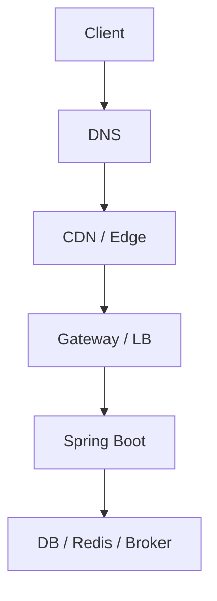

# Networking — DNS, TLS, HTTP/2 và Load Balancing

## 1. Request path thực tế



Mỗi cạnh có:

- resolution;
- connect;
- TLS;
- connection pool;
- queue;
- timeout;
- retry;
- identity;
- observability.

“Service chậm” có thể do bất kỳ đoạn nào.

## 2. DNS mental model

DNS là hệ thống phân cấp, cached và eventual. Client thường đi qua:

```text
application/JVM cache
-> OS resolver
-> recursive resolver
-> authoritative servers
```

TTL không bảo đảm mọi cache đổi đúng một thời điểm. Negative answers cũng có thể cache. DNS record mới không khiến connection đang mở tự chuyển target.

## 3. DNS failure modes

- NXDOMAIN do rollout/config;
- stale IP sau instance/service thay;
- resolver timeout;
- partial region answer;
- JVM/client cache quá lâu;
- search domain tạo query bất ngờ;
- pod DNS overload;
- split-horizon khác môi trường;
- thundering herd khi cache hết hạn.

Client cần connection lifetime/re-resolution phù hợp; không resolve một lần lúc startup rồi giữ vô hạn nếu topology động.

## 4. DNS debug

Read-only evidence:

```bash
dig +trace api.example.com
dig api.example.com A
dig api.example.com AAAA
getent hosts api.example.com
```

Ghi:

- resolver đang dùng;
- answer/TTL;
- A/AAAA/CNAME;
- khác biệt trong pod/node/local;
- timestamp;
- connection đang reuse hay resolve mới.

Không sửa DNS trước khi xác định authoritative owner và propagation/rollback.

## 5. TCP connection

Chi phí:

- three-way handshake;
- TLS handshake;
- socket/file descriptor;
- kernel buffer;
- server connection state;
- health check/keepalive.

Connection reuse giảm handshake nhưng có thể:

- pin load vào backend cũ;
- giữ credential/cert/session lâu;
- gặp stale connection;
- tạo uneven balancing;
- che DNS update.

## 6. Connection pool

Mỗi downstream client có:

```markdown
Max total/per-host:
Acquire timeout:
Connect timeout:
Read/response timeout:
Idle timeout:
Max lifetime:
Validation/retry:
TLS config:
Metrics:
Shutdown/drain:
```

Pool wait phải nằm trong deadline. Pool lớn hơn downstream capacity chỉ chuyển queue vào dependency.

## 7. TIME_WAIT và port exhaustion

Tạo connection mới mỗi request gây:

- handshake CPU;
- ephemeral port pressure;
- TIME_WAIT;
- load balancer/NAT state;
- latency.

Ưu tiên pooled keep-alive, nhưng đặt lifetime/idle phù hợp topology. Không “fix” bằng sysctl nguy hiểm trước khi sửa connection churn.

## 8. TLS 1.3 mental model

TLS cung cấp confidentiality, integrity và peer authentication theo credential/trust config. Cần quản:

- certificate chain;
- hostname/SAN verification;
- trust store;
- expiry/rotation;
- cipher/protocol;
- SNI/ALPN;
- client certificate nếu mTLS;
- private key protection;
- revocation model.

`HTTPS` không chứng minh caller được authorize vào resource.

## 9. TLS debug

```bash
openssl s_client \
  -connect api.example.com:443 \
  -servername api.example.com \
  -showcerts

curl -v --connect-timeout 3 https://api.example.com/actuator/health
```

Kiểm tra:

- certificate presented;
- SAN/hostname;
- issuer/chain;
- notBefore/notAfter;
- negotiated TLS/ALPN;
- proxy nào terminate TLS;
- clock.

Không dùng `-k`/disable hostname verification như production fix.

## 10. mTLS

mTLS xác thực workload/client bằng certificate. Nó không tự:

- ánh xạ identity sang business authorization;
- rotate certificate an toàn;
- ngăn compromised workload dùng quyền;
- bảo vệ data sau termination;
- cung cấp end-user identity.

Cần workload identity, issuance, short-lived cert, rotation, policy và audit.

## 11. HTTP/1.1 và HTTP/2

| Đặc điểm | HTTP/1.1 | HTTP/2 |
|---|---|---|
| Concurrent request | nhiều connection hoặc pipelining hạn chế | multiplex streams |
| Header | text, lặp | HPACK compression |
| Framing | message text semantics | binary frames |
| Flow control | chủ yếu TCP/app | per-stream + connection |
| Failure | connection/request | stream + connection errors |

HTTP/2 multiplex giảm số connection nhưng packet loss vẫn ảnh hưởng streams chung ở TCP layer. Một connection quá lớn có thể làm load balance lệch.

## 12. HTTP/2 và gRPC

gRPC thường dùng HTTP/2:

- long-lived multiplexed connection;
- stream limits;
- keepalive;
- flow control;
- trailers/status;
- load balancer phải hiểu HTTP/2/gRPC nếu L7.

Connection-level LB có thể gửi nhiều RPC vào một backend. Xem [[36-So-sanh-REST-gRPC-GraphQL-Webhooks-va-AsyncAPI]].

## 13. L4 và L7 load balancer

| Loại | Thấy gì | Dùng khi |
|---|---|---|
| L4 | IP/port/connection | generic TCP, throughput |
| L7 HTTP | host/path/header/method | routing, auth, rate, canary |

L7 có thêm parsing/policy/latency và phải cấu hình:

- request/body/header limits;
- idle/request/connect timeout;
- retry;
- buffering;
- streaming/WebSocket/SSE;
- TLS;
- trusted proxy headers;
- health/readiness.

## 14. Algorithms

- round robin;
- weighted round robin;
- least connections/requests;
- consistent/rendezvous hash;
- locality-aware;
- EWMA/latency-aware;
- power of two choices.

Không có thuật toán tốt nhất. Long request/stream, heterogeneous instance, cache affinity và locality làm round-robin có thể không cân.

## 15. Sticky session

Sticky session giúp:

- session/cache local;
- WebSocket/legacy affinity.

Nhưng:

- hotspot;
- failover mất state;
- scaling/draining khó;
- deploy version pinning.

Ưu tiên stateless hoặc shared/durable state. Affinity chỉ dùng khi requirement rõ và có failure behavior.

## 16. Health vs readiness

LB chỉ gửi traffic đến ready endpoint. Readiness phải phản ánh khả năng phục vụ local mà không tạo global restart/unready storm.

Passive health (error/latency) và active probe bổ sung nhau. Outlier ejection cần minimum sample và recovery để không loại hết fleet khi shared dependency lỗi.

Liên quan [[33-Kubernetes-Production-cho-Spring-Boot]].

## 17. Proxy timeout chain

```text
client deadline 2s
gateway request timeout 1.8s
service downstream budget 1.2s
DB/query 0.5s
```

Nếu gateway 30s nhưng client 2s, work tiếp tục vô ích. Nếu proxy timeout ngắn hơn legitimate stream, connection bị cắt.

Ghi rõ:

- connect;
- TLS;
- pool acquire;
- request/response;
- idle stream;
- overall deadline.

## 18. Retry ở proxy

Proxy có thể retry request khi connection reset/5xx. Nguy hiểm với POST/payment nếu response mất sau commit. Chỉ retry khi:

- method/operation idempotent;
- body replayable;
- outcome classification rõ;
- attempts/budget;
- same deadline;
- observability;
- không trùng retry application/SDK.

## 19. Forwarded headers

`X-Forwarded-For`, `Forwarded`, scheme/host headers có thể bị client giả nếu app tin trực tiếp.

- edge xóa/ghi lại;
- app chỉ trust known proxy hops;
- limit chain size;
- không dùng IP duy nhất cho authentication;
- canonical host/scheme cho redirect;
- test header smuggling/duplicates.

## 20. Kubernetes Service

Service cung cấp endpoint ổn định cho tập Pods; traffic routing thực tế phụ thuộc kube-proxy/implementation. Hiểu:

- ClusterIP/NodePort/LoadBalancer;
- selectors/endpoints;
- readiness;
- internal/external traffic policy;
- session affinity;
- DNS;
- EndpointSlice;
- graceful termination.

Service không mã hóa/authenticate traffic tự động.

## 21. Ingress/Gateway/API Gateway/Service Mesh

| Layer | Scope |
|---|---|
| Ingress/Gateway | north–south routing vào cluster |
| API Gateway | API policy, auth, quota, transformation |
| Service mesh | east–west proxy, identity, traffic/telemetry |

Sản phẩm có thể chồng chức năng. Vẽ owner mỗi policy để tránh timeout/retry/TLS/rate limit cấu hình ba nơi mâu thuẫn.

## 22. Có cần service mesh?

Driver:

- fleet microservice lớn;
- uniform mTLS/workload identity;
- traffic policy/telemetry;
- platform team vận hành data/control plane.

Cost:

- proxy CPU/memory/latency;
- config/debug complexity;
- certificate/control-plane failure;
- duplicate telemetry/retry;
- upgrade compatibility.

Modular monolith hoặc ít service thường chưa cần.

## 23. NetworkPolicy

Deny-by-default + explicit ingress/egress theo workload giảm lateral movement, nhưng:

- cần CNI hỗ trợ;
- DNS/telemetry/control-plane egress;
- test policy;
- log denied traffic;
- không thay app auth;
- policy rollout có rollback.

## 24. Network troubleshooting ladder

1. tên resolve đúng không;
2. route/port reachable;
3. TCP connect;
4. TLS handshake/identity;
5. HTTP protocol/status/header;
6. proxy route/policy;
7. app readiness;
8. downstream pool/timeout;
9. packet capture chỉ khi được phép và cần.

So sánh từ cùng network namespace/pod; local laptop thành công không chứng minh pod path đúng.

## 25. Observability

- DNS latency/error;
- connect/TLS latency/error;
- active/idle/pending connections;
- connection age/churn;
- bytes;
- LB backend distribution;
- retry/reset;
- HTTP method/route/status;
- HTTP/2 streams/goaway;
- proxy queue;
- cert expiry;
- network policy deny.

Metric label không dùng raw IP/URL không bounded nếu fleet lớn.

## 26. Failure tests

- stale DNS;
- resolver unavailable;
- certificate expired/wrong SAN/rotation overlap;
- connection reset before/after request write;
- one backend slow;
- LB drains pod;
- HTTP/2 GOAWAY;
- proxy timeout mismatch;
- NAT/port exhaustion;
- network partition/latency/loss;
- mesh control plane down.

## 27. Liên kết tư duy

| Quan hệ | Ghi chú |
|---|---|
| API/protocol | [[05-Chuan-REST-API]], [[36-So-sanh-REST-gRPC-GraphQL-Webhooks-va-AsyncAPI]] |
| Reliability | [[21-Distributed-Reliability-va-Resilience4j]], [[35-Nen-tang-He-phan-tan-CAP-Clock-Consensus]] |
| Platform | [[29-Microservices-API-Gateway-va-Service-Communication]], [[33-Kubernetes-Production-cho-Spring-Boot]] |
| Performance | [[40-Performance-Capacity-va-Load-Testing]] |
| Security | [[08-Spring-Security-va-API-Security]], [[42-Threat-Modeling-va-Software-Supply-Chain-Security]] |
| Troubleshooting | [[24-Production-Troubleshooting-Playbook]], [[34-OpenTelemetry-Micrometer-va-Observability-Implementation]] |

