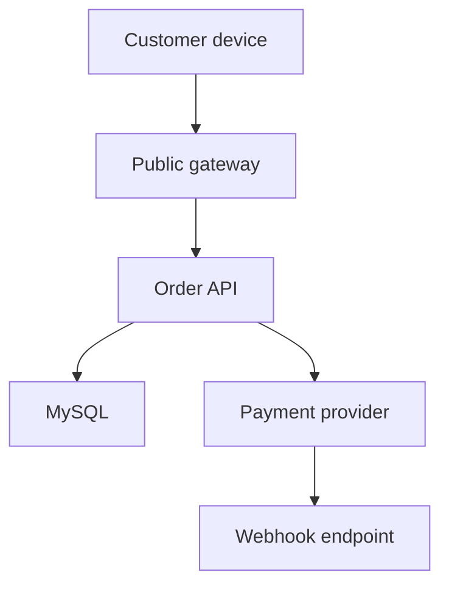

# Threat Modeling và Software Supply Chain Security

## 1. Security là property xuyên lifecycle

Không thể “thêm security” ở cuối pipeline. NIST SSDF đặt secure practices vào SDLC; vault này chuyển thành bốn vòng:

1. thiết kế threat/invariant;
2. code/dependency/build an toàn;
3. verify artifact trước deploy;
4. monitor/respond/learn.

## 2. Threat model đầu vào

```markdown
System/use case:
Assets:
Actors:
Trust boundaries:
Entry/exit points:
Data classification:
Dependencies:
Privileges:
Abuse cases:
Existing controls:
Residual risks:
Owner/review date:
```

Threat model theo data flow/use case, không phải checklist chung một lần.

## 3. Data flow diagram



Trust boundaries:

- Internet → gateway;
- gateway → workload;
- application → database;
- organization → provider;
- provider → webhook.

Mỗi boundary hỏi identity, authorization, integrity, confidentiality, replay, availability và logging.

## 4. STRIDE như bộ câu hỏi

| Nhóm | Câu hỏi | Ví dụ Phone Store |
|---|---|---|
| Spoofing | giả identity? | giả webhook provider |
| Tampering | sửa data/message? | đổi amount/orderId |
| Repudiation | chối hành động? | staff điều chỉnh stock |
| Information disclosure | lộ data? | token/PII trong log |
| Denial of service | làm cạn resource? | GraphQL query cost lớn |
| Elevation of privilege | tăng quyền? | customer gọi admin endpoint |

STRIDE giúp tìm threat, không tự đánh giá risk/prioritize.

## 5. Abuse case checkout

| Abuse | Control |
|---|---|
| Client gửi giá thấp | server authoritative pricing |
| Spam create order | rate/quota + idempotency |
| Replay payment callback | signature timestamp + event inbox |
| Đặt âm stock | DB atomic condition/lock |
| Truy cập order người khác | object authorization |
| Coupon race | unique/atomic usage constraint |
| Payload rất lớn | body/item/page limits |

Mỗi control cần test và telemetry.

## 6. Authentication khác authorization

- Authentication: ai/cái gì đang gọi.
- Authorization: caller được làm action nào trên resource nào trong tenant/context nào.

JWT hợp lệ không chứng minh được xem order `42`. Controller route role check không thay ownership/domain policy.

Liên quan [[08-Spring-Security-va-API-Security]], [[19-OAuth2-OIDC-va-Token-Security-Nang-cao]], [[37-Data-Modeling-Multi-Tenancy-Temporal-va-Audit]].

## 7. Secret lifecycle

```text
generate -> distribute -> use -> rotate -> revoke -> destroy -> audit
```

Mỗi secret:

- owner/purpose/scope;
- issuer/source;
- consumers;
- storage;
- TTL/rotation;
- overlap;
- revocation;
- break-glass;
- logging redaction;
- incident response.

Environment variable không tự là secret manager; có thể lộ qua process/debug/dump.

## 8. Rotation pattern

Ví dụ webhook HMAC:

1. thêm `secret-v2` ở provider/consumer;
2. consumer chấp nhận v1 và v2;
3. provider bắt đầu ký v2;
4. quan sát không còn v1;
5. revoke v1;
6. cập nhật audit/runbook.

Rotation không có overlap dễ gây outage; overlap vô hạn giữ secret cũ mãi.

## 9. Dependency risk

Không chỉ CVE:

- package giả/typosquat;
- compromised maintainer/repository;
- malicious install/build script;
- dependency confusion;
- transitive bloat;
- license;
- unmaintained component;
- mutable tag/artifact;
- poisoned cache/registry.

## 10. Dependency governance

- repository allowlist;
- lockfile/Gradle dependency locking;
- checksum verification;
- BOM/version catalog;
- review dependency mới;
- minimal dependencies;
- automated update có test;
- vulnerability/license policy;
- remove unused;
- record owner/exception expiry.

Không auto-merge security update chỉ vì scanner xanh; breaking behavior vẫn cần verify.

## 11. SBOM

CycloneDX có thể mô tả components, dependencies, services, vulnerabilities và relationships. SBOM trả lời **có gì** trong artifact; không tự chứng minh:

- component không bị exploit;
- build không bị tamper;
- runtime dùng code path vulnerable;
- artifact đúng source.

SBOM phải gắn artifact digest/version và được lưu/phân phối để incident query.

## 12. VEX và triage

Scanner báo CVE cần:

- component/version/path;
- reachable/exploitable context;
- fix availability;
- internet exposure/privilege/data;
- compensating controls;
- owner/deadline;
- evidence;
- exception expiry.

Không đóng issue bằng “not affected” không evidence.

## 13. Build provenance

SLSA mô tả các mức/track tăng bảo đảm supply chain và provenance. Provenance liên kết:

- artifact digest;
- source revision;
- build system/workflow;
- parameters/materials;
- builder identity.

Mục tiêu: verifier kiểm tra artifact đến từ workflow/source được tin, không chỉ file có chữ ký bất kỳ.

## 14. Signing và verification

Sigstore/Cosign có thể ký/verify container/blob/attestation. Control đầy đủ:

```text
build immutable artifact
-> produce SBOM/provenance
-> sign/attest
-> registry immutable
-> admission/deploy verifies identity + digest + policy
```

Ký artifact nhưng deploy bằng mutable `latest` phá traceability.

## 15. CI/CD identity

Ưu tiên short-lived workload identity/OIDC hơn static cloud key dài hạn. Giới hạn:

- repository/branch/environment;
- workflow identity;
- audience;
- permission;
- protected environment approval;
- fork/untrusted PR;
- secret exposure;
- reusable workflow trust.

Pull request không tin cậy không được có production secret/token.

## 16. Hermetic/reproducible thinking

Build đáng tin cần kiểm soát input:

- source revision;
- dependencies/checksums;
- toolchain/container;
- network access;
- environment/time;
- generated code;
- caches;
- build scripts/plugins.

Reproducible output hữu ích nhưng không phải mọi Java artifact dễ byte-identical; ít nhất provenance phải giải thích input và builder.

## 17. Container supply chain

- base image minimal, pinned digest;
- multi-stage;
- non-root;
- không package build tool/secret;
- scan OS + app dependencies;
- SBOM;
- sign/provenance;
- registry retention/immutability;
- admission policy;
- runtime read-only/capability/seccomp.

`alpine`/distroless không tự an toàn nếu ứng dụng/dependency sai.

## 18. Source control controls

- protected branch;
- review/owner cho security/build files;
- signed/verified identities theo policy;
- no direct production changes;
- secret scanning;
- CI config review;
- CODEOWNERS không thay review chất lượng;
- audit log/retention;
- admin/bypass tối thiểu;
- offboarding.

## 19. Security verification layers

| Layer | Tìm gì |
|---|---|
| Compiler/static analysis | bug pattern/type |
| SAST | source vulnerability pattern |
| SCA | component/CVE/license |
| Secret scan | credential material |
| IaC/container scan | misconfiguration/package |
| DAST | runtime endpoint behavior |
| Fuzz | parser/input crash/invariant |
| Pen test | attack chain/human reasoning |
| ASVS review | control coverage |

Không một scanner nào thay các lớp khác.

## 20. SSRF example

Feature “import product image from URL” có thể gọi:

- cloud metadata;
- localhost/admin;
- private service;
- redirect sang private IP;
- DNS rebinding;
- huge/slow response.

Controls:

- tốt nhất upload trực tiếp;
- scheme allowlist;
- resolve/validate destination mỗi hop;
- block private/link-local/metadata ranges;
- no arbitrary redirects;
- egress proxy/policy;
- size/time/content limits;
- isolated fetcher;
- audit/rate.

Liên quan [[32-Object-Storage-va-File-Processing]], [[41-Networking-DNS-TLS-HTTP2-va-Load-Balancing]].

## 21. Deserialization/template/SQL

- parameterized query;
- allowlisted sort/field;
- no unsafe polymorphic deserialization;
- template escaping theo output context;
- avoid shell command construction;
- validate archive/path;
- parser resource limit.

Framework giảm risk nhưng không thay trust-boundary validation.

## 22. Security logging

Ghi:

- auth success/failure class;
- authorization deny;
- privileged change;
- secret/key rotation;
- webhook signature failure;
- rate/abuse;
- artifact verification failure.

Không ghi:

- password/token/cookie;
- private key;
- full auth header;
- sensitive request body;
- presigned URL.

Audit access controlled và tamper-evident theo risk.

## 23. Vulnerability response

```text
advisory -> inventory/SBOM query -> exposure triage
-> mitigate/patch -> rebuild all artifacts -> sign/verify
-> deploy progressively -> verify -> revoke old -> retrospective
```

Không chỉ patch code; image/cache/old deployment/backup/worker cũng có thể còn artifact cũ.

## 24. Security test examples

- IDOR/cross-tenant;
- role downgrade/disabled account;
- JWT wrong issuer/audience/alg/key;
- replay webhook/idempotency key;
- SSRF redirect/DNS rebinding;
- upload polyglot/zip bomb;
- GraphQL depth/cost;
- secret redaction;
- unsigned/untrusted image denied;
- dependency lock/checksum tamper;
- expired cert/secret rotation.

## 25. Risk record

```markdown
Threat:
Asset/impact:
Precondition/exposure:
Likelihood:
Existing controls:
Evidence/tests:
Residual risk:
Decision: mitigate/accept/transfer/avoid
Owner:
Deadline/review date:
```

## 26. Liên kết tư duy

| Quan hệ | Ghi chú |
|---|---|
| Application security | [[08-Spring-Security-va-API-Security]], [[19-OAuth2-OIDC-va-Token-Security-Nang-cao]] |
| Data/tenant/audit | [[37-Data-Modeling-Multi-Tenancy-Temporal-va-Audit]] |
| Network/upload | [[32-Object-Storage-va-File-Processing]], [[41-Networking-DNS-TLS-HTTP2-va-Load-Balancing]] |
| Build/deploy | [[11-Docker-CICD-va-Van-hanh]], [[33-Kubernetes-Production-cho-Spring-Boot]], [[43-Release-Engineering-GitOps-Feature-Flags-va-Canary]] |
| Verification | [[22-Test-Engineering-Nang-cao]], [[13-Checklist-Definition-of-Done]] |
| Incident | [[24-Production-Troubleshooting-Playbook]] |

