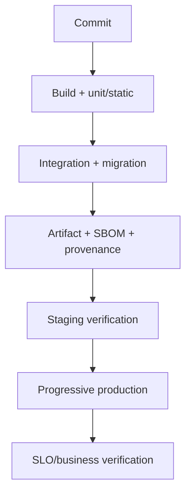

# Release Engineering, GitOps, Feature Flags và Canary

## 1. Release không đồng nghĩa deploy

- Build: tạo artifact.
- Deploy: đưa artifact vào environment.
- Release: bật behavior cho user.
- Rollback: quay artifact/config/traffic/flag.

Feature flag cho phép deploy code trước release; không miễn compatibility và cleanup.

## 2. Nguyên tắc artifact

```text
source revision
-> build once
-> test
-> immutable artifact digest
-> promote same digest qua environments
-> verify provenance/SBOM/signature
```

Không rebuild mỗi environment vì output có thể khác. Config environment tách khỏi artifact nhưng version/audit được.

## 3. Pipeline stages



Gate theo risk, không chạy mọi test nặng cho mọi thay đổi nếu feedback quá chậm; nhưng critical path/migration/security không được bỏ.

## 4. GitOps

OpenGitOps nhấn mạnh desired state declarative, versioned/immutable, pulled automatically và continuously reconciled.

Mental model:

```text
Git desired state
      ↓
reconciler compares desired vs live
      ↓
apply correction + status
```

Không chỉnh production bằng `kubectl edit` không ghi lại. Emergency change phải được capture/reconcile về source.

## 5. GitOps repository

Tách/ghép app và environment repo tùy ownership. Cần:

- artifact digest;
- config/version;
- environment overlays tối thiểu;
- review/approval;
- secret reference, không plaintext;
- promotion PR;
- drift policy;
- rollback commit;
- status link tới deployment.

Copy-paste manifest nhiều environment tạo drift; abstraction quá thông minh khó review. Chọn mức vừa đủ.

## 6. Pull-based deployment

Ưu:

- cluster không cần mở credential deploy cho CI rộng;
- desired state/audit rõ;
- reconciliation/drift detection.

Rủi ro:

- reconciler privilege lớn;
- bad Git commit lan nhanh;
- secret/plugin/repository compromise;
- sync loop overwrite emergency mitigation;
- multi-cluster blast radius.

Phải phân tách identity, approval, project/namespace và rollout wave.

## 7. Deployment strategies

| Strategy | Ưu | Nhược |
|---|---|---|
| Recreate | đơn giản | downtime |
| Rolling | cost thấp, built-in | hai version đồng thời |
| Blue-green | switch/rollback nhanh | double capacity/data compatibility |
| Canary | giảm blast radius, có evidence | routing/analysis phức tạp |
| Shadow | test read/compute bằng traffic thật | duplicate side effect/data/privacy |

Không shadow command side effect trừ khi sandbox/dry-run.

## 8. Rolling compatibility

Trong rollout có:

```text
old app + new app
old app + new DB schema
old producer + new consumer
new producer + old consumer
```

Tất cả combination trong window phải tương thích.

## 9. Database expand-contract

Ví dụ rename `phone` → `phone_number`:

1. add nullable `phone_number`;
2. new code dual-read/dual-write có rule;
3. backfill;
4. verify;
5. switch reads;
6. stop old write;
7. enforce constraint;
8. drop old column sau retention.

Dual-write trong app có thể split; migration/outbox/reconciliation phải rõ.

Liên quan [[07-JPA-Hibernate-va-Transaction]], [[28-MySQL-Replication-Backup-va-Scaling]], [[31-Background-Jobs-Scheduling-va-Spring-Batch]].

## 10. Event compatibility rollout

Safe sequence:

1. consumer mới hiểu schema cũ + mới;
2. deploy toàn consumer;
3. producer bắt đầu field/event mới;
4. observe;
5. ngừng schema cũ;
6. cleanup sau replay retention.

Không deploy producer breaking trước consumer.

## 11. Feature flag types

| Type | Mục tiêu | Lifetime |
|---|---|---|
| Release | tách deploy/release | ngắn |
| Experiment | A/B | đến khi kết luận |
| Ops | kill switch/degradation | dài nhưng test |
| Permission/entitlement | business access | domain policy, không chỉ flag |

Flag không thay authorization. Entitlement cần audit/source of truth.

## 12. Flag evaluation

OpenFeature chuẩn hóa API abstraction, nhưng provider/semantics vẫn cần thiết kế:

- targeting context;
- default;
- cache/freshness;
- provider outage;
- consistency;
- PII;
- audit;
- telemetry;
- version.

```java
boolean enabled = featureClient.getBooleanValue(
    "new-checkout",
    false,
    evaluationContext
);
```

API cụ thể phụ thuộc SDK/version; ví dụ chỉ diễn đạt semantics.

## 13. Safe default

Khi flag service lỗi:

| Flag | Default |
|---|---|
| new checkout release | old checkout |
| disable risky export | disabled |
| fraud check bypass | không bypass |
| optional recommendation | off |

Fail-open/fail-closed là business/security decision.

## 14. Flag lifecycle

Mỗi flag:

```markdown
Key:
Owner:
Purpose/type:
Created/expiry:
Default:
Targeting:
Failure default:
Dependencies:
Metrics:
Removal issue:
```

CI/static scan cảnh báo expired flag. Hai nhánh phải test trong thời gian tồn tại; xóa code cũ khi rollout ổn.

## 15. Canary design

Canary theo:

- % traffic;
- tenant/account allowlist;
- region;
- internal users;
- workload instance;
- operation.

Traffic cohort phải sticky nếu user flow cần nhất quán. Không canary payment theo request ngẫu nhiên giữa hai implementation có state không tương thích.

## 16. Canary metrics

So sánh canary vs baseline:

- request/error/latency;
- resource/GC/pool;
- business success/conflict;
- payment unknown/stock mismatch;
- dependency attempts;
- logs/exceptions;
- data reconciliation;
- cohort size/confidence.

Chỉ CPU xanh không chứng minh business đúng.

## 17. Automated analysis

Gate ví dụ:

```text
5% traffic 15 min
  if error budget burn > threshold -> abort
  if p99 regression > 20% with enough samples -> abort
  if checkout success delta unacceptable -> abort
  else -> 25% -> 50% -> 100%
```

Threshold phải xử lý low traffic/noisy metric; không auto-promote khi không đủ dữ liệu critical.

## 18. Rollback

Rollback app chỉ an toàn nếu:

- schema backward-compatible;
- event/API compatible;
- state written by new version readable by old;
- no irreversible external effect;
- feature flag/config version phù hợp.

Nếu new version đã migration/destructive write, forward-fix hoặc compatibility shim có thể an toàn hơn.

## 19. Config release

Config có thể phá production như code. Yêu cầu:

- schema validation;
- typed binding/fail-fast;
- review;
- staged rollout;
- secret separation;
- version;
- rollback;
- telemetry;
- no unbounded dynamic value.

Hot reload critical policy phải atomic; tránh mỗi pod thấy config khác quá lâu.

## 20. Migration gate

Trước deploy:

- dry-run/validate migration;
- lock/size estimate;
- backup/PITR;
- backward compatibility;
- owner;
- timeout/stop;
- replica lag/disk;
- rollback/forward-fix.

Sau:

- schema version;
- row/backfill count;
- constraints;
- error/latency/lag;
- old app compatibility.

## 21. Release evidence bundle

```markdown
Artifact digest/source:
SBOM/provenance/signature:
Change/ADR:
Compatibility matrix:
Migration:
Tests:
Canary cohort:
Metrics/dashboard:
Rollback:
Owner/on-call:
Residual risks:
```

AI Agent phải tạo/bổ sung evidence, không tự khẳng định deploy an toàn.

## 22. Emergency release

- incident commander/approver;
- minimal reversible change;
- preserve audit;
- explicit bypass;
- smoke/SLO verification;
- rollback;
- follow-up đưa live state về source;
- retrospective cho guardrail bị bypass.

Không để emergency access thành đường thường trực.

## 23. Supply chain gate

Trước admission:

- trusted registry;
- immutable digest;
- signature/provenance identity;
- SBOM policy;
- vulnerability exception chưa hết hạn;
- base image policy;
- namespace/service account policy.

Liên quan [[42-Threat-Modeling-va-Software-Supply-Chain-Security]].

## 24. Tests

- mixed old/new app/schema/event;
- flag on/off/provider down;
- canary routing/stickiness;
- rollback sau new write;
- GitOps drift/reconcile;
- bad config/migration;
- unsigned artifact reject;
- partial cluster rollout;
- DB/Redis/provider degraded during deploy;
- emergency rollback drill.

## 25. Liên kết tư duy

| Quan hệ | Ghi chú |
|---|---|
| CI/container | [[11-Docker-CICD-va-Van-hanh]], [[42-Threat-Modeling-va-Software-Supply-Chain-Security]] |
| Kubernetes | [[33-Kubernetes-Production-cho-Spring-Boot]] |
| Compatibility | [[05-Chuan-REST-API]], [[18-Event-Driven-Outbox-va-Kafka]], [[37-Data-Modeling-Multi-Tenancy-Temporal-va-Audit]] |
| Evidence | [[22-Test-Engineering-Nang-cao]], [[34-OpenTelemetry-Micrometer-va-Observability-Implementation]], [[40-Performance-Capacity-va-Load-Testing]] |
| Incident/rollback | [[24-Production-Troubleshooting-Playbook]] |
| Case study | [[45-Case-Study-Phone-Store-at-Scale]] |

