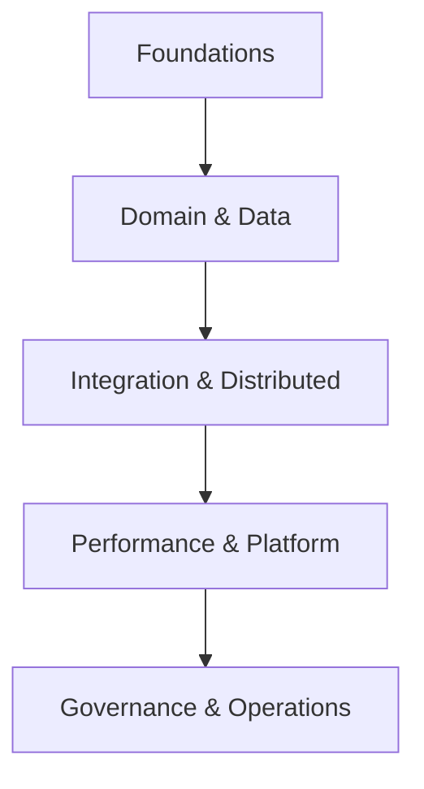
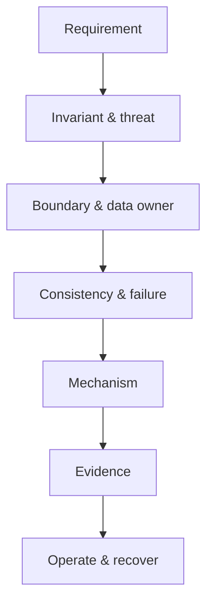

# MOC — Mạng lưới tư duy Backend và Spring Boot

> [!important]
> Đây là router của toàn vault. Không đọc tuyến tính mọi file cho mọi nhiệm vụ. Bắt đầu từ câu hỏi, đi theo quan hệ và chỉ nạp context đủ để ra quyết định/viết code.

## 1. Năm loại cạnh trong knowledge graph

| Cạnh | Ý nghĩa | Câu hỏi |
|---|---|---|
| `requires` | kiến thức tiên quyết | cần hiểu gì trước? |
| `constrains` | đặt giới hạn/correctness | thiết kế này bị ràng buộc bởi gì? |
| `implements` | cơ chế hiện thực | pattern/công nghệ nào thực thi quyết định? |
| `verified_by` | bằng chứng | test/metric/plan nào chứng minh? |
| `operated_by` | vận hành/recovery | deploy, alert, runbook nào giữ nó sống? |

Ví dụ:

```text
Inventory invariant
  requires transaction/concurrency
  constrains cache/replica/eventual consistency
  implements atomic SQL + idempotency
  verified_by MySQL concurrency test
  operated_by stock mismatch alert + reconciliation
```

## 2. Bản đồ tầng



### Foundations

- [[02-Nen-tang-Backend]]
- [[03-Java-21-va-Spring-Boot-Core]]
- [[15-Spring-Internals-AOP-va-Request-Lifecycle]]
- [[25-Java-Concurrency-va-Collections-Nang-cao]]
- [[35-Nen-tang-He-phan-tan-CAP-Clock-Consensus]]

### Domain & Data

- [[04-Kien-truc-va-cau-truc-code]]
- [[14-DDD-va-Modular-Monolith-Nang-cao]]
- [[26-Design-Patterns-va-Anti-Patterns-Spring-Boot]]
- [[06-Database-va-toi-uu-SQL-MySQL]]
- [[07-JPA-Hibernate-va-Transaction]]
- [[16-MySQL-Optimizer-va-Index-Nang-cao]]
- [[17-Concurrency-Isolation-va-Idempotency-Nang-cao]]
- [[28-MySQL-Replication-Backup-va-Scaling]]
- [[37-Data-Modeling-Multi-Tenancy-Temporal-va-Audit]]

### API & Integration

- [[05-Chuan-REST-API]]
- [[36-So-sanh-REST-gRPC-GraphQL-Webhooks-va-AsyncAPI]]
- [[18-Event-Driven-Outbox-va-Kafka]]
- [[39-Kafka-Deep-Dive-Partition-Rebalance-EOS]]
- [[29-Microservices-API-Gateway-va-Service-Communication]]
- [[38-Search-Architecture-Elasticsearch-va-Projection]]
- [[32-Object-Storage-va-File-Processing]]
- [[46-CQRS-Event-Sourcing-va-Read-Models]]
- [[47-Saga-Workflow-Orchestration-va-Choreography]]
- [[49-Message-Broker-Queue-Selection-Kafka-RabbitMQ]]

### Runtime & Platform

- [[20-JVM-Memory-GC-va-Profiling]]
- [[30-Spring-MVC-WebFlux-va-Virtual-Threads]]
- [[21-Distributed-Reliability-va-Resilience4j]]
- [[27-Redis-Cache-Data-Structures-va-Distributed-Lock]]
- [[31-Background-Jobs-Scheduling-va-Spring-Batch]]
- [[40-Performance-Capacity-va-Load-Testing]]
- [[41-Networking-DNS-TLS-HTTP2-va-Load-Balancing]]
- [[33-Kubernetes-Production-cho-Spring-Boot]]
- [[48-NoSQL-Data-Store-Selection]]
- [[50-Multi-Region-Architecture-DR-va-Data-Residency]]
- [[53-Platform-Engineering-IDP-va-Golden-Paths]]
- [[54-FinOps-Cost-Engineering-va-Unit-Economics]]

### Security, Quality & Operations

- [[08-Spring-Security-va-API-Security]]
- [[19-OAuth2-OIDC-va-Token-Security-Nang-cao]]
- [[42-Threat-Modeling-va-Software-Supply-Chain-Security]]
- [[09-Chien-luoc-Testing]]
- [[22-Test-Engineering-Nang-cao]]
- [[10-Observability-Performance-Reliability]]
- [[34-OpenTelemetry-Micrometer-va-Observability-Implementation]]
- [[11-Docker-CICD-va-Van-hanh]]
- [[43-Release-Engineering-GitOps-Feature-Flags-va-Canary]]
- [[24-Production-Troubleshooting-Playbook]]
- [[51-Zero-Downtime-Schema-va-Data-Migration]]
- [[52-Privacy-Data-Governance-Retention-va-Erasure]]
- [[55-Incident-Management-OnCall-va-Chaos-Engineering]]

### Governance & Application

- [[01-Chinh-sach-kiem-chung-nguon]]
- [[12-Bo-quy-tac-cho-AI-Agent]]
- [[13-Checklist-Definition-of-Done]]
- [[23-Blueprint-Phone-Store-Backend]]
- [[45-Case-Study-Phone-Store-at-Scale]]
- [[90-Template-Ghi-chu-Ky-thuat]]
- [[99-Danh-muc-nguon-chuan]]

## 3. Router theo nhiệm vụ

| Nhiệm vụ | Điểm bắt đầu | Ràng buộc | Bằng chứng |
|---|---|---|---|
| Thêm endpoint CRUD | [[05-Chuan-REST-API]] | [[04-Kien-truc-va-cau-truc-code]], [[08-Spring-Security-va-API-Security]] | [[09-Chien-luoc-Testing]] |
| Checkout/stock race | [[17-Concurrency-Isolation-va-Idempotency-Nang-cao]] | [[35-Nen-tang-He-phan-tan-CAP-Clock-Consensus]] | [[22-Test-Engineering-Nang-cao]] |
| Tối ưu SQL | [[16-MySQL-Optimizer-va-Index-Nang-cao]] | [[07-JPA-Hibernate-va-Transaction]] | EXPLAIN + [[40-Performance-Capacity-va-Load-Testing]] |
| Thêm Redis cache | [[27-Redis-Cache-Data-Structures-va-Distributed-Lock]] | [[37-Data-Modeling-Multi-Tenancy-Temporal-va-Audit]] | cold-cache/load/freshness test |
| Tách microservice | [[29-Microservices-API-Gateway-va-Service-Communication]] | [[14-DDD-va-Modular-Monolith-Nang-cao]], [[35-Nen-tang-He-phan-tan-CAP-Clock-Consensus]] | contract + failure + ops evidence |
| Thêm Kafka event | [[18-Event-Driven-Outbox-va-Kafka]] | [[39-Kafka-Deep-Dive-Partition-Rebalance-EOS]] | duplicate/replay/crash tests |
| Xây product search | [[38-Search-Architecture-Elasticsearch-va-Projection]] | [[37-Data-Modeling-Multi-Tenancy-Temporal-va-Audit]] | relevance + lag + rebuild tests |
| Chọn MVC/WebFlux | [[30-Spring-MVC-WebFlux-va-Virtual-Threads]] | [[25-Java-Concurrency-va-Collections-Nang-cao]] | profiling/load benchmark |
| Upload file | [[32-Object-Storage-va-File-Processing]] | [[42-Threat-Modeling-va-Software-Supply-Chain-Security]] | parser/scan/auth tests |
| Batch/backfill | [[31-Background-Jobs-Scheduling-va-Spring-Batch]] | [[28-MySQL-Replication-Backup-va-Scaling]] | restart/reconcile/load |
| Kubernetes rollout | [[33-Kubernetes-Production-cho-Spring-Boot]] | [[43-Release-Engineering-GitOps-Feature-Flags-va-Canary]] | probes/canary/rollback |
| Sự cố production | [[24-Production-Troubleshooting-Playbook]] | [[41-Networking-DNS-TLS-HTTP2-va-Load-Balancing]] | [[34-OpenTelemetry-Micrometer-va-Observability-Implementation]] |
| Security review | [[42-Threat-Modeling-va-Software-Supply-Chain-Security]] | [[08-Spring-Security-va-API-Security]] | negative tests + artifact evidence |
| Thiết kế command/read model | [[46-CQRS-Event-Sourcing-va-Read-Models]] | [[14-DDD-va-Modular-Monolith-Nang-cao]] | replay/projection/concurrency tests |
| Workflow xuyên service | [[47-Saga-Workflow-Orchestration-va-Choreography]] | [[17-Concurrency-Isolation-va-Idempotency-Nang-cao]] | crash/duplicate/compensation tests |
| Chọn database mới | [[48-NoSQL-Data-Store-Selection]] | [[35-Nen-tang-He-phan-tan-CAP-Clock-Consensus]] | production-shaped spike + restore |
| Chọn broker/queue | [[49-Message-Broker-Queue-Selection-Kafka-RabbitMQ]] | [[18-Event-Driven-Outbox-va-Kafka]] | duplicate/backlog/poison/recovery |
| Multi-region/DR | [[50-Multi-Region-Architecture-DR-va-Data-Residency]] | [[28-MySQL-Replication-Backup-va-Scaling]] | measured failover/restore RTO-RPO |
| Đổi schema không downtime | [[51-Zero-Downtime-Schema-va-Data-Migration]] | [[43-Release-Engineering-GitOps-Feature-Flags-va-Canary]] | mixed-version/backfill/rollback |
| Retention/xóa PII | [[52-Privacy-Data-Governance-Retention-va-Erasure]] | [[37-Data-Modeling-Multi-Tenancy-Temporal-va-Audit]] | erasure/restore/reconciliation |
| Xây golden path | [[53-Platform-Engineering-IDP-va-Golden-Paths]] | [[42-Threat-Modeling-va-Software-Supply-Chain-Security]] | zero-to-prod + upgrade evidence |
| Tối ưu chi phí | [[54-FinOps-Cost-Engineering-va-Unit-Economics]] | [[40-Performance-Capacity-va-Load-Testing]] | unit-cost trước/sau + SLO |
| Incident/game day | [[55-Incident-Management-OnCall-va-Chaos-Engineering]] | [[24-Production-Troubleshooting-Playbook]] | timeline/recovery/action evidence |

## 4. Router theo symptom

| Symptom | Điều tra đầu | Nhánh tiếp theo |
|---|---|---|
| p99 tăng, CPU thấp | queue/pool wait | [[21-Distributed-Reliability-va-Resilience4j]], [[41-Networking-DNS-TLS-HTTP2-va-Load-Balancing]] |
| CPU cao sau release | profile/JFR/version | [[20-JVM-Memory-GC-va-Profiling]], [[43-Release-Engineering-GitOps-Feature-Flags-va-Canary]] |
| DB connection timeout | pool pending/query/lock | [[16-MySQL-Optimizer-va-Index-Nang-cao]], [[40-Performance-Capacity-va-Load-Testing]] |
| Dữ liệu search cũ | projection lag/version | [[38-Search-Architecture-Elasticsearch-va-Projection]], [[39-Kafka-Deep-Dive-Partition-Rebalance-EOS]] |
| Duplicate payment | timeout ambiguity/idempotency | [[35-Nen-tang-He-phan-tan-CAP-Clock-Consensus]], [[17-Concurrency-Isolation-va-Idempotency-Nang-cao]] |
| Kafka lag tăng | processing/skew/rebalance | [[39-Kafka-Deep-Dive-Partition-Rebalance-EOS]], [[40-Performance-Capacity-va-Load-Testing]] |
| Pod restart hàng loạt | liveness/OOM/shared dependency | [[33-Kubernetes-Production-cho-Spring-Boot]], [[24-Production-Troubleshooting-Playbook]] |
| TLS/DNS intermittent | connection age/resolution/cert | [[41-Networking-DNS-TLS-HTTP2-va-Load-Balancing]] |
| Cross-tenant leak | repository/auth/data model | [[37-Data-Modeling-Multi-Tenancy-Temporal-va-Audit]], [[08-Spring-Security-va-API-Security]] |
| Workflow stuck/compensating lâu | workflow state/deadline | [[47-Saga-Workflow-Orchestration-va-Choreography]], [[55-Incident-Management-OnCall-va-Chaos-Engineering]] |
| Projection rebuild không hội tụ | sequence/schema/idempotency | [[46-CQRS-Event-Sourcing-va-Read-Models]], [[49-Message-Broker-Queue-Selection-Kafka-RabbitMQ]] |
| Migration làm replica lag | DDL/backfill/write amplification | [[51-Zero-Downtime-Schema-va-Data-Migration]], [[28-MySQL-Replication-Backup-va-Scaling]] |
| Cloud cost tăng đột biến | retry/log/egress/cardinality | [[54-FinOps-Cost-Engineering-va-Unit-Economics]], [[34-OpenTelemetry-Micrometer-va-Observability-Implementation]] |
| Erasure còn dữ liệu | lineage/cache/search/backup | [[52-Privacy-Data-Governance-Retention-va-Erasure]], [[50-Multi-Region-Architecture-DR-va-Data-Residency]] |

## 5. Những xung đột cần nhận biết

| Muốn | Xung đột với | Cách tư duy |
|---|---|---|
| cache lâu | freshness/revocation | phân loại data + TTL/invalidation |
| replica read | read-your-writes | route/token/wait/primary |
| retry nhiều | overload/duplicate | idempotency + deadline + budget |
| pool/queue lớn | tail latency/memory | bounded admission + capacity |
| microservice nhỏ | operational complexity | modular monolith trước |
| strict ordering | parallelism | key/partition/authority |
| dynamic schema | constraints/queryability | version/validation/projection |
| fast release | verification/compatibility | progressive evidence |
| rich telemetry | cost/privacy/cardinality | sampling/redaction/budget |
| high availability | strong consistency khi partition | operation-level CAP decision |

## 6. Chuỗi suy luận cho một feature



Ví dụ “đặt hàng”:

1. requirement: tạo order một lần;
2. invariant: total server-side, stock không âm;
3. boundary: ordering/inventory/payment;
4. consistency: local DB strong, provider outcome uncertain;
5. mechanism: transaction + atomic update + idempotency + outbox;
6. evidence: concurrent/crash/webhook duplicate tests;
7. operate: trace, payment UNKNOWN alert, reconciliation.

## 7. Bốn trục không được bỏ

Mọi quyết định phải đi qua:

| Trục | Câu hỏi |
|---|---|
| Correctness | invariant nào không được phá? |
| Security | ai có thể lạm dụng/đọc/sửa? |
| Reliability | dependency/timeout/duplicate/partition thì sao? |
| Operability | đo, deploy, rollback, restore thế nào? |

Performance là constraint thứ năm khi có SLO/workload cụ thể.

## 8. Lộ trình học theo cấp

### Level 1 — Viết đúng một service

[[02-Nen-tang-Backend]] → [[03-Java-21-va-Spring-Boot-Core]] → [[04-Kien-truc-va-cau-truc-code]] → [[05-Chuan-REST-API]] → [[06-Database-va-toi-uu-SQL-MySQL]] → [[09-Chien-luoc-Testing]]

### Level 2 — Bảo vệ state và security

[[07-JPA-Hibernate-va-Transaction]] → [[17-Concurrency-Isolation-va-Idempotency-Nang-cao]] → [[08-Spring-Security-va-API-Security]] → [[22-Test-Engineering-Nang-cao]]

### Level 3 — Hiểu runtime và production

[[15-Spring-Internals-AOP-va-Request-Lifecycle]] → [[20-JVM-Memory-GC-va-Profiling]] → [[21-Distributed-Reliability-va-Resilience4j]] → [[34-OpenTelemetry-Micrometer-va-Observability-Implementation]]

### Level 4 — Distributed/data platform

[[35-Nen-tang-He-phan-tan-CAP-Clock-Consensus]] → [[18-Event-Driven-Outbox-va-Kafka]] → [[39-Kafka-Deep-Dive-Partition-Rebalance-EOS]] → [[28-MySQL-Replication-Backup-va-Scaling]] → [[38-Search-Architecture-Elasticsearch-va-Projection]]

### Level 5 — Platform/governance

[[40-Performance-Capacity-va-Load-Testing]] → [[41-Networking-DNS-TLS-HTTP2-va-Load-Balancing]] → [[33-Kubernetes-Production-cho-Spring-Boot]] → [[42-Threat-Modeling-va-Software-Supply-Chain-Security]] → [[43-Release-Engineering-GitOps-Feature-Flags-va-Canary]]

### Level 6 — Architecture evolution và socio-technical operations

[[46-CQRS-Event-Sourcing-va-Read-Models]] → [[47-Saga-Workflow-Orchestration-va-Choreography]] → [[48-NoSQL-Data-Store-Selection]] → [[49-Message-Broker-Queue-Selection-Kafka-RabbitMQ]] → [[51-Zero-Downtime-Schema-va-Data-Migration]] → [[50-Multi-Region-Architecture-DR-va-Data-Residency]] → [[52-Privacy-Data-Governance-Retention-va-Erasure]] → [[53-Platform-Engineering-IDP-va-Golden-Paths]] → [[54-FinOps-Cost-Engineering-va-Unit-Economics]] → [[55-Incident-Management-OnCall-va-Chaos-Engineering]]

## 9. Context packs cho AI Agent

### API feature pack

```text
12-Bo-quy-tac-cho-AI-Agent
05-Chuan-REST-API
04-Kien-truc-va-cau-truc-code
08-Spring-Security-va-API-Security
09-Chien-luoc-Testing
+ SRS/OpenAPI/schema/code/tests thật
```

### Distributed command pack

```text
12-Bo-quy-tac-cho-AI-Agent
17-Concurrency-Isolation-va-Idempotency-Nang-cao
35-Nen-tang-He-phan-tan-CAP-Clock-Consensus
18-Event-Driven-Outbox-va-Kafka
21-Distributed-Reliability-va-Resilience4j
+ invariant/provider contract/failure evidence
```

### Performance incident pack

```text
24-Production-Troubleshooting-Playbook
34-OpenTelemetry-Micrometer-va-Observability-Implementation
40-Performance-Capacity-va-Load-Testing
20-JVM-Memory-GC-va-Profiling
16-MySQL-Optimizer-va-Index-Nang-cao
+ dashboard/trace/JFR/EXPLAIN/deploy diff
```

### Platform release pack

```text
33-Kubernetes-Production-cho-Spring-Boot
42-Threat-Modeling-va-Software-Supply-Chain-Security
43-Release-Engineering-GitOps-Feature-Flags-va-Canary
13-Checklist-Definition-of-Done
+ manifests/pipeline/SBOM/provenance/SLO/runbook
```

### Long-running distributed workflow pack

```text
46-CQRS-Event-Sourcing-va-Read-Models
47-Saga-Workflow-Orchestration-va-Choreography
49-Message-Broker-Queue-Selection-Kafka-RabbitMQ
17-Concurrency-Isolation-va-Idempotency-Nang-cao
55-Incident-Management-OnCall-va-Chaos-Engineering
+ workflow contract/state/deadline/provider evidence
```

### Data lifecycle and migration pack

```text
37-Data-Modeling-Multi-Tenancy-Temporal-va-Audit
48-NoSQL-Data-Store-Selection
51-Zero-Downtime-Schema-va-Data-Migration
52-Privacy-Data-Governance-Retention-va-Erasure
50-Multi-Region-Architecture-DR-va-Data-Residency
+ schema/lineage/retention/RTO-RPO/restore evidence
```

## 10. Ma trận bằng chứng

| Claim | Bằng chứng tối thiểu |
|---|---|
| “Query nhanh” | schema + representative params + EXPLAIN ANALYZE + latency |
| “Thread-safe” | invariant + happens-before/atomic primitive + concurrent test |
| “Idempotent” | same key duplicate/concurrent/crash test |
| “Secure” | threat/control + negative tests + config/version |
| “Scalable” | workload + load curve + bottleneck + N−1 |
| “Highly available” | failure model + failover drill + measured RTO/RPO |
| “Exactly once” | phạm vi + durable dedupe + crash/replay evidence |
| “Observable” | trace/metric/log correlation + actionable alert/runbook |
| “Rollback được” | compatibility + rollback drill |

## 11. Quy tắc cập nhật graph

Mọi ghi chú mới phải có:

- `status`, `verified_on`, `sources`;
- ít nhất hai internal links có meaning;
- một comparison/decision section;
- một failure/test section;
- “không dùng khi”;
- connection vào MOC;
- version scope nếu API/config thay đổi theo version.

Không tạo note orphan.

## 12. Quy tắc chống mâu thuẫn

Khi hai ghi chú cho lời khuyên khác:

1. kiểm tra version/applies_to;
2. phân biệt invariant và optimization;
3. xác định workload/failure model;
4. ưu tiên project ADR/rules mới nhất;
5. tạo ADR nêu lựa chọn;
6. thêm link “conflicts/trade-off” ở hai note;
7. tạo test/metric quyết định nếu có thể.

## 13. Điểm vào/ra

- Home: [[00-README]]
- Quy tắc nguồn: [[01-Chinh-sach-kiem-chung-nguon]]
- AI Constitution: [[12-Bo-quy-tac-cho-AI-Agent]]
- Definition of Done: [[13-Checklist-Definition-of-Done]]
- Case tổng hợp: [[45-Case-Study-Phone-Store-at-Scale]]
- Template: [[90-Template-Ghi-chu-Ky-thuat]]
- Nguồn: [[99-Danh-muc-nguon-chuan]]
