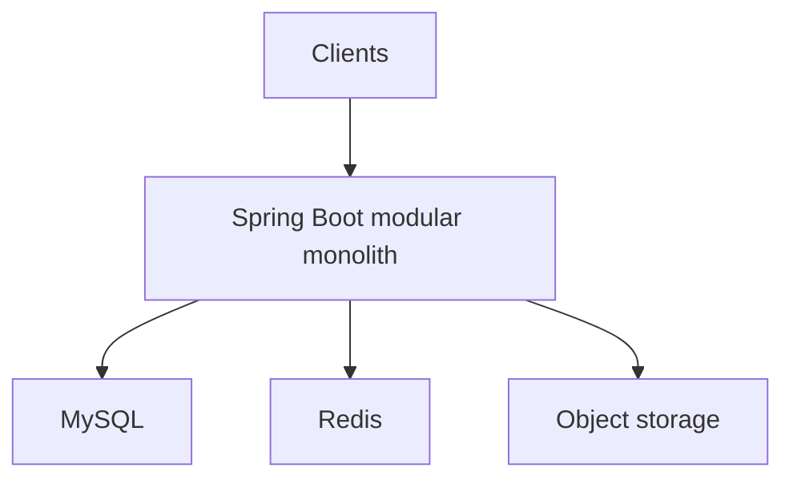
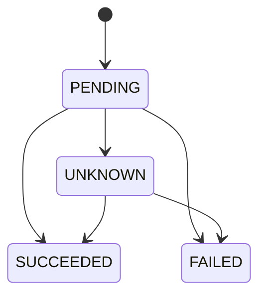

# Case Study xuyên suốt — Phone Store at Scale

> [!warning]
> Đây là bài tập kiến trúc có số liệu giả định để minh họa cách nối kiến thức, không phải requirement thật. Khi áp dụng dự án, thay bằng SRS, traffic, schema, provider contract và SLO được xác minh.

## 1. Bối cảnh giả định

```text
Catalog: 2 triệu products/variants
Traffic peak: 2.000 RPS browse, 120 RPS checkout
Orders: 5 triệu/năm
Availability target browse: 99.95%
Checkout: 99.9%, p95 <= 800 ms trước bước redirect/payment
Search freshness: <= 10 giây
Stock: không âm
Payment: không charge trùng
Deployment: không downtime
```

## 2. Kiến trúc khởi đầu

Modular monolith:



Lý do:

- transaction order/stock dễ;
- team nhỏ;
- deploy/debug đơn giản;
- module boundary vẫn chuẩn bị tách.

Liên quan [[14-DDD-va-Modular-Monolith-Nang-cao]], [[23-Blueprint-Phone-Store-Backend]].

## 3. Module ownership

| Module | Owns | Invariant chính |
|---|---|---|
| catalog | product/variant/spec/media metadata | SKU active/unique |
| inventory | stock/reservation/movement | available không âm |
| ordering | order/items/history | transition hợp lệ, snapshot price |
| payment | attempt/webhook/refund | provider event/idempotency unique |
| identity | user/session/role | credential/revocation |
| search | product projection | version không lùi |
| audit | privileged/security audit | append/access policy |

Module khác không update bảng của owner trực tiếp.

## 4. Core schema

```sql
CREATE TABLE inventory_items (
    variant_id BINARY(16) PRIMARY KEY,
    available INT NOT NULL,
    reserved INT NOT NULL,
    version BIGINT NOT NULL,
    CONSTRAINT chk_inventory_nonnegative
      CHECK (available >= 0 AND reserved >= 0)
);

CREATE TABLE stock_reservations (
    id BINARY(16) PRIMARY KEY,
    order_id BINARY(16) NOT NULL,
    variant_id BINARY(16) NOT NULL,
    quantity INT NOT NULL,
    status VARCHAR(24) NOT NULL,
    expires_at DATETIME(6) NOT NULL,
    operation_id BINARY(16) NOT NULL,
    UNIQUE KEY uk_reservation_operation (operation_id),
    INDEX idx_reservation_expiry (status, expires_at, id)
);
```

Index candidates phải kiểm tra bằng [[16-MySQL-Optimizer-va-Index-Nang-cao]].

## 5. Checkout API contract

```http
POST /api/v1/orders
Authorization: Bearer ...
Idempotency-Key: 01K...
Content-Type: application/json

{
  "cartId": "cart_42",
  "shippingAddressId": "addr_7",
  "paymentMethod": "CARD"
}
```

Response không tin price từ client:

```json
{
  "orderId": "ord_9",
  "status": "PENDING_PAYMENT",
  "amount": {"value":"24990000.00","currency":"VND"},
  "paymentAction": {"type":"REDIRECT","url":"...short-lived..."}
}
```

`paymentAction.url` nhạy cảm, không log/cache.

## 6. Idempotency record

```sql
CREATE TABLE idempotency_records (
    scope VARCHAR(100) NOT NULL,
    idempotency_key VARCHAR(100) NOT NULL,
    request_hash BINARY(32) NOT NULL,
    status VARCHAR(20) NOT NULL,
    response_status INT NULL,
    response_body JSON NULL,
    resource_id BINARY(16) NULL,
    created_at DATETIME(6) NOT NULL,
    expires_at DATETIME(6) NOT NULL,
    PRIMARY KEY (scope, idempotency_key)
);
```

Same key + different request hash → conflict. Concurrent duplicate chỉ một owner tạo order; caller khác chờ/đọc outcome theo bounded policy.

## 7. Place order transaction

```java
@Transactional
public PlaceOrderResult handle(PlaceOrder command) {
    var idem = idempotency.start(
        command.customerId(),
        command.idempotencyKey(),
        command.requestHash()
    );
    if (idem.completed()) return idem.previousResult();

    var cart = carts.getOwned(command.customerId(), command.cartId());
    var priced = pricing.priceAuthoritatively(cart);
    var reservations = inventory.reserveAll(command.operationId(), priced.items());
    var order = orders.save(Order.place(command, priced, reservations, clock.instant()));
    outbox.append(OrderPlaced.from(order));
    idempotency.complete(idem, order.result());
    return order.result();
}
```

Implementation thật phải xử lý exception/duplicate state rõ; code chỉ minh họa boundary.

## 8. Atomic stock update

```sql
UPDATE inventory_items
SET available = available - :qty,
    reserved = reserved + :qty,
    version = version + 1
WHERE variant_id = :variantId
  AND available >= :qty;
```

Affected rows:

- `1`: reserve thành công;
- `0`: hết stock hoặc row không tồn tại → query/translate đúng.

Nhiều items cần deterministic order để giảm deadlock và rollback toàn transaction nếu một item fail.

## 9. Price snapshot

`order_items` lưu:

- product/variant IDs;
- SKU/name/attributes snapshot;
- unit price;
- discount/tax rule result;
- quantity/line total;
- currency.

Không render lịch sử order từ catalog hiện tại. Liên quan [[37-Data-Modeling-Multi-Tenancy-Temporal-va-Audit]].

## 10. Payment flow

Không gọi provider trong transaction giữ stock/order lock lâu.



Flow:

1. order transaction commit + outbox;
2. payment worker tạo attempt với provider idempotency key;
3. timeout → `UNKNOWN`, không charge lại bằng key mới;
4. webhook/poll reconcile;
5. succeeded → order paid event;
6. failed/expired → release stock idempotent.

## 11. Webhook endpoint

```java
public ResponseEntity<Void> receive(
        String timestamp,
        String signature,
        byte[] rawBody) {
    verifier.verify(timestamp, signature, rawBody);
    PaymentEvent event = parser.parse(rawBody);
    receipts.storeIfAbsent(event.provider(), event.id(), rawBody);
    return ResponseEntity.noContent().build();
}
```

Xử lý business async sau durable receipt. Tests: signature sai, replay, duplicate, out-of-order, secret rotation.

Liên quan [[36-So-sanh-REST-gRPC-GraphQL-Webhooks-va-AsyncAPI]], [[42-Threat-Modeling-va-Software-Supply-Chain-Security]].

## 12. Outbox event

```json
{
  "eventId": "evt_01K...",
  "eventType": "order.placed",
  "eventVersion": 1,
  "aggregateId": "ord_9",
  "aggregateVersion": 1,
  "occurredAt": "2026-07-23T09:00:00Z",
  "correlationId": "checkout_...",
  "payload": {
    "customerId": "cus_4",
    "amount": {"value":"24990000.00","currency":"VND"}
  }
}
```

Không đưa full address/token/PII nếu consumer không cần.

## 13. Kafka topology khi scale

```text
commerce.orders.v1 key=orderId
commerce.payments.v1 key=orderId
catalog.products.v1 key=productId
```

- ordering consumer inbox durable;
- partition count từ throughput/parallelism;
- aggregate version phát hiện gap;
- DLQ có redrive/reconciliation;
- Kafka EOS không thay MySQL outbox/inbox.

Liên quan [[39-Kafka-Deep-Dive-Partition-Rebalance-EOS]].

## 14. Product search

Search document từ catalog event/CDC:

```text
MySQL source of truth
-> outbox/CDC
-> Kafka
-> indexer
-> products-vN alias products-read
```

Search result trả `inStock` hint có thể stale; checkout luôn kiểm tra inventory authoritative.

Freshness SLO:

- p99 event-to-search ≤ 10 s;
- alert oldest projection lag;
- admin save hiển thị “indexing” đến version xuất hiện.

## 15. Redis cache

Cache:

- product detail public;
- category tree;
- short-lived price projection nếu business cho phép;
- rate limiter.

Không cache authoritative stock cho reserve.

```text
key: catalog:product:v3:{productId}:{locale}
TTL: 5m ± jitter
invalidate: ProductUpdated after commit
cold-start: DB/search admission limit
```

Liên quan [[27-Redis-Cache-Data-Structures-va-Distributed-Lock]].

## 16. Product images

```text
request upload session
-> authorize admin
-> opaque object key + short presigned URL
-> upload
-> verify checksum/type/size
-> scan + re-encode
-> AVAILABLE
-> CDN immutable version URL
```

Orphan/stuck/multipart cleanup bằng durable job. Liên quan [[32-Object-Storage-va-File-Processing]].

## 17. Read scaling

Replica có thể phục vụ:

- historical order list nếu stale nhỏ chấp nhận;
- catalog/report reads.

Primary:

- checkout;
- authorization/revocation critical;
- read-your-writes order confirmation;
- lock/current stock.

Route theo consistency class, không theo tên `find*`. Xem [[28-MySQL-Replication-Backup-va-Scaling]].

## 18. Capacity model

Giả sử measured:

```text
API pod safe browse capacity: 250 RPS at p95 SLO
Peak browse: 2000 RPS
Target 65% + N-1
ceil(2000 / (250 × 0.65)) = 13 pods
```

Phải test:

- 13 và 12 pods;
- cold Redis/search;
- DB failover;
- one slow provider;
- spike;
- rolling deployment;
- checkout mix.

Số giả định, không dùng production.

## 19. Kubernetes profile

```yaml
apiVersion: apps/v1
kind: Deployment
metadata:
  name: phone-store-api
spec:
  replicas: 13
  strategy:
    rollingUpdate:
      maxUnavailable: 1
      maxSurge: 2
  template:
    spec:
      terminationGracePeriodSeconds: 45
      containers:
        - name: app
          image: registry/phone-store@sha256:...
          readinessProbe:
            httpGet: {path: /actuator/health/readiness, port: 8081}
          livenessProbe:
            httpGet: {path: /actuator/health/liveness, port: 8081}
```

Resource/probe timings phải lấy từ profiling/startup thật. Liveness không gọi payment/DB.

## 20. Telemetry

Trace checkout:

```text
POST /orders
  price cart
  reserve inventory
    MySQL atomic updates
  insert order/items
  insert outbox
  commit
```

Business metrics:

- order create success/conflict;
- stock insufficient/oversell reconciliation;
- payment succeeded/failed/unknown age;
- reservation expiry;
- outbox/search lag;
- duplicate idempotency hit;
- checkout p95/p99.

Không dùng order/customer ID làm metric label.

## 21. SLO và alert

| SLI | SLO/alert idea |
|---|---|
| Browse availability | valid non-5xx response |
| Checkout correctness | no duplicate order/negative stock |
| Checkout latency | p95 threshold |
| Payment unknown | oldest age/count |
| Search freshness | event→indexed lag |
| Event pipeline | outbox oldest/consumer lag |

Correctness alert cần reconciliation data, không chỉ HTTP metric.

## 22. Threat model highlights

- IDOR order/cart/address;
- admin inventory abuse;
- price tampering;
- coupon race;
- payment webhook spoof/replay;
- presigned URL leak;
- GraphQL/search cost abuse;
- SSRF image import;
- dependency/image tamper;
- PII in logs/events.

Controls liên kết [[42-Threat-Modeling-va-Software-Supply-Chain-Security]].

## 23. Release sequence: thêm discount

1. add nullable discount snapshot columns;
2. deploy reader hiểu null/zero;
3. deploy promotion calculation behind flag;
4. canary internal accounts;
5. compare totals/provider/reconciliation;
6. ramp;
7. backfill/report logic nếu cần;
8. enforce constraints;
9. remove old branch/flag.

Rollback an toàn vì old version hiểu schema và new writes.

## 24. Failure scenario A — payment response mất

```text
provider charged
-> response lost
-> client/service timeout
```

Sai: tạo attempt mới với key mới.

Đúng:

- attempt `UNKNOWN`;
- same provider idempotency key;
- webhook/query status;
- reconcile;
- no success/failure giả;
- alert age.

## 25. Failure scenario B — Redis down

- catalog cache miss tăng;
- admission/bulkhead bảo vệ DB;
- public product có thể fallback search/stale local theo policy;
- rate limiter fail-open/closed theo endpoint;
- checkout không phụ thuộc Redis correctness;
- dashboard eviction/connection/DB load;
- gradual warm-up sau recovery.

## 26. Failure scenario C — search lag

- checkout unaffected;
- browse có thể stale;
- admin thấy projection version;
- alert lag;
- indexer pause/recover;
- replay events;
- reconcile sample/count;
- alias rollback nếu mapping release lỗi.

## 27. Failure scenario D — deploy bad liveness

- liveness gọi DB;
- DB chậm → mọi pod restart;
- outage khuếch đại.

Phòng:

- liveness local-only;
- readiness/dependency policy;
- canary manifests;
- probe failure dashboard;
- PodDisruptionBudget;
- rollback GitOps;
- failure drill.

## 28. Test portfolio

| Risk | Test |
|---|---|
| Stock race | 50 concurrent orders for 10 units |
| Order duplicate | same key concurrent/retry after response loss |
| Payment | timeout/webhook duplicate/out-of-order |
| Event | crash after DB before offset/outbox publish |
| Search | old event cannot overwrite new, rebuild alias |
| Security | cross-user/role/tenant, price tamper |
| Upload | polyglot/zip bomb/scanner down |
| Performance | steady/spike/soak/N−1/cold cache |
| Release | old/new schema/event/flag/rollback |
| DR | primary failover, backup PITR restore |

## 29. Architecture evolution triggers

| Từ | Sang | Chỉ khi |
|---|---|---|
| monolith DB search | Elasticsearch projection | query/relevance/SLO chứng minh |
| sync email/payment prep | broker worker | latency/burst/reliability cần |
| one DB | read replicas | read workload vượt sau tối ưu |
| module | microservice | owner/scale/isolation/deploy benefit |
| manual deploy | GitOps progressive | fleet/assurance cần |
| static capacity | autoscale | metric/load model/downstream budget |

Không thay architecture theo mốc user giả như “10.000 user là phải microservice”.

## 30. ADR set

```text
ADR-001 Modular monolith and module ownership
ADR-002 Order idempotency semantics
ADR-003 Inventory reservation concurrency
ADR-004 Payment UNKNOWN/reconciliation
ADR-005 Transactional outbox and event contracts
ADR-006 Search projection/freshness/rebuild
ADR-007 Redis cache classes/failure policy
ADR-008 Kubernetes probes/resources/rollout
ADR-009 Supply-chain verification
ADR-010 SLO/capacity model
```

## 31. Context pack cho AI Agent

Ví dụ giao task “implement place order”:

```text
12-Bo-quy-tac-cho-AI-Agent
23-Blueprint-Phone-Store-Backend
45-Case-Study-Phone-Store-at-Scale
17-Concurrency-Isolation-va-Idempotency-Nang-cao
07-JPA-Hibernate-va-Transaction
05-Chuan-REST-API
08-Spring-Security-va-API-Security
+ SRS/OpenAPI/schema/migrations/code/tests/ADRs thật
```

Agent không được copy giả định case study thành requirement.

## 32. Definition of Done cho checkout

- requirement/invariant/state machine rõ;
- server authoritative price;
- DB stock không âm;
- idempotency concurrent/crash-safe;
- transaction + outbox atomic;
- payment timeout = unknown/reconcile;
- auth/ownership;
- migration backward-compatible;
- MySQL integration/concurrency tests;
- telemetry/runbook;
- load within SLO;
- rollout/rollback evidence.

## 33. Liên kết tổng hợp

Điểm vào: [[44-MOC-Mang-luoi-Tu-duy-Backend-Spring-Boot]].

Các trục:

- Domain: [[14-DDD-va-Modular-Monolith-Nang-cao]]
- Data: [[37-Data-Modeling-Multi-Tenancy-Temporal-va-Audit]]
- Transaction: [[17-Concurrency-Isolation-va-Idempotency-Nang-cao]]
- Distributed: [[35-Nen-tang-He-phan-tan-CAP-Clock-Consensus]]
- API: [[36-So-sanh-REST-gRPC-GraphQL-Webhooks-va-AsyncAPI]]
- Event: [[39-Kafka-Deep-Dive-Partition-Rebalance-EOS]]
- Search: [[38-Search-Architecture-Elasticsearch-va-Projection]]
- Capacity: [[40-Performance-Capacity-va-Load-Testing]]
- Network: [[41-Networking-DNS-TLS-HTTP2-va-Load-Balancing]]
- Security: [[42-Threat-Modeling-va-Software-Supply-Chain-Security]]
- Release: [[43-Release-Engineering-GitOps-Feature-Flags-va-Canary]]

## 34. CQRS có chọn lọc

Không event-source toàn Phone Store. Chọn:

- orders/payments: state tables làm source of truth + history/outbox;
- product search: CQRS projection từ catalog;
- payment ledger: chỉ cân nhắc Event Sourcing nếu audit/reconstruction là requirement lõi;
- admin CRUD: giữ CRUD đơn giản.

Xem [[46-CQRS-Event-Sourcing-va-Read-Models]].

## 35. Checkout saga khi tách service

Khi ordering, inventory và payment trở thành owners độc lập:

```text
STARTED
→ STOCK_RESERVED
→ PAYMENT_AUTHORIZED
→ COMPLETED
or COMPENSATING → CANCELED/MANUAL_REVIEW
```

Orchestrator giữ workflow version/deadline; participants dedupe command; timeout payment thành UNKNOWN; release/refund là compensation idempotent. Nếu còn cùng monolith/database, giữ local transaction.

Xem [[47-Saga-Workflow-Orchestration-va-Choreography]].

## 36. Data-store portfolio

| Capability | Authority/projection | Lý do |
|---|---|---|
| order/payment/stock | MySQL | invariant/transaction |
| hot product view | Redis cache | read latency, rebuildable |
| product search | Elasticsearch projection | text/relevance |
| images | object storage | blob/lifecycle |
| telemetry | time-series/log backend | time-window/retention |

Không thêm document/graph store trước access-pattern spike và restore drill. Xem [[48-NoSQL-Data-Store-Selection]].

## 37. Broker decision

- `order.placed` cho nhiều independent consumers/rebuild → Kafka-style stream;
- `invoice.generate` một worker pool, delayed retry → work queue phù hợp;
- webhook receipt → durable DB receipt trước business async.

Broker không thay outbox/inbox. Xem [[49-Message-Broker-Queue-Selection-Kafka-RabbitMQ]].

## 38. DR tiers

Checkout/payment có RTO/RPO chặt hơn analytics. Runbook:

1. fence old writer;
2. promote/restore;
3. verify stock/order/payment invariants;
4. canary traffic;
5. reconcile provider/outbox/search;
6. failback có authority rõ.

Số RTO/RPO phải do business quyết định và được drill. Xem [[50-Multi-Region-Architecture-DR-va-Data-Residency]].

## 39. Migration example: discount snapshot

1. add nullable columns;
2. old/new code cùng đọc được;
3. new writer ghi columns;
4. backfill bounded/idempotent;
5. compare totals/reports;
6. switch reads;
7. giữ rollback window;
8. enforce/drop old path.

Xem [[51-Zero-Downtime-Schema-va-Data-Migration]].

## 40. Privacy and erasure

Account erasure graph gồm identity, cache, search, media, analytics, logs, DLQ, processors và backup tombstone replay. Orders/payments có thể cần retain/restrict/pseudonymize theo policy, không xóa mù. Xem [[52-Privacy-Data-Governance-Retention-va-Erasure]].

## 41. Platform golden path

Phone Store service template phải cung cấp Java/BOM, tests, SBOM/signing, telemetry, probes/resources, GitOps, SLO/runbook và catalog owner. Exception có ADR/expiry; service team vẫn sở hữu business/on-call. Xem [[53-Platform-Engineering-IDP-va-Golden-Paths]].

## 42. Unit economics

Theo dõi:

```text
cost / successful checkout
cost / 1,000 product searches
telemetry cost / service
retry and egress amplification
```

Tối ưu chỉ pass khi unit cost giảm mà correctness/SLO/DR không regression. Xem [[54-FinOps-Cost-Engineering-va-Unit-Economics]].

## 43. Incident/game day

Game day “Redis outage ở peak browse” có steady state, blast radius, abort và IC. Assert fallback bounded, DB không collapse, checkout correctness không phụ thuộc cache và recovery không stampede. Postmortem actions phải có owner/date/control. Xem [[55-Incident-Management-OnCall-va-Chaos-Engineering]].

## 44. Knowledge note cho feature mới

Mọi feature/ADR quan trọng dùng [[90-Template-Ghi-chu-Ky-thuat]]: claim inventory, invariant, decision, code/SQL, failure, security, performance, rollout, evidence và safe default cho unknown. Agent không được coi số giả định trong case này là requirement thật.
