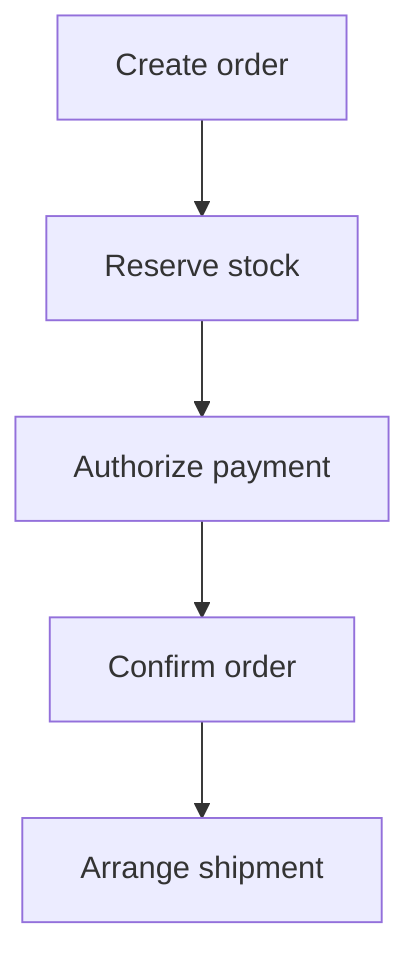
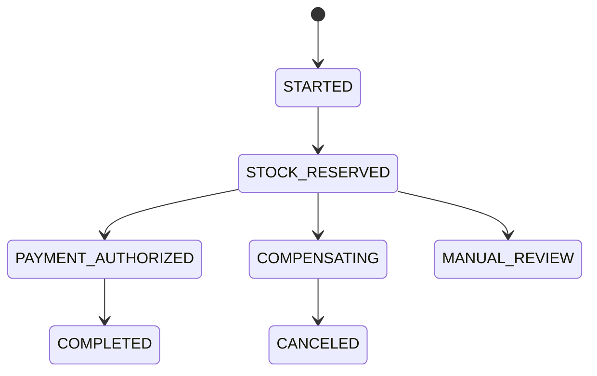

# Saga, Workflow Orchestration và Choreography

> [!summary]
> Saga không tạo ACID xuyên service. Nó chia workflow thành local transactions, giữ durable state và dùng compensation/retry để tiến tới trạng thái business chấp nhận được. “Compensate” là hành động nghiệp vụ mới, không phải time machine rollback.

## 1. Khi nào thật sự cần saga?

Chỉ khi một use case đi qua nhiều owner/data store độc lập và không thể thu về một local transaction hợp lý.



Nếu ordering và inventory đang cùng modular monolith/database, local transaction thường đúng và rẻ hơn.

## 2. Ba loại bước

| Loại | Ý nghĩa | Ví dụ |
|---|---|---|
| Compensable | có hành động bù | reserve ↔ release stock |
| Pivot | điểm cam kết/khó đảo | capture payment |
| Retryable | sau pivot phải cuối cùng thành công | record shipment request |

Sắp xếp bước để hoãn irreversible side effect càng lâu càng tốt.

## 3. Orchestration và choreography

| Tiêu chí | Choreography | Orchestration |
|---|---|---|
| Điều phối | service phản ứng event | workflow controller |
| Flow đơn giản 2–3 bước | tốt | có thể thừa |
| Flow dài/branch/timer | khó nhìn | phù hợp |
| Coupling | event semantics | command với orchestrator |
| Quan sát instance | phải ghép trace/event | có workflow state |
| Thay đổi flow | đụng nhiều consumer | tập trung hơn |
| Rủi ro | cyclic “event soup” | god orchestrator |

Quy tắc: domain logic ở participant; orchestrator chỉ giữ flow, deadline, retry, compensation và state transition.

## 4. State machine rõ ràng



Không dùng một boolean `completed`. Cần:

- `workflowId`, `businessKey`, `workflowVersion`;
- current state/step;
- attempt/deadline/next run;
- command/event IDs;
- compensation status;
- timestamps và correlation ID;
- terminal reason.

## 5. Durable schema minh họa

```sql
CREATE TABLE checkout_workflows (
    workflow_id BINARY(16) PRIMARY KEY,
    order_id BINARY(16) NOT NULL,
    state VARCHAR(40) NOT NULL,
    workflow_version INT NOT NULL,
    row_version BIGINT NOT NULL,
    next_action_at DATETIME(6) NULL,
    last_error_code VARCHAR(80) NULL,
    created_at DATETIME(6) NOT NULL,
    updated_at DATETIME(6) NOT NULL,
    UNIQUE KEY uk_checkout_order (order_id),
    INDEX idx_workflow_due (state, next_action_at, workflow_id)
);
```

Worker claim phải atomic/leased; nhiều instance không chạy cùng step. Xem [[31-Background-Jobs-Scheduling-va-Spring-Batch]].

## 6. Command envelope

```json
{
  "commandId": "cmd_01K...",
  "workflowId": "wf_01K...",
  "workflowVersion": 3,
  "type": "inventory.reserve",
  "deadline": "2026-07-23T10:01:00Z",
  "payload": {"orderId":"ord_9","items":[{"variantId":"v1","qty":1}]}
}
```

Participant dedupe `commandId`, trả stable outcome. Timeout không chứng minh command thất bại.

## 7. Spring Boot orchestrator skeleton

```java
@Transactional
public void on(StockReserved event) {
    Workflow wf = workflows.lockById(event.workflowId());
    if (wf.alreadyApplied(event.eventId())) return;
    if (!wf.accepts(event)) {
        inbox.recordIgnored(event.eventId(), "stale-or-unexpected");
        return;
    }
    wf.stockReserved(event.reservationId());
    outbox.append(AuthorizePayment.forWorkflow(wf));
    inbox.markApplied(event.eventId());
}
```

State update + next command + inbox marker phải cùng local transaction.

## 8. Compensation semantics

`ReleaseStock` có thể fail/retry. `RefundPayment` không xóa charge lịch sử mà tạo một transaction mới; phí/tỷ giá/thời gian có thể khác.

Mỗi compensation cần:

- idempotency key riêng nhưng liên hệ original operation;
- precondition/state machine;
- deadline/retry classification;
- terminal failure và manual repair path;
- audit của ai/điều gì kích hoạt.

## 9. Timeout và unknown outcome

```text
send authorize payment
network timeout
provider may have committed
```

Không phát lệnh mới bằng idempotency key mới. Chuyển `PAYMENT_UNKNOWN`, query/reconcile bằng provider reference, nhận webhook, rồi quyết định.

## 10. Timer

Timer là durable state, không phải `Thread.sleep`:

- stock reservation expiry;
- payment authorization timeout;
- webhook not received;
- compensation retry;
- workflow overall deadline.

Clock skew, restart và duplicate wake-up đều phải được xử lý.

## 11. Workflow versioning

Instance cũ có thể sống nhiều ngày trong khi code deploy:

- pin `workflowVersion` lúc tạo;
- code mới hiểu state/event cũ;
- không đổi tên/xóa state đang tồn tại;
- dùng migration có checkpoint hoặc worker compatibility;
- canary workflow version mới;
- test replay histories cũ.

## 12. Failure matrix

| Failure | State an toàn | Hành động |
|---|---|---|
| reserve stock reject | canceled | không payment |
| reserve timeout | unknown | lookup/dedupe |
| payment decline | compensating | release stock |
| payment timeout | manual/unknown | reconcile, không blind retry |
| orchestrator crash | persisted prior state | resume |
| duplicate event | unchanged | inbox dedupe |
| out-of-order event | unchanged/quarantine | state/version check |
| compensation fail | compensating | bounded retry + alert |

## 13. Observability

Metric theo business state:

```text
workflow_started_total{type}
workflow_terminal_total{type,outcome}
workflow_step_duration_seconds{type,step}
workflow_stuck_total{type,state}
compensation_total{type,step,outcome}
```

Không dùng `orderId` làm metric label. Log/trace có `workflowId`, `orderId` được redaction theo policy.

## 14. Tests bắt buộc

- crash sau local commit, trước publish;
- crash sau participant commit, trước response;
- duplicate command và event;
- out-of-order/stale version;
- timeout trước/sau provider commit;
- compensation cũng timeout;
- orchestrator chạy hai instance;
- timer fire hai lần;
- deploy code mới với workflow cũ;
- invariant reconciliation cuối: order/payment/stock không mâu thuẫn.

## 15. Anti-patterns

- saga cho hai bảng cùng database;
- compensate bằng cách delete audit;
- event chung chung `SomethingUpdated`;
- mọi service lắng nghe mọi event rồi sinh vòng lặp;
- orchestrator chứa pricing/inventory domain logic;
- infinite retry không deadline;
- terminal `FAILED` nhưng không nêu side effect đã xảy ra;
- dashboard chỉ nhìn queue lag, không nhìn stuck workflow.

## 16. Kết nối graph

- Local atomicity/idempotency: [[17-Concurrency-Isolation-va-Idempotency-Nang-cao]]
- Outbox/inbox: [[18-Event-Driven-Outbox-va-Kafka]]
- Broker semantics: [[49-Message-Broker-Queue-Selection-Kafka-RabbitMQ]]
- Durable worker/timer: [[31-Background-Jobs-Scheduling-va-Spring-Batch]]
- Incident/reconciliation: [[55-Incident-Management-OnCall-va-Chaos-Engineering]]

## Nguồn chính thức

1. [Azure Architecture Center — Saga design pattern](https://learn.microsoft.com/en-us/azure/architecture/patterns/saga) — truy cập 2026-07-23.
2. [Temporal Documentation — Workflows](https://docs.temporal.io/workflows) — truy cập 2026-07-23.
3. [AWS Prescriptive Guidance — Saga orchestration pattern](https://docs.aws.amazon.com/prescriptive-guidance/latest/cloud-design-patterns/saga-orchestration.html) — truy cập 2026-07-23.

