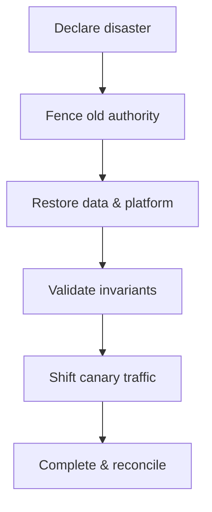

# Multi-Region Architecture, Disaster Recovery và Data Residency

> [!summary]
> Multi-region không tự động là DR, và replica không thay backup. Bắt đầu từ business impact, RTO/RPO theo capability, failure scope và data residency; sau đó chọn backup/restore, pilot light, warm standby hay active-active.

## 1. Định nghĩa

- **RTO:** downtime tối đa chấp nhận trước khi capability phải phục hồi.
- **RPO:** khoảng mất dữ liệu tối đa chấp nhận, tính từ recovery point.
- **Failover:** chuyển traffic/authority sang recovery site.
- **Failback:** trở lại hoặc tái lập primary sau recovery.

RTO/RPO là target cho một event, không phải số “trung bình đẹp”.

## 2. Phân loại capability

| Capability | RTO giả định | RPO giả định | Degraded mode |
|---|---:|---:|---|
| Browse catalog | 15 phút | 1 giờ | cache/static |
| Checkout | 30 phút | 0–5 phút | disable new checkout |
| Payment webhook | 5 phút | gần 0 | durable edge queue |
| Admin analytics | 24 giờ | 24 giờ | unavailable |

Số trên chỉ minh họa; project phải được business phê duyệt.

## 3. Strategy ladder

| Strategy | Cost | RTO/RPO điển hình | Độ khó |
|---|---|---|---|
| Backup & restore | thấp | cao | thấp |
| Pilot light | thấp-vừa | trung-cao | vừa |
| Warm standby | vừa-cao | thấp hơn | cao |
| Active-active | rất cao | thấp tiềm năng | rất cao |

Active-active write chỉ đáng khi business cần và data model giải được conflict/authority. Không chọn vì sơ đồ đẹp.

## 4. Dependency inventory

Recovery không chỉ là app + DB:

```text
DNS/traffic manager
container registry/artifact
config/secrets/KMS
database/cache/broker/search/object storage
identity provider/payment/webhook
observability
CI/CD/IaC
runbook and human access
```

Một secret/KMS chỉ tồn tại primary region có thể phá toàn DR.

## 5. Data authority models

| Model | Ưu | Rủi ro |
|---|---|---|
| Single writer region | conflict đơn giản | write latency/failover authority |
| Home region per tenant | scale/locality | tenant routing/move phức tạp |
| Active-active same entity | availability/local writes | conflict/invariant khó |
| Read local, write primary | read latency tốt | read freshness/read-your-writes |

Stock/payment thường cần single authority hoặc partition rõ theo entity. Catalog content có thể replicate eventual.

## 6. Fencing khi failover

Rủi ro:

```text
primary bị cô lập nhưng vẫn write
secondary được promote và cũng write
→ split brain
```

Control:

- consensus/managed promotion;
- epoch/term token;
- revoke old credentials/routes;
- database read-only/fencing;
- verify old writer không còn authority trước mở write.

Xem [[35-Nen-tang-He-phan-tan-CAP-Clock-Consensus]].

## 7. DNS và traffic

DNS failover bị ảnh hưởng bởi:

- TTL và cache ngoài kiểm soát;
- client connection lâu;
- health check false positive;
- resolver/network dependency;
- TLS certificate/SNI;
- stale endpoints.

Ứng dụng/client cần reconnect, timeout và endpoint strategy; đổi DNS không ép mọi TCP connection cũ biến mất.

## 8. Backup khác replication

Replication sao chép:

- accidental delete;
- bad migration;
- corrupt application write;
- ransomware nếu cùng trust.

Backup cần:

- versioning/immutability;
- independent credentials/account;
- encryption/key recovery;
- retention;
- integrity validation;
- restore drill đến service usable.

## 9. Restore sequence



Runbook phải nêu decision owner và stop conditions.

## 10. Data reconciliation

Sau failover:

- xác định committed transactions trước cutoff;
- dedupe requests/events;
- reconcile payment provider;
- rebuild projections/search/cache;
- compare inventory/order/payment invariants;
- preserve evidence;
- communicate potentially lost/stale operations.

Không “sync hai bên” tùy tiện khi chưa xác định authority.

## 11. Data residency

Inventory cho mỗi data class:

| Field/class | Region allowed | Replica/backup | Retention | Transfer basis/approval |
|---|---|---|---|---|
| Account PII | policy-defined | policy-defined | policy-defined | legal/privacy |
| Payment token | provider boundary | minimal | contract | security |
| Product public | global | global | business | normal |
| Audit log | restricted | immutable | policy | privileged |

Residency gồm log, trace, search index, DLQ, backup và support export—không chỉ primary DB.

## 12. DR test levels

1. tabletop: roles/decisions;
2. component restore: backup → clean environment;
3. dependency isolation;
4. regional traffic canary;
5. full failover;
6. failback/reconciliation.

Đo actual:

```text
detect time
decision time
fence time
restore/promote time
validation time
traffic recovery time
actual data loss window
```

## 13. Failure matrix

| Failure | Không được giả định | Bằng chứng |
|---|---|---|
| zone loss | region healthy nghĩa app healthy | zone evacuation test |
| region loss | replica promote tự động đúng | full drill |
| control plane loss | có thể deploy/config | pre-provision/runbook |
| identity/KMS loss | service vẫn decrypt | key/access exercise |
| network partition | primary chết | fencing test |
| logical corruption | replica sạch | PITR restore |
| operator error | runbook đủ rõ | game day |

## 14. Spring Boot concerns

- config/secret external, reproducible;
- readiness phản ánh ability to serve, không gây cascading;
- idempotency key tồn tại cross-region;
- jobs có single owner/lease epoch;
- session không pin local memory;
- URL/webhook callback có failover plan;
- schema versions tương thích trong recovery;
- telemetry vẫn hoạt động khi primary observability chết.

## 15. Anti-patterns

- tuyên bố RPO=0 với async replication;
- backup chưa từng restore;
- failover tự động chỉ dựa một health check;
- active-active cho stock không conflict policy;
- DR account dùng cùng credential bị compromise;
- chỉ test failover, không test failback;
- không tính SaaS/provider dependency;
- không biết ai có quyền declare disaster.

## 16. Kết nối graph

- Replication/backup: [[28-MySQL-Replication-Backup-va-Scaling]]
- CAP/fencing: [[35-Nen-tang-He-phan-tan-CAP-Clock-Consensus]]
- Network/DNS/TLS: [[41-Networking-DNS-TLS-HTTP2-va-Load-Balancing]]
- Migration compatibility: [[51-Zero-Downtime-Schema-va-Data-Migration]]
- Incident command: [[55-Incident-Management-OnCall-va-Chaos-Engineering]]
- Cost trade-off: [[54-FinOps-Cost-Engineering-va-Unit-Economics]]

## Nguồn chính thức

1. [AWS Well-Architected Reliability Pillar — DR objectives](https://docs.aws.amazon.com/wellarchitected/latest/reliability-pillar/disaster-recovery-dr-objectives.html) — truy cập 2026-07-23.
2. [AWS Well-Architected — Plan for disaster recovery](https://docs.aws.amazon.com/wellarchitected/latest/reliability-pillar/plan-for-disaster-recovery-dr.html) — truy cập 2026-07-23.
3. [AWS Well-Architected — Test DR implementation](https://docs.aws.amazon.com/wellarchitected/latest/framework/rel_planning_for_recovery_dr_tested.html) — truy cập 2026-07-23.
4. [MySQL 8.4 Reference Manual — Backup and Recovery](https://dev.mysql.com/doc/refman/8.4/en/backup-and-recovery.html) — truy cập 2026-07-23.

