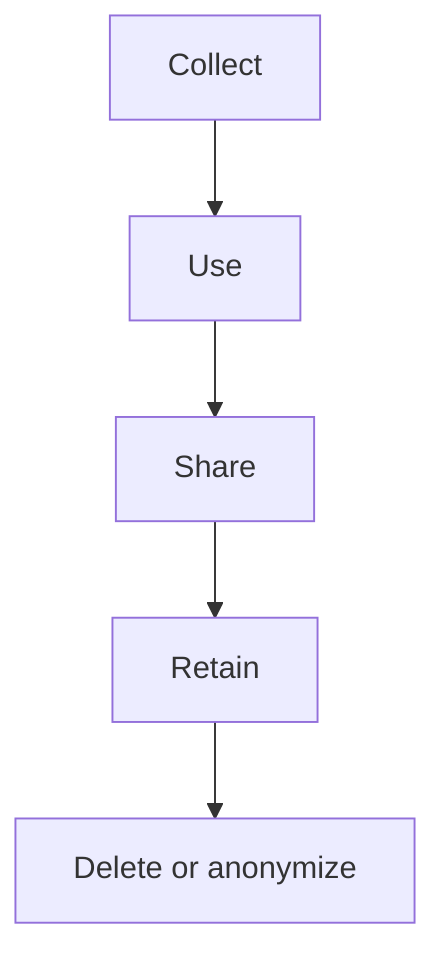
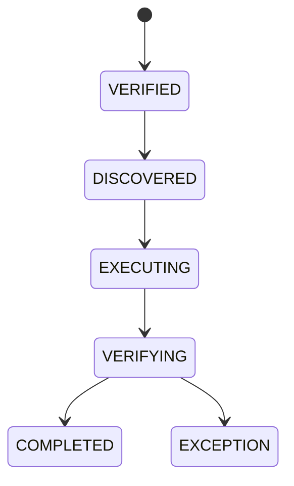

# Privacy Engineering, Data Governance, Retention và Erasure

> [!warning]
> Đây là hướng dẫn kỹ thuật, không phải tư vấn pháp lý. Luật, hợp đồng và khu vực áp dụng phải được legal/privacy owner xác nhận. Mục tiêu kỹ thuật là làm data flow nhìn thấy được, giảm dữ liệu, thực thi lifecycle và tạo bằng chứng.

## 1. Privacy khác security

- Security hỏi ai có thể truy cập/sửa/phá.
- Privacy hỏi thu thập gì, vì mục đích nào, dùng/chia sẻ/giữ bao lâu và quyền của data subject.

Dữ liệu mã hóa mạnh nhưng thu thập vô hạn, dùng sai mục đích vẫn là privacy failure.

## 2. Data inventory tối thiểu

| Data class | Ví dụ | Purpose | Owner | Store/flow | Retention | Access |
|---|---|---|---|---|---|---|
| Direct identifier | email/phone | account | identity | DB→email provider | policy | support limited |
| Address | shipping | fulfillment | ordering | DB→carrier | policy | fulfillment |
| Payment | provider token | payment | payment | vault/provider | contract | payment only |
| Behavior | searches/clicks | analytics | product | event lake | consent/policy | analytics |
| Security | IP/device | abuse | security | logs/SIEM | policy | security |

Không thể xóa đúng nếu không biết dữ liệu nằm ở đâu.

## 3. Data lifecycle



Mỗi cạnh cần purpose, lawful/contract basis, access, encryption, retention và evidence.

## 4. Data minimization

Trước khi thêm field/event/log:

1. Feature có cần không?
2. Có thể dùng derived/coarse value?
3. Có cần gửi cho consumer này?
4. Có cần giữ raw?
5. Retention ngắn hơn được không?
6. Có thể tokenize/pseudonymize?

`OrderPlaced` cho search không cần full address, phone hoặc payment token.

## 5. Classification trong code/schema

```java
public record CustomerContact(
        @Sensitive(DataClass.DIRECT_IDENTIFIER) String email,
        @Sensitive(DataClass.DIRECT_IDENTIFIER) String phone) {}
```

Annotation chỉ là metadata; phải nối tới:

- log redaction;
- serialization policy;
- access review;
- retention/erasure handler;
- test rule.

Không dựa annotation như security boundary duy nhất.

## 6. Access control

- least privilege theo service purpose;
- field-level/row/tenant scoping khi cần;
- support access time-bound và audited;
- production export có approval;
- break-glass có alert/review;
- service account rotation;
- analytics dataset tách identifiers.

Audit log cũng là sensitive data; không để mọi developer đọc.

## 7. Retention as code

```yaml
dataPolicy:
  class: customer_support_attachment
  owner: support-platform
  activeRetention: P90D
  deletionGrace: P7D
  backupExpiry: P35D
  legalHoldSupported: true
  deletionEvidence: aggregate-only
```

Giá trị chỉ minh họa, phải theo policy thật. Job deletion:

- idempotent;
- checkpointed;
- tenant/hold aware;
- rate limited;
- auditable nhưng không log lại data đã xóa.

## 8. Erasure graph

Request xóa account có thể đi:

```text
identity DB
orders (legal retention/pseudonymize)
search index
Redis cache/session
object storage
Kafka/DLQ
analytics lake
logs/traces
backups
third-party processors
```

Mỗi node có action: delete, anonymize, restrict, retain theo obligation, hoặc expire. “DELETE FROM users” không hoàn tất request.

## 9. Erasure workflow



Yêu cầu:

- xác minh identity/authorization chống xóa tài khoản người khác;
- durable request ID/idempotency;
- deadline/escalation;
- per-system receipt không chứa PII;
- legal hold/exception;
- retry và manual repair;
- final evidence.

## 10. Pseudonymization vs anonymization

| Cách | Có thể liên kết lại? | Ghi chú |
|---|---|---|
| Tokenization | có qua vault/map | vẫn sensitive |
| Hash plain email | thường dò được | không anonymization |
| Salted/secret HMAC | khó dò hơn | rotation/linkability cần policy |
| Aggregation | tùy nhóm/k-anonymity | small group risk |
| True anonymization | không hợp lý để tái định danh | khó chứng minh |

Không tự gọi dữ liệu “anonymous” chỉ vì xóa tên.

## 11. Encryption và crypto-shredding

- encryption at rest không thay authorization;
- envelope encryption + per-subject key có thể hỗ trợ erasure;
- delete key phải bao phủ copies/escrow/cache;
- metadata vẫn có thể nhận diện;
- key deletion phải có evidence và recovery policy;
- legal/privacy review tính phù hợp.

## 12. Logging/telemetry

Không log:

- access/refresh token;
- password/secret;
- full card/payment token;
- presigned URL;
- raw request body mặc định;
- address/phone/email khi không cần.

Thay bằng stable opaque ID, error code, count/bucket. Trace baggage phải allowlist và size-bound.

## 13. Event sourcing và immutable logs

Event stream bất biến tạo tension:

- tách PII ra referenced store;
- minimize event payload;
- encrypt selected field/per-subject key;
- design tombstone/compensation;
- retention theo stream;
- tránh dùng immutable audit như kho dump.

Xem [[46-CQRS-Event-Sourcing-va-Read-Models]].

## 14. Backup semantics

Không cần rewrite mọi backup ngay trong mọi policy, nhưng phải có:

- backup expiry rõ;
- không restore data erased vào active service mà không reapply deletion ledger;
- deletion requests lưu riêng tối thiểu;
- restore runbook chạy tombstones;
- access backup restricted.

Luật/policy cụ thể do owner phê duyệt.

## 15. Privacy threat scenarios

| Scenario | Control |
|---|---|
| cross-tenant export | tenant predicate + authz test |
| support bulk scrape | scoped access + audit/rate limit |
| log contains token | redaction + sink scan |
| forgotten search document | erasure reconciliation |
| stale backup restore | replay deletion ledger |
| analytics re-identification | minimization/aggregation/access |
| webhook leaks PII | signed transport + minimal payload |

## 16. Verification

- data-flow diagram diff trong design review;
- schema/event/log static checks;
- authz negative tests;
- erasure integration test qua DB/cache/search/object;
- backup restore + deletion replay;
- retention job clock-bound tests;
- sample access audit;
- third-party deletion receipt/reconciliation;
- periodic orphan dataset discovery.

## 17. Anti-patterns

- “encrypted nên giữ mãi”;
- copy production PII sang dev;
- hash email không secret rồi gọi anonymous;
- log full payload để debug;
- privacy review sau release;
- xóa primary DB, bỏ cache/search/backups;
- metric label chứa user/order/email;
- legal hold là cờ không test.

## 18. Kết nối graph

- Security/authz: [[08-Spring-Security-va-API-Security]]
- Tenant/audit/temporal: [[37-Data-Modeling-Multi-Tenancy-Temporal-va-Audit]]
- Telemetry redaction: [[34-OpenTelemetry-Micrometer-va-Observability-Implementation]]
- Threat model: [[42-Threat-Modeling-va-Software-Supply-Chain-Security]]
- Multi-region/residency: [[50-Multi-Region-Architecture-DR-va-Data-Residency]]
- Incident response: [[55-Incident-Management-OnCall-va-Chaos-Engineering]]

## Nguồn chính thức

1. [NIST Privacy Framework](https://www.nist.gov/privacy-framework) — truy cập 2026-07-23.
2. [EU Regulation 2016/679 (GDPR), official text](https://eur-lex.europa.eu/eli/reg/2016/679/oj) — truy cập 2026-07-23.
3. [OWASP Cheat Sheet — Logging](https://cheatsheetseries.owasp.org/cheatsheets/Logging_Cheat_Sheet.html) — truy cập 2026-07-23.
4. [OWASP Cheat Sheet — User Privacy Protection](https://cheatsheetseries.owasp.org/cheatsheets/User_Privacy_Protection_Cheat_Sheet.html) — truy cập 2026-07-23.

