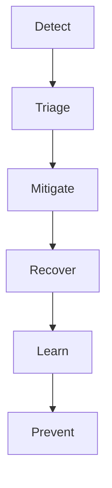

# Incident Management, On-call và Chaos Engineering

> [!summary]
> Trong incident, tối ưu đầu tiên là giảm user impact và giữ coordination—not tìm root cause hoàn hảo. Chaos engineering là thí nghiệm có hypothesis, blast radius và abort condition; không phải phá production ngẫu nhiên.

## 1. Incident lifecycle



Mitigation có thể là rollback, disable feature, shed load, route traffic hoặc degraded mode.

## 2. Severity

| Severity | Ví dụ | Response |
|---|---|---|
| SEV-1 | checkout/payment toàn hệ thống | immediate incident command |
| SEV-2 | degraded nhiều user/tenant | urgent coordinated |
| SEV-3 | limited workaround | business-hours/owned |

Project định nghĩa theo user/business impact, không theo “CPU đỏ”.

## 3. Roles

- **Incident Commander (IC):** mục tiêu, ưu tiên, quyết định.
- **Operations lead:** thao tác kỹ thuật.
- **Communications lead:** stakeholder/status.
- **Scribe:** timeline, decisions, evidence.
- **Subject experts:** investigation scoped.

IC không cần là người gõ lệnh giỏi nhất. Một người không kiêm mọi vai trong SEV lớn.

## 4. First 15 minutes

```text
impact and start time
affected capabilities/regions/tenants
recent changes
declare severity and IC
freeze risky changes
choose safest mitigation
open timeline/comms channel
assign investigation branches
set next update time
```

Không để 10 người cùng query production/roll restart.

## 5. Evidence hierarchy

1. user-visible SLI;
2. deploy/config/traffic timeline;
3. distributed trace;
4. dependency/queue/pool saturation;
5. logs/profile/query plans;
6. hypothesis-specific experiment.

Dashboard đỏ là symptom, không luôn là cause.

## 6. Mitigation decision

| Action | Time | Reversible | Risk | Khi dùng |
|---|---:|---|---|---|
| rollback | nhanh | có | schema compatibility | recent bad release |
| feature flag off | rất nhanh | có | hidden side effects | isolated feature |
| scale out | nhanh | có | DB downstream overload | compute bottleneck |
| shed load | nhanh | có | rejected users | saturation |
| failover | vừa | khó hơn | stale/split brain | region/data failure |
| data repair | chậm | rủi ro | corruption | sau fence/backup |

Chọn action giảm impact với evidence và stop condition.

## 7. Communication

Update:

```text
Time:
Impact:
What changed:
Current mitigation:
Risk/unknown:
Next update:
```

Không suy đoán root cause như fact. Dùng timestamp/timezone nhất quán.

## 8. Handover

On-call fatigue tạo lỗi. Handover gồm:

- current impact/SLI;
- actions đã làm và outcome;
- active hypotheses/evidence;
- dangerous actions tránh;
- credentials/access status;
- next decision/time;
- owner từng branch.

## 9. Recovery criteria

Không đóng vì graph xanh 5 phút:

- SLI ổn qua observation window;
- backlog drain;
- duplicate/reconciliation complete hoặc owned;
- no hidden tenant/region impact;
- temporary controls documented;
- monitoring/alerting active;
- follow-up owner.

## 10. Blameless postmortem

Tập trung điều kiện hệ thống và decision context, không “ai gây lỗi”.

Template:

```text
summary and impact
timeline
detection
contributing factors
what went well/poorly/luck
root/system causes
corrective actions
owners/dates/priority
evidence and review
```

Blameless không nghĩa accountability-free; action vẫn có owner/date.

## 11. Action quality

| Action yếu | Action mạnh |
|---|---|
| cẩn thận hơn | validation tự động |
| viết docs | runbook + drill |
| thêm alert | SLI alert + threshold/runbook |
| test nhiều hơn | test failure cụ thể trong CI |
| scale DB | query/index/load evidence |

Ưu tiên controls giảm cả probability và blast radius.

## 12. On-call readiness

Service vào production cần:

- owner/escalation;
- SLO/alerts;
- dashboard/trace/log access;
- common runbooks;
- deploy/rollback;
- dependency contacts;
- data repair safety;
- capacity/DR knowledge;
- shadow rotation/training.

Alert phải actionable; symptom-based paging, ticket cho nonurgent.

## 13. Chaos experiment design

```yaml
hypothesis: checkout remains below 1% errors when one app zone is unavailable
steadyState:
  checkoutSuccessRate: ">= 99%"
  p95LatencyMs: "<= 800"
fault: block traffic to zone-a app pods
blastRadius: 5% canary traffic
duration: 10m
abort:
  errorRate: "> 1%"
  paymentUnknownRate: "> 0.1%"
owner: reliability-team
rollback: restore network policy and verify endpoints
```

Experiment phải có approval/risk policy của tổ chức.

## 14. Maturity ladder

1. test/local deterministic fault;
2. integration dependency failure;
3. staging with production-like load;
4. production canary;
5. scheduled game day;
6. continuous limited verification.

Không bắt đầu bằng regional shutdown.

## 15. Fault catalog

- latency/timeout/reset;
- dependency 5xx/rate limit;
- DNS/TLS/certificate;
- broker duplicate/out-of-order/lag;
- DB lock/replica lag/failover;
- disk/memory/CPU pressure;
- clock skew;
- pod/node/zone loss;
- secret rotation;
- bad config/schema/event.

Fault phải map tới hazard/invariant, không chỉ hạ pod vì dễ.

## 16. Safety

- blast radius bounded;
- abort automated/observable;
- business peak/change freeze awareness;
- no irreversible data corruption;
- IC/on-call informed;
- backup/recovery verified;
- third-party/legal constraints;
- experiment ID trong telemetry;
- stop control độc lập.

## 17. Verification examples

### Payment timeout

Hypothesis: timeout sau provider commit không charge lại.

Assert:

- attempt thành `UNKNOWN`;
- retry giữ same provider idempotency key;
- webhook/reconcile chuyển terminal;
- exactly one charge;
- alert nếu unknown quá deadline.

### DB pool saturation

Assert:

- admission rejects bounded;
- memory/thread không tăng vô hạn;
- health endpoint không gây restart storm;
- recovery không retry storm;
- p99/backlog quay về baseline.

## 18. Anti-patterns

- restart mọi thứ trước giữ evidence;
- scale mù làm dependency chết nhanh hơn;
- 20 người không IC;
- postmortem chỉ “human error”;
- actions không owner/date;
- alert theo mọi exception;
- chaos production không abort;
- game day có fault nhưng không business SLI;
- đóng incident khi traffic thấp tạm thời.

## 19. Kết nối graph

- Troubleshooting: [[24-Production-Troubleshooting-Playbook]]
- Telemetry: [[34-OpenTelemetry-Micrometer-va-Observability-Implementation]]
- Resilience/overload: [[21-Distributed-Reliability-va-Resilience4j]], [[40-Performance-Capacity-va-Load-Testing]]
- DR: [[50-Multi-Region-Architecture-DR-va-Data-Residency]]
- Release: [[43-Release-Engineering-GitOps-Feature-Flags-va-Canary]]
- DoD: [[13-Checklist-Definition-of-Done]]

## Nguồn chính thức/chuẩn ngành

1. [Google SRE Book — Managing Incidents](https://sre.google/sre-book/managing-incidents/) — truy cập 2026-07-23.
2. [Google SRE Book — Postmortem Culture](https://sre.google/sre-book/postmortem-culture/) — truy cập 2026-07-23.
3. [Principles of Chaos Engineering](https://principlesofchaos.org/) — truy cập 2026-07-23.
4. [Google SRE Workbook — Incident Response](https://sre.google/workbook/incident-response/) — truy cập 2026-07-23.

