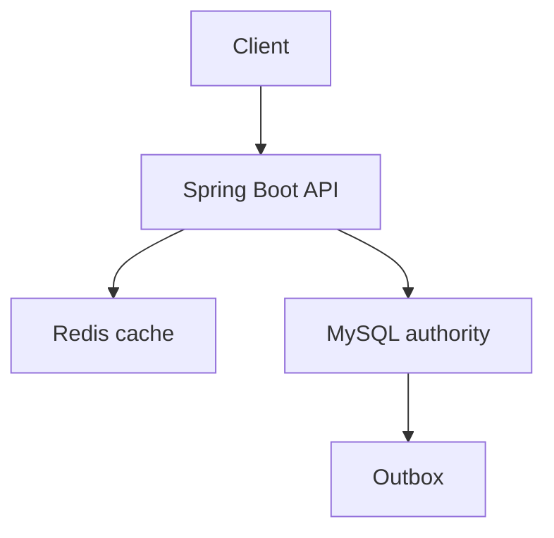
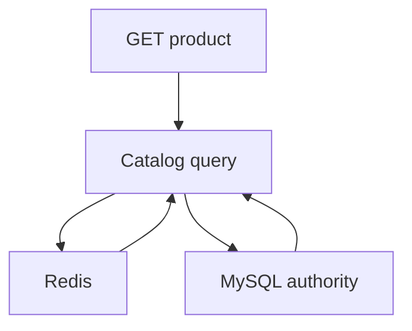

# Template ghi chú kỹ thuật có kiểm chứng cho người và AI Agent

> [!important]
> Đây không phải một trang có nhiều tiêu đề để trống. Nó là **giao thức biến thông tin thành tri thức có thể dùng để ra quyết định và sinh code**. Mỗi phần đều chỉ rõ: phải viết gì, ví dụ đạt chuẩn, bằng chứng nào cần có và AI Agent được phép suy luận đến đâu.

## Phần A — Cách dùng template

### A1. Chọn đúng loại tài liệu

| Loại | Mục đích | Bằng chứng bắt buộc | AI Agent được dùng thế nào |
|---|---|---|---|
| `fact` | mô tả behavior/cơ chế | nguồn chính thức + reproduction nếu quan trọng | làm premise trong reasoning |
| `recommendation` | mặc định kỹ thuật có trade-off | comparison + failure + test/benchmark | dùng làm default, được override bằng ADR |
| `adr` | quyết định của dự án | context + options + decision + consequences | coi là ràng buộc project |
| `runbook` | xử lý/vận hành | trigger + commands + stop/rollback + drill | thực thi từng bước trong scope cho phép |
| `experiment` | kiểm tra hypothesis | workload + method + raw result | không khái quát quá phạm vi |
| `tutorial` | dạy một kỹ năng | runnable example + giải thích | học pattern, không coi config là project fact |

Một note có thể kết hợp, nhưng frontmatter phải nêu `content_type` chính.

### A2. Không được xóa các phần cốt lõi

Một note “đạt” phải có:

1. kết luận ngắn;
2. phạm vi phiên bản và mức chắc chắn;
3. context/workload/invariant;
4. mental model;
5. decision table;
6. ví dụ đúng và phản ví dụ;
7. failure modes;
8. security/privacy;
9. verification;
10. operability;
11. liên kết graph;
12. nguồn có ngày kiểm tra.

Nếu phần nào không áp dụng, ghi **“Không áp dụng — vì …”**, không để trống.

### A3. Thang chất lượng 100 điểm

| Nhóm | Điểm | Tiêu chí đạt tối đa |
|---|---:|---|
| Scope và claim | 10 | version, workload, non-goal, certainty rõ |
| Correctness/mental model | 15 | giải thích cơ chế và invariant |
| Decision/trade-off | 15 | so sánh ≥2 lựa chọn, “không dùng khi” |
| Example | 15 | code/SQL/config/HTTP có context và caveat |
| Failure/reliability | 10 | timeout, duplicate, overload, recovery |
| Security/privacy | 10 | threat, authz, secret/PII, negative test |
| Verification | 15 | cách tái hiện, test/benchmark, acceptance |
| Graph/operations | 5 | links có nghĩa, metric/runbook/owner |
| Sources/freshness | 5 | primary source, section/version/date |

Gate:

- `< 70`: draft, không đưa cho Agent làm rule;
- `70–84`: reviewed recommendation;
- `85–94`: verified;
- `95–100`: project-ready kèm evidence thực tế.

### A4. Quy tắc chống “tài liệu nghe hay nhưng rỗng”

Không viết:

> Redis làm hệ thống nhanh hơn và có thể mở rộng.

Phải viết:

> Với endpoint đọc product detail có p95 DB 45 ms, freshness budget 5 phút và 90% request tập trung vào 10% SKU, thử cache-aside Redis TTL 300 s. Chấp nhận stale price tối đa 5 phút **chỉ cho browse**; checkout vẫn đọc price authoritative. Gate: p95 giảm ≥30%, DB read QPS giảm ≥40%, stale-price mismatch <0,1% và cold-cache không vượt SLO.

Câu thứ hai có workload, boundary, consistency, đo lường và “không áp dụng cho checkout”.

---

## Phần B — Template copy-ready, không có mục rỗng vô nghĩa

Copy từ heading `B1` đến hết `B23`. Thay giá trị ví dụ trong dấu `{{...}}`; nếu chưa biết, dùng trạng thái `UNKNOWN — cần đo/xác nhận bởi ...`, không bịa.

### B1. Frontmatter chuẩn

```yaml
---
title: "{{Kết luận/chủ đề có thể tìm kiếm; ví dụ: Cache-aside Product Detail}}"
aliases: ["{{từ đồng nghĩa; ví dụ: Product cache}}"]
tags: ["{{domain}}", "{{technology}}", "{{quality-attribute}}"]
status: "draft | reviewed | verified | superseded"
content_type: "fact | recommendation | adr | runbook | experiment | tutorial"
verified_on: "{{YYYY-MM-DD; ví dụ: 2026-07-23}}"
applies_to:
  - "{{Spring Boot 4.1.x}}"
  - "{{Redis 8.x hoặc version dự án đã kiểm tra}}"
not_applies_to:
  - "{{checkout authoritative pricing}}"
certainty: "high | medium | low"
owner: "{{team/person chịu trách nhiệm; ví dụ: catalog-team}}"
review_cycle: "{{3-months | 6-months | event-driven}}"
review_triggers:
  - "{{major version upgrade}}"
  - "{{SLO/workload thay đổi > 2x}}"
sources:
  - "{{official URL + section}}"
requires:
  - "{{internal note prerequisite}}"
constrains:
  - "{{internal note bị quyết định này giới hạn}}"
implements:
  - "{{pattern/config/code thực hiện}}"
verified_by:
  - "{{test, benchmark, EXPLAIN hoặc drill}}"
operated_by:
  - "{{dashboard, alert, runbook, job}}"
---
```

### B2. Kết luận ngắn

Viết 3–6 câu trả lời trực tiếp:

```text
Chọn gì?
Cho workload/use case nào?
Invariant/SLO nào quyết định?
Trade-off lớn nhất là gì?
Khi nào phải đánh giá lại?
```

Ví dụ:

> Dùng cache-aside cho Product Detail vì workload đọc nhiều và chấp nhận stale metadata tối đa 5 phút. Không dùng cache làm nguồn price/stock khi checkout. Key có tenant + product + representation version; TTL có jitter; miss được single-flight trong mỗi instance. Đánh giá lại khi hit ratio dưới 70%, invalidation lag vượt freshness budget hoặc traffic tăng gấp đôi.

### B3. Claim inventory và độ chắc chắn

| ID | Claim | Loại | Certainty | Evidence | Nếu sai thì sao? |
|---|---|---|---|---|---|
| C1 | `{{Redis GET là read path cho browse}}` | project decision | high | ADR/config | latency và freshness đổi |
| C2 | `{{TTL 300 s đạt freshness}}` | hypothesis | low trước benchmark | load/freshness test | stale data |
| C3 | `{{checkout bỏ qua cache}}` | invariant/control | high | integration test | sai giá/stock |

Quy tắc:

- fact từ docs không biến thành project fact nếu chưa thấy code/config;
- recommendation không biến thành requirement nếu chưa có ADR;
- benchmark của người khác không chứng minh workload của mình.

### B4. Context, workload và non-goals

Điền đủ:

```text
Actors: {{customer, admin, worker}}
Traffic: {{average/peak RPS, burst, read/write ratio}}
Data: {{rows/bytes/growth/cardinality/distribution}}
SLO: {{availability, p95/p99, freshness, durability}}
Consistency: {{strong, read-your-writes, monotonic, eventual}}
Dependencies: {{MySQL, Redis, Kafka, provider}}
Failure scope: {{process, node, zone, region, provider}}
Security/data class: {{public, internal, confidential, restricted}}
Team/operations: {{owner, on-call, current skills}}
Constraints: {{budget, deadline, legacy clients, migration}}
Non-goals: {{điều note không giải; ví dụ full-text search}}
```

Nếu chưa có số liệu:

```text
Peak RPS: UNKNOWN — owner performance-team; lấy từ gateway 30 ngày;
không quyết định pool/cache size trước khi có dữ liệu.
```

### B5. Invariants

Invariant là điều không được phá, không phải mong muốn mơ hồ.

| ID | Invariant | Authority | Enforcement | Evidence |
|---|---|---|---|---|
| I1 | `{{stock không âm}}` | inventory DB | conditional SQL/transaction | concurrency test |
| I2 | `{{payment không charge trùng}}` | provider + payment DB | idempotency/reconcile | duplicate/timeout test |
| I3 | `{{tenant không đọc chéo}}` | authz + data layer | scoped query/policy | negative test |

Mỗi optimization phải nói nó có thể ảnh hưởng invariant nào.

### B6. Mental model

Giải thích theo chuỗi:

```text
input/request/event
→ boundary nhận
→ state đọc
→ decision/invariant
→ state commit
→ side effect/publication
→ response/ack
→ metric/recovery
```

Gợi ý:

- state nằm ở đâu?
- transaction bắt đầu/kết thúc ở đâu?
- ai là authority?
- concurrency conflict ở đâu?
- crash giữa hai mũi tên thì sao?
- retry nhìn thấy state gì?
- clock/order có được giả định không?

### B7. Sơ đồ nhỏ

Chỉ dùng sơ đồ nếu làm rõ topology/sequence/state. Ví dụ:



Kèm đoạn văn nêu rõ Redis là projection/cache, MySQL là authority.

### B8. Decision table

Ít nhất 2 lựa chọn thực tế và 1 lựa chọn “do nothing”.

| Lựa chọn | Khi dùng | Không dùng khi | Correctness | Latency/scale | Ops/cost | Migration |
|---|---|---|---|---|---|---|
| Không thêm công nghệ | load hiện tại đạt SLO | DB đã saturation | đơn giản | giới hạn hiện tại | thấp | không |
| Cache local | dataset nhỏ/per-instance | cần shared invalidation | stale per instance | rất thấp | thấp | dễ |
| Redis cache-aside | shared hot reads | strong latest read | cần bypass/invalidate | thấp | thêm dependency | vừa |
| Read replica | SQL reads, stale có kiểm soát | read-your-writes | replica lag | network/DB | DB ops | vừa |

Sau bảng ghi:

```text
Decision: {{lựa chọn}}.
Why now: {{bằng chứng}}.
Rejected: {{lựa chọn và lý do}}.
Revisit trigger: {{metric/date/version}}.
```

### B9. Ví dụ tối thiểu chạy được

Mỗi code block phải có:

- version/dependency;
- vị trí/layer;
- phần production còn thiếu;
- cách test.

```java
// Java 21; minh họa application boundary, không phải library cache hoàn chỉnh.
public ProductView get(ProductId id) {
    return cache.find(id)
        .orElseGet(() -> cache.putAndReturn(id, products.loadView(id)));
}
```

Ngay dưới phải giải thích:

```text
Thiếu có chủ đích: timeout, serialization version, TTL jitter, metrics,
single-flight, negative-cache policy và tenant namespace.
Không copy production trước khi các mục đó được quyết định.
```

### B10. Ví dụ đầy đủ theo layer

#### API/contract

```http
GET /api/v1/products/prd_1
If-None-Match: "product-prd_1-v17"
```

#### Application/domain

Nêu command/query, authorization và invariant.

#### Persistence

```sql
SELECT id, name, version, updated_at
FROM products
WHERE tenant_id = :tenantId
  AND id = :productId
  AND status = 'ACTIVE';
```

#### Configuration

```yaml
feature:
  product-cache:
    enabled: true
    ttl: 5m
    timeout: 40ms
```

#### Test

```java
@Test
void checkoutPriceDoesNotComeFromBrowseCache() {
    // Arrange cached old browse price and newer authoritative price.
    // Assert checkout uses authoritative price.
}
```

Các block trên là cấu trúc minh họa; note thật phải thay bằng code chạy được của chủ đề.

### B11. Phản ví dụ

Format:

```text
Looks reasonable:
{{cách làm trông hợp lý}}

Why it fails:
{{cơ chế gây sai}}

Observed consequence:
{{data corruption, latency, leak, outage}}

Safer alternative:
{{pattern + evidence}}
```

Ví dụ:

```java
// Sai: cache-aside cho stock authoritative.
int available = cache.get("stock:" + variantId);
if (available > 0) {
    createOrder();
}
```

Hai request có thể cùng đọc `1`; cache không enforce atomic decrement. Dùng conditional SQL/transaction ở inventory authority.

### B12. Failure matrix bắt buộc

| Failure | Outcome có thể | Detection | Prevention/containment | Recovery | Test |
|---|---|---|---|---|---|
| timeout trước commit | có thể chưa commit | trace/state lookup | deadline/idempotency | retry có điều kiện | inject timeout |
| timeout sau commit | outcome unknown | reconcile/idempotency record | same key | return stored result | crash-after-commit |
| duplicate | side effect lặp | duplicate metric | unique/inbox | skip/reconcile | send 2–100 lần |
| out-of-order | state lùi | version gap | sequence check | buffer/rebuild | permute events |
| dependency down | fail/queue | SLI/health | timeout/bulkhead | degraded/retry | kill dependency |
| overload | queue/memory/p99 | saturation metric | admission/load shed | drain/scale | open-load test |
| deploy incompatible | errors/data drift | canary | expand-contract | rollback/rollforward | mixed-version |
| region/data loss | outage/stale | synthetic/replication | DR/backup | failover/restore | drill |

Không xóa row “không liên quan”; đổi thành `Không áp dụng — vì ...`.

### B13. Concurrency và transaction

Trả lời:

- concurrent writers là ai?
- isolation/lock/atomic primitive nào?
- lock order?
- retry deadlock bao nhiêu, ở boundary nào?
- transaction có network I/O không?
- idempotency scope/TTL/request hash?
- unique constraint cuối cùng ở đâu?

Ví dụ:

```sql
UPDATE inventory_items
SET available = available - :qty
WHERE variant_id = :id
  AND available >= :qty;
```

Acceptance: affected rows `1` thành công; `0` map thành out-of-stock/not-found theo query bổ sung và contract.

### B14. Security và privacy

| Threat/data question | Decision/control | Negative evidence |
|---|---|---|
| Ai gọi được? | authentication + method/ownership authz | anonymous/other-owner denied |
| Tenant scope? | tenant từ trusted identity, không từ body | forged tenant denied |
| Input abuse? | allowlist/size/rate | oversized/malformed test |
| Secret/token? | vault/rotation/redaction | scan logs |
| PII? | minimize/classify/retention | erasure integration test |
| SSRF/file/webhook? | destination/signature/content controls | malicious fixtures |
| Audit? | actor/action/result/correlation | tamper/access test |

Không viết “đã dùng Spring Security nên secure”.

### B15. Performance và capacity

Ghi workload:

```text
arrival model: open | closed
dataset/warm state:
traffic mix:
payload distribution:
concurrency:
test duration:
environment delta:
SLO/gate:
```

Kết quả:

| Metric | Baseline | Candidate | Gate | Kết luận |
|---|---:|---:|---:|---|
| throughput | `{{850 RPS}}` | `{{1,200 RPS}}` | `>=1,000` | pass |
| p95 | `{{120 ms}}` | `{{70 ms}}` | `<=100` | pass |
| p99 | `{{400 ms}}` | `{{230 ms}}` | `<=250` | pass |
| error | `{{0.1%}}` | `{{0.2%}}` | `<0.5%` | pass |
| DB CPU | `{{78%}}` | `{{46%}}` | `<60%` | pass |

Nếu chưa chạy, ghi `PLANNED`, không điền số đẹp giả.

### B16. Observability

Liệt kê:

- SLI user-visible;
- RED/USE metrics;
- business invariant metric;
- trace span boundary;
- structured log fields;
- cardinality/redaction;
- alert threshold/window;
- dashboard;
- runbook.

Ví dụ:

```text
cache_request_total{cache,outcome}
cache_load_duration_seconds{cache}
cache_fallback_total{cache,reason}
```

Không label `productId`, `orderId`, `email`.

### B17. Deployment, migration và rollback

```text
Precondition: {{schema/config/dependency}}
Expand step: {{backward-compatible change}}
Canary: {{traffic/tenant/time}}
Success gate: {{SLI/invariant}}
Abort gate: {{error/data condition}}
Rollback: {{code/config/data compatibility}}
Cleanup: {{khi nào xóa old path}}
Owner: {{role/team}}
```

Rollback không đủ nếu side effect/data đã đổi; khi đó cần roll-forward/reconciliation.

### B18. Verification plan chi tiết

| Layer | Test | Fixture/environment | Assertion | Evidence location |
|---|---|---|---|---|
| unit | invariant/branch | deterministic | event/result | test class |
| integration | DB/cache/broker thật | Testcontainers | transaction/schema | CI report |
| contract | provider/consumer | schema fixtures | compatibility | contract report |
| concurrency | N writers | real DB | invariant/duplicates | test output |
| failure | timeout/crash | fault proxy | recovery | experiment log |
| performance | representative load | staging/prod-like | SLO/saturation | report |
| security | authz/abuse | negative identities | deny/redact | security tests |
| operations | restore/rollback | isolated env | RTO/RPO | drill record |

Definition of “verified” phải nêu ngày và exact artifact/commit nếu là project evidence.

### B19. Acceptance criteria

Không dùng checklist `- [ ] ...`. Viết item đo được:

- [ ] p95 ≤ `{{100 ms}}` ở `{{1,000 RPS}}`, error < `{{0.5%}}`.
- [ ] Duplicate cùng idempotency key `{{100 lần}}` tạo đúng `{{1 business effect}}`.
- [ ] Other-tenant ID trả `{{404/403 theo policy}}`, không lộ existence.
- [ ] Kill dependency trong `{{60 s}}`; memory/threads bounded và service hồi phục.
- [ ] Rollback từ new app về previous app trên transition schema thành công.
- [ ] Dashboard/alert/runbook có owner và đã dry-run.
- [ ] Source/version/freshness review hoàn tất.

### B20. Liên kết knowledge graph có ngữ nghĩa

| Edge | Link | Giải thích bắt buộc |
|---|---|---|
| Requires | [[02-Nen-tang-Backend]] | thay bằng note giải thích cơ chế cần hiểu trước |
| Constrains | [[37-Data-Modeling-Multi-Tenancy-Temporal-va-Audit]] | thay bằng note bị quyết định giới hạn |
| Implements | [[27-Redis-Cache-Data-Structures-va-Distributed-Lock]] | thay bằng pattern/code/config thực thi |
| Verified by | [[22-Test-Engineering-Nang-cao]] | thay bằng note/evidence chứng minh |
| Operated by | [[24-Production-Troubleshooting-Playbook]] | thay bằng runbook giữ hệ thống sống/recover |
| Conflicts with | [[35-Nen-tang-He-phan-tan-CAP-Clock-Consensus]] | thay bằng note/lựa chọn xung đột và nêu điều kiện |

Ít nhất hai links phải có câu giải thích, không link để trang trí.

### B21. Nguồn

Mỗi nguồn theo format:

```text
1. Tổ chức — Tên tài liệu — URL
   Section/version: {{exact section/version}}
   Supports: {{claim IDs C1, C2}}
   Accessed: {{YYYY-MM-DD}}
   Caveat: {{vendor-specific, version, normative/informative}}
```

Thứ tự ưu tiên:

1. specification/RFC/standard;
2. official product documentation;
3. source code/release notes;
4. peer-reviewed/authoritative engineering book;
5. vendor benchmark;
6. community/blog chỉ làm lead, phải kiểm chứng.

### B22. Open questions và debt

Không ghi “TBD” trống:

| Question | Vì sao quan trọng | Owner | Cách trả lời | Deadline | Default an toàn |
|---|---|---|---|---|---|
| Peak RPS? | size pool/cache | perf team | gateway 30d | sprint 42 | giữ bounded current |
| PII retention? | erasure/legal | privacy owner | policy review | before release | không persist new field |

Default an toàn ngăn AI Agent bịa quyết định khi câu hỏi chưa trả lời.

### B23. Changelog và supersession

```text
- 2026-07-23: created; source versions; author/reviewer.
- YYYY-MM-DD: claim C2 changed because benchmark/workload/version changed.
- Superseded by: `new-note-or-ADR`; thay bằng link note thật, kèm reason và migration date.
```

Không âm thầm sửa rule quan trọng mà không ghi lý do.

---

## Phần C — Ví dụ đã điền kín: Cache-aside cho Product Detail

Phần này là “đáp án mẫu”. Nó cho thấy độ sâu mong đợi; số liệu là giả định minh họa và được đánh dấu, không phải fact của dự án.

### C1. Metadata mẫu

```yaml
---
title: "Cache-aside Redis cho Product Detail"
tags: [catalog, redis, cache, performance, freshness]
status: "reviewed"
content_type: "recommendation"
verified_on: "2026-07-23"
applies_to: ["Java 21", "Spring Boot 4.1.x", "Redis 8.x"]
not_applies_to: ["checkout price", "inventory availability", "payment"]
certainty: "medium — cần benchmark trên workload thật"
owner: "catalog-team"
review_cycle: "3-months"
review_triggers: ["traffic >2x", "Redis major upgrade", "freshness SLO change"]
requires: ["27-Redis-Cache-Data-Structures-va-Distributed-Lock"]
constrains: ["45-Case-Study-Phone-Store-at-Scale"]
verified_by: ["integration", "cold-cache-load-test", "freshness-test"]
operated_by: ["catalog-cache-dashboard", "redis-degraded-runbook"]
---
```

### C2. Kết luận mẫu

Dùng Redis cache-aside cho response Product Detail vì đây là read-heavy workload và metadata product chấp nhận eventual freshness tối đa 5 phút. MySQL vẫn là source of truth; checkout price và stock luôn đi đường authoritative. Key chứa tenant, product ID và representation schema version. Cache timeout 40 ms nằm trong request budget, lỗi cache fallback về DB với admission control; không retry Redis trong request.

### C3. Claims mẫu

| ID | Claim | Loại | Certainty | Evidence |
|---|---|---|---|---|
| C1 | Product metadata stale ≤5 phút được chấp nhận | project requirement giả định | medium | cần product owner ký |
| C2 | Cache giảm DB read QPS ≥40% | hypothesis | low | planned load test |
| C3 | Checkout không đọc browse cache | invariant/control | high | architecture + integration test |
| C4 | Redis outage không làm API sập ngay | recommendation | medium | failure test |

### C4. Context mẫu

```text
Actors: anonymous/customer browse; catalog admin writes.
Traffic giả định: 2,000 peak read RPS; 4 write RPS; burst 2x/30 s.
Distribution giả định: top 10% products nhận 80% reads.
Dataset: 2M products; response p50 12 KiB, p99 80 KiB.
SLO: 99.95%; p95 150 ms; p99 350 ms.
Freshness: metadata ≤5m; admin preview read-your-writes.
Authority: MySQL catalog tables.
Failure: Redis process/node/cluster; DB overload; deploy mixed schema.
Data: public catalog; internal unpublished product không được leak.
Non-goals: full-text search, stock, personalized price.
```

### C5. Invariants mẫu

| ID | Invariant | Enforcement |
|---|---|---|
| I1 | unpublished product không trả anonymous | authoritative status + cache namespace/invalidation |
| I2 | tenant A không nhận product tenant B | tenant in trusted context + key + DB predicate |
| I3 | checkout price không lấy cache browse | separate application port |
| I4 | cache failure không tạo unbounded DB load | timeout + concurrency/admission bound |

### C6. Mental model mẫu



1. API xác thực optional identity và derive tenant từ trusted route/token.
2. Query tạo key `catalog:product:v3:{tenant}:{id}`.
3. Redis hit → deserialize và kiểm tra representation version.
4. Miss/error → bounded loader đọc MySQL với tenant/status predicate.
5. Loader map public view, ghi cache TTL 300 s ± jitter.
6. Admin update commit DB + outbox; invalidator xóa key.
7. TTL là safety net nếu invalidation mất.

### C7. Decision mẫu

| Lựa chọn | Correctness | Performance | Operations | Kết luận |
|---|---|---|---|---|
| MySQL only | đơn giản/strong | có thể đạt hiện tại | thấp | baseline bắt buộc |
| Caffeine per pod | stale mỗi pod | cực nhanh | invalidation khó | dùng L1 chỉ khi đo |
| Redis cache-aside | eventual có boundary | giảm shared DB reads | thêm dependency | chọn thử |
| Read replica | replica lag | SQL flexible | DB ops/cost | chưa cần |

Decision: thử Redis cache-aside sau khi đo baseline MySQL. Revisit nếu hit ratio <70%, Redis cost vượt DB saving, invalidation lag >5 phút hoặc DB-only đã đạt SLO với headroom.

### C8. Key/value mẫu

```java
record CachedProductView(
        int schemaVersion,
        String productId,
        String name,
        List<VariantView> variants,
        Instant sourceUpdatedAt) {}

String key(TenantId tenant, ProductId product) {
    return "catalog:product:v3:%s:%s"
            .formatted(tenant.value(), product.value());
}
```

Không nhét email, raw token hoặc product name vào key. `v3` là representation version, cho phép deploy schema mới mà không deserialize value cũ sai.

### C9. Service mẫu

```java
public ProductView getVisibleProduct(
        TrustedTenant tenant,
        ProductId productId,
        Viewer viewer) {
    CacheKey key = keys.productV3(tenant.id(), productId);

    Optional<ProductView> hit = cache.get(key, Duration.ofMillis(40));
    if (hit.isPresent()) {
        metrics.hit();
        return authorization.filterFor(viewer, hit.get());
    }

    return loaders.singleFlight(key, () -> {
        admission.acquireOrThrow();
        ProductView loaded = repository.findVisible(tenant.id(), productId, viewer)
                .orElseThrow(ProductNotFound::new);
        cache.putBestEffort(key, loaded, ttl.withJitter(Duration.ofMinutes(5)));
        return loaded;
    });
}
```

Production caveats:

- authorization-sensitive representation có key/partition riêng hoặc filter không làm leak;
- `singleFlight` trên một instance, không phải distributed lock;
- loader/admission bounded;
- cache exception không bị nuốt không metric;
- large values có limit/compression benchmark;
- negative cache chỉ cho true not-found và TTL ngắn, không cho transient/unauthorized.

### C10. Query mẫu

```sql
SELECT p.id, p.name, p.updated_at, v.id, v.sku, v.color, v.storage_gb
FROM products p
JOIN product_variants v
  ON v.tenant_id = p.tenant_id
 AND v.product_id = p.id
WHERE p.tenant_id = :tenantId
  AND p.id = :productId
  AND p.status = 'PUBLISHED'
  AND v.status = 'ACTIVE'
ORDER BY v.id;
```

Index candidate phải kiểm tra với schema/data thực:

```sql
CREATE INDEX idx_variant_product_status
ON product_variants (tenant_id, product_id, status, id);
```

Không thêm index chỉ vì nhìn query; dùng `EXPLAIN ANALYZE`, write/storage cost và index redundancy.

### C11. Invalidation mẫu

```java
@Transactional
public void renameProduct(RenameProduct command) {
    Product product = products.lockOwned(command.tenantId(), command.productId());
    product.rename(command.newName());
    products.save(product);
    outbox.append(new ProductChanged(
            command.tenantId(),
            product.id(),
            product.version()));
}
```

Consumer:

```java
@Transactional
public void on(ProductChanged event) {
    if (!inbox.recordIfAbsent(event.eventId())) return;
    invalidationJobs.enqueue(event.tenantId(), event.productId(), event.version());
}
```

Cache delete ngoài DB transaction có thể retry idempotently. Không gọi Redis trong transaction và rollback product vì Redis timeout.

### C12. Admin read-your-writes

Sau admin update:

- response command trả representation/version mới;
- admin preview có thể bypass public cache;
- public browse chấp nhận freshness budget;
- invalidation lag có metric.

Không sleep 500 ms rồi hy vọng cache đã xóa.

### C13. Failure matrix mẫu

| Failure | Outcome | Control | Recovery/Test |
|---|---|---|---|
| Redis timeout | fallback DB | 40 ms deadline, no retry | inject latency |
| Redis outage + traffic peak | DB overload | admission/load shed, capacity headroom | kill Redis at peak load |
| hot key expires | stampede | jitter + per-instance single-flight | synchronized expiry test |
| invalidation lost | stale ≤TTL | TTL safety + lag/reconcile | drop event |
| old value schema | deserialize fail | key version + tolerant handling | fixture v2/v3 |
| product unpublished | stale leak | invalidate priority + short sensitive TTL/bypass | auth negative test |
| DB down on miss | error/degraded | bounded timeout; serve stale only if explicit policy | kill DB |
| duplicate invalidation | harmless | delete idempotent | repeat 100x |

### C14. Security/privacy mẫu

- tenant lấy từ verified context;
- repository luôn predicate tenant/status;
- cache key namespace tenant;
- unpublished/admin view không share public key;
- value không chứa supplier secret/cost price;
- Redis TLS/auth/network policy/least privilege;
- logs chỉ cache name/outcome, không full value;
- erasure/product takedown có cache purge/reconciliation;
- poisoning test với forged serialized payload/config boundary.

Negative tests:

```text
anonymous reads DRAFT → 404
tenant A requests tenant B ID → 404
cached admin view cannot be read via public endpoint
malformed/oversized cached value → evict + bounded fallback
```

### C15. Load experiment mẫu

```text
Status: PLANNED — các số dưới là gate, không phải result.
Model: open workload.
Duration: 15m warm-up + 30m steady + 5m Redis outage.
Dataset: production-shaped 2M products; Zipf-like popularity.
Traffic: 2,000 RPS steady, burst 4,000 RPS/30s.
Mix: 95% read, 5% simulated update/invalidation.
Environment: same app/DB instance class as performance baseline.
```

| Metric | Gate |
|---|---:|
| hit ratio after warm-up | ≥80% |
| p95 | ≤150 ms |
| p99 | ≤350 ms |
| DB read QPS reduction | ≥40% |
| error steady | <0.5% |
| error during Redis outage | <2% hoặc degraded policy |
| invalidation p99 | ≤30 s |
| memory utilization | <70% steady |

### C16. Observability mẫu

```text
catalog_cache_requests_total{outcome=hit|miss|error}
catalog_cache_load_duration_seconds
catalog_cache_entry_bytes
catalog_cache_invalidation_lag_seconds
catalog_cache_fallback_total{reason}
catalog_product_not_found_total{source}
```

Alert:

- fallback rate cao **và** DB saturation/user SLI xấu;
- invalidation p99 vượt freshness budget;
- Redis memory/eviction vượt baseline;
- deserialize errors sau deploy.

Không page chỉ vì hit ratio giảm nếu SLO/capacity vẫn tốt; tạo ticket/investigation.

### C17. Deployment mẫu

1. deploy instrumentation, đo MySQL-only baseline;
2. provision Redis/security/backup policy nếu cần;
3. deploy cache code disabled;
4. enable 1% tenant/traffic;
5. gate SLI/correctness/DB/Redis;
6. tăng 10% → 50% → 100%;
7. simulate Redis outage;
8. giữ kill switch;
9. review cost sau 7/30 ngày.

Abort:

- cross-tenant/unpublished leak: immediate disable;
- stale vượt 5 phút;
- DB saturation khi fallback;
- error/p99 vượt SLO.

Rollback: disable flag; DB path vẫn nguyên vẹn. Không cần data rollback vì cache không authority.

### C18. Test portfolio mẫu

- unit: key namespace/version, TTL jitter bounds;
- integration Redis: hit/miss/timeout/corrupt value;
- MySQL: tenant/status query;
- concurrency: 100 miss cùng key, bounded loaders;
- event: duplicate/lost/delayed invalidation;
- security: draft/cross-tenant/admin cache;
- load: warm/cold/outage/recovery;
- operation: key rotation, Redis failover, flush/rebuild;
- cost: bytes/entry × projected cardinality/replication.

### C19. Acceptance mẫu

- [ ] Product browse không trả DRAFT/cross-tenant trong mọi hit/miss path.
- [ ] Checkout test chứng minh price/stock bypass browse cache.
- [ ] Planned load test đạt toàn bộ gate C15; raw report được link.
- [ ] Redis outage không tạo unbounded DB connections/threads.
- [ ] Invalidation duplicate/lost/delayed tests pass.
- [ ] Kill switch rollback dưới 5 phút đã dry-run.
- [ ] Dashboard, alert và runbook có owner.
- [ ] Cost/benefit được review sau 30 ngày.

### C20. Open questions mẫu

| Question | Owner | Method | Deadline | Default an toàn |
|---|---|---|---|---|
| Freshness 5m đã được product duyệt? | product owner | ADR review | trước canary | TTL 60s/bypass sensitive |
| Peak/hot-key distribution thật? | perf team | 30d access data | sprint hiện tại | size conservatively, bounded |
| Serve stale khi DB down? | architecture/security | impact review + test | trước 50% | không serve stale |
| Redis persistence/DR cần không? | platform | classify cache rebuild/RTO | trước provision | cache rebuildable, no authority |

### C21. Graph mẫu

- Requires [[27-Redis-Cache-Data-Structures-va-Distributed-Lock]] vì note đó giải thích TTL, eviction, stampede và failure.
- Constrains [[45-Case-Study-Phone-Store-at-Scale]] vì checkout phải tách browse data khỏi authoritative price/stock.
- Verified by [[40-Performance-Capacity-va-Load-Testing]] vì lợi ích cache là hypothesis workload.
- Operated by [[24-Production-Troubleshooting-Playbook]] khi Redis outage gây fallback/DB saturation.
- Security constrained by [[52-Privacy-Data-Governance-Retention-va-Erasure]] cho cached data và purge.

### C22. Nguồn mẫu

1. Redis — Client-side caching/reference hoặc data type/eviction docs — exact version/section cần chọn theo implementation.
2. Spring Framework — Cache Abstraction — exact Spring Framework version của BOM.
3. MySQL 8.4 Reference Manual — `EXPLAIN ANALYZE`/index sections.
4. Project evidence — benchmark report/commit/ADR, chưa có thì note giữ `reviewed`, chưa lên `verified`.

Ví dụ cố ý không giả URL/benchmark nội bộ. Người viết phải link exact official page và evidence project trước khi nâng status.

---

## Phần D — Giao thức cho AI Agent

### D1. Thứ tự đọc

Agent phải trích:

```text
1. applies_to / not_applies_to
2. status / certainty / verified_on
3. invariants
4. decision + rejected alternatives
5. acceptance criteria
6. failure/security controls
7. open questions/default safe
8. sources/project evidence
```

Không lấy code example trước khi đọc caveat và scope.

### D2. Quy tắc xung đột

Khi note xung đột:

1. project ADR mới nhất;
2. security/privacy/invariant;
3. exact version;
4. verified project evidence;
5. official specification/docs;
6. recommendation generic;
7. example/tutorial.

Agent phải nêu xung đột, không tự chọn âm thầm.

### D3. Machine-readable extraction

Agent có thể tóm tắt thành:

```yaml
decision:
  use: "Redis cache-aside for public Product Detail"
  do_not_use: ["checkout price", "stock", "payment"]
invariants:
  - "no cross-tenant data"
  - "unpublished product is not public"
evidence_status: "planned-performance-test"
must_implement:
  - "tenant/versioned key"
  - "bounded timeout and fallback"
  - "invalidation plus TTL"
must_test:
  - "cold cache and Redis outage"
  - "duplicate/lost invalidation"
  - "cross-tenant/draft denial"
unknowns:
  - owner: "product-owner"
    question: "freshness budget approval"
    safe_default: "do not cache sensitive/unpublished representation"
```

### D4. Agent stop conditions

Agent phải dừng và hỏi/đánh dấu blocker nếu:

- version/project dependency không xác định và ảnh hưởng API;
- invariant mâu thuẫn;
- migration/destructive change thiếu rollback;
- security/privacy owner chưa quyết định dữ liệu nhạy cảm;
- benchmark claim không có workload/evidence;
- production action vượt quyền;
- open question không có safe default.

### D5. Output contract khi Agent dùng note

Khi đề xuất code, Agent nên báo:

```text
Applied rules: note/ADR + exact sections.
Assumptions: project facts chưa xác minh.
Implementation: files/boundaries changed.
Evidence: tests/benchmark/EXPLAIN executed.
Unverified: remaining gaps.
Rollback/operations: if relevant.
```

---

## Phần E — Review cuối trước khi merge note

### E1. Red-team review

Reviewer cố phá note:

- workload khác thì lời khuyên còn đúng?
- concurrent request có phá invariant?
- timeout xảy ra sau commit?
- dependency trả chậm thay vì chết?
- event duplicate/out-of-order?
- deploy old/new code cùng lúc?
- data tenant/PII xuất hiện ở cache/log/DLQ?
- backup restore đưa dữ liệu cũ lại?
- metric/alert có high cardinality/noise?
- rollback có thật hay chỉ là câu chữ?

### E2. Source review

- [ ] Mỗi claim quan trọng map tới source/evidence.
- [ ] Link là trang tài liệu trực tiếp, không trang search.
- [ ] Version/section/date được ghi.
- [ ] Vendor claim được đánh dấu và benchmark độc lập.
- [ ] Không trích blog như normative source.
- [ ] Claim dễ đổi có review trigger.

### E3. Completeness review

- [ ] Không có heading trống.
- [ ] Không còn `...`, `TBD` hoặc bảng rỗng.
- [ ] Unknown có owner/method/deadline/safe default.
- [ ] Có ít nhất một example và một anti-example.
- [ ] Có failure, security và verification.
- [ ] Có “không dùng khi”.
- [ ] Có ít nhất hai graph edges được giải thích.
- [ ] Status phản ánh evidence thật, không tự nâng `verified`.

### E4. Điểm mẫu C

| Nhóm | Điểm minh họa | Lý do |
|---|---:|---|
| Scope/claim | 10/10 | use/non-use, certainty rõ |
| Correctness | 15/15 | authority/invariants rõ |
| Decision | 15/15 | bốn lựa chọn/revisit |
| Example | 14/15 | code/SQL/config đủ nhưng chưa repo thật |
| Failure | 10/10 | outage/stampede/invalidation |
| Security/privacy | 10/10 | tenant/draft/log/purge |
| Verification | 10/15 | plan tốt nhưng chưa có raw result |
| Graph/ops | 5/5 | links/metrics/deploy |
| Sources | 2/5 | cần exact URLs/version |
| **Tổng** | **91/100** | `reviewed`, chưa `verified` do evidence chưa chạy |

Điểm cao không che thiếu evidence; gate status vẫn áp dụng.

---

## Liên kết trung tâm

- Chính sách nguồn: [[01-Chinh-sach-kiem-chung-nguon]]
- AI Constitution: [[12-Bo-quy-tac-cho-AI-Agent]]
- Definition of Done: [[13-Checklist-Definition-of-Done]]
- Knowledge graph router: [[44-MOC-Mang-luoi-Tu-duy-Backend-Spring-Boot]]
- Case study: [[45-Case-Study-Phone-Store-at-Scale]]
- Privacy: [[52-Privacy-Data-Governance-Retention-va-Erasure]]
- Incident/evidence vận hành: [[55-Incident-Management-OnCall-va-Chaos-Engineering]]

## Changelog

- 2026-07-23 — v5.0.0: viết lại hoàn toàn; thêm scoring 100 điểm, claim inventory, invariant, decision, failure/security/performance/operations schema, giao thức AI Agent và ví dụ Cache-aside đã điền kín.
- 2026-07-23 — v4.0.0: thêm frontmatter knowledge-graph và các mục failure/verification cơ bản.
